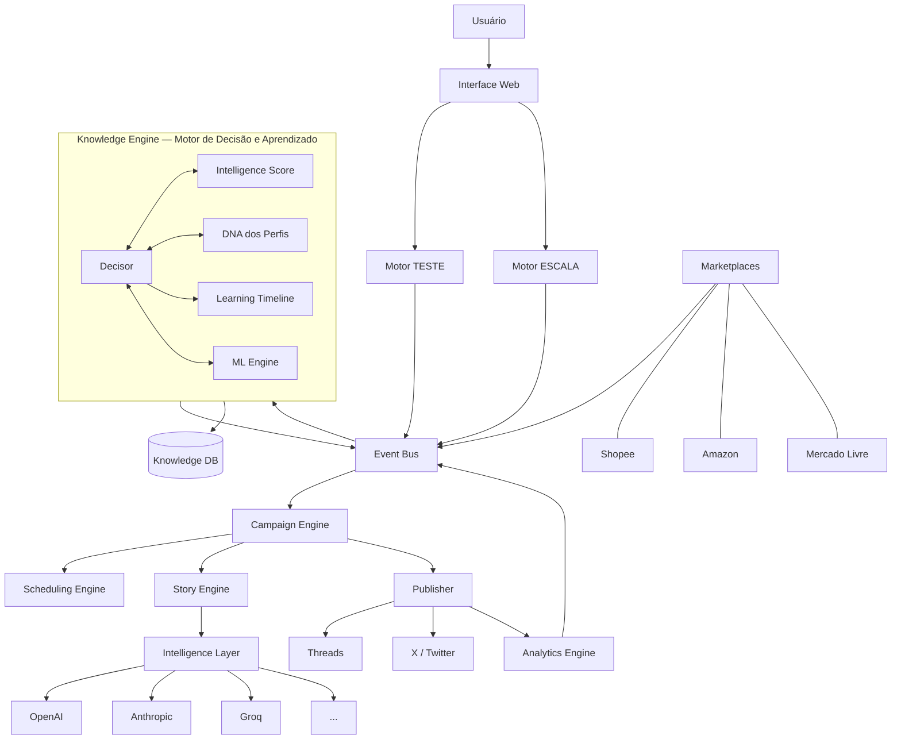

# Escriba AI — Sistema Operacional para Afiliados

> *"A IA não é o produto. O aprendizado é o produto."*

---

## O que é

**Escriba AI** é um SaaS de automação inteligente para afiliados digitais.

Ela não é um gerador de copy.  
Ela não é um agendador de posts.  
Ela não é um painel de métricas.  
Ela não é um dashboard financeiro.  
Ela não é um Buffer, Hootsuite, Metricool ou Canva.

Ela é um **sistema operacional para afiliados**.

Seu único objetivo é descobrir automaticamente quais narrativas geram vendas nas redes sociais e escalar infinitamente apenas o que foi provado que funciona — enquanto acumula um ativo de conhecimento que nenhuma troca de modelo de IA jamais apagará.

---

## O Problema que Resolve

Afiliados digitais enfrentam três problemas simultâneos:

1. **Não sabem o que funciona** antes de testar — e testar às cegas é lento, caro e impreciso.
2. **Não conseguem escalar com consistência** — quando algo funciona, não sabem como replicar sem perder a essência.
3. **Não acumulam conhecimento** — cada ciclo começa do zero. O aprendizado some.

O mercado atual oferece ferramentas isoladas para cada um desses problemas. Nenhuma resolve os três em conjunto, de forma integrada, com aprendizado contínuo.

**Escriba AI** resolve os três simultaneamente — e aprende sozinha.

---

## O Princípio Fundamental

A plataforma **nunca gera uma história aleatoriamente**.

Ela primeiro toma decisões. Ela decide:

| Dimensão | Decisão |
|---|---|
| Produto | Qual produto será promovido |
| Narrativa | Qual estrutura narrativa será utilizada |
| Público | Para quem essa história está sendo contada |
| Emoção | Qual emoção primária será ativada |
| Horário | Qual o melhor momento para publicar |
| Perfil | Qual perfil publicará |
| Rede | Em qual rede social será publicado |
| CTA | Qual chamada para ação será utilizada |
| Blocos | Quantos blocos a história terá |
| Tom | Qual o tom narrativo (íntimo, urgente, inspiracional...) |
| Personagem | Qual arquétipo de personagem será utilizado |
| Estrutura | Qual estrutura de storytelling será aplicada |

Somente após todas essas decisões estarem tomadas é que a escrita começa.

**Nunca o contrário.**

---

## Os Dois Motores Visíveis

Toda a complexidade da plataforma está encapsulada em dois conceitos simples:

```
╔══════════════════════════════════════════════════════════╗
║                                                          ║
║    TESTE                          ESCALA                 ║
║                                                          ║
║  Descobrir.                    Multiplicar.              ║
║  Aprender.                     Preservar DNA.            ║
║  Validar.                      Maximizar.                ║
║  Experimentar.                 Escalar infinitamente.    ║
║                                                          ║
║  Nunca prioriza                Nunca experimenta.        ║
║  faturamento.                  Nunca arrisca.            ║
║                                                          ║
╚══════════════════════════════════════════════════════════╝
```

O usuário jamais precisará entender o que acontece por baixo desses dois motores.  
Toda a complexidade técnica, estatística e de IA é completamente invisível.

---

## O Cérebro da Plataforma: Knowledge Engine

O Knowledge Engine não é um repositório.  
Ele não armazena dados passivamente.  
Ele é o **motor de decisão e aprendizado** da plataforma.

É ele que decide:
- O que testar a seguir
- O que escalar agora
- O que pausar imediatamente
- O que arquivar definitivamente
- Qual narrativa tem maior probabilidade de converter
- Qual produto está com momentum de mercado
- Qual perfil está saturado
- Qual horário vai maximizar alcance

Ele não executa. Ele decide. Outros motores executam.

O GPT pode ser trocado.  
Claude pode ser trocado.  
Groq pode ser trocado.  
Gemini pode ser trocado.  
Qualquer modelo pode ser trocado.

Mas o **conhecimento acumulado no Knowledge Engine** — os padrões descobertos, as narrativas validadas, os horários mapeados, os produtos que convertem, os CTAs que funcionam, o DNA de cada perfil — esse ativo **nunca pode ser perdido**.

O Knowledge Engine é o maior ativo competitivo da empresa.  
É o que transforma Escriba AI de uma ferramenta em uma vantagem composta.  
É o que cria o foso (moat) intransponível.

Quanto mais tempo um usuário usa a plataforma, mais ela sabe sobre ele.  
Quanto mais usuários usam a plataforma, mais ela sabe sobre o mercado.

---

## Os Motores Internos

Por baixo dos dois motores visíveis (Teste e Escala), existem quatro motores de infraestrutura que o usuário jamais verá diretamente, mas que são responsáveis por toda a inteligência da plataforma.

### Campaign Engine

Gerencia o ciclo de vida completo de uma campanha, do início ao encerramento.

Uma campanha passa pelos seguintes estados:

```
Rascunho → Agendada → Em execução → Pausada → Concluída → Arquivada
                                  ↘ Escalada → Em execução (escala)
```

O Campaign Engine:
- Orquestra Story Engine e Scheduling Engine
- Monitora métricas em tempo real
- Detecta anomalias (queda brusca, pico inesperado)
- Reporta resultados ao Knowledge Engine
- Nunca toma decisões estratégicas — apenas executa o que o Knowledge Engine decidiu

**Visível para o usuário:** Não diretamente. O usuário vê campanhas, não o engine que as gerencia.

---

### Scheduling Engine

Decide **quando** publicar. Não **o quê** — isso é responsabilidade do Story Engine.

O Scheduling Engine analisa:
- Histórico de engajamento por horário e dia do perfil específico
- Padrões de consumo da audiência-alvo na rede-alvo
- Algoritmos de alcance da rede (janelas de distribuição)
- Sobrecarga de publicação (evita publicar demais no mesmo intervalo)
- Saturação detectada (recua o ritmo quando a campanha está perdendo eficácia)
- Competição de horário com outras campanhas ativas do mesmo perfil
- Eventos externos relevantes (datas comemorativas, tendências de mercado)

**Visível para o usuário:** Não. O usuário pode ver "próxima publicação prevista" mas nunca configura horário manualmente — a plataforma decide.

> **Decisão arquitetural:** Tirar o controle de horário do usuário é uma escolha deliberada e agressiva. A maioria das plataformas deixa o usuário configurar horários porque é mais fácil de construir. Nós não fazemos isso porque a plataforma sabe mais que o usuário sobre quando publicar. Isso é parte do que nos diferencia. A tensão com usuários que "querem controle" será gerenciada via UX — mostrando o raciocínio por trás de cada decisão de horário.

---

### Intelligence Layer

Camada de abstração entre toda a plataforma e os modelos de IA externos.

Nenhum componente da plataforma chama OpenAI, Claude ou Groq diretamente.  
Todo acesso a LLMs passa pela Intelligence Layer.

Responsabilidades:
- **Roteamento de modelo:** escolhe o modelo certo para cada tarefa com base em custo, velocidade e qualidade necessária
- **Engenharia de prompts:** traduz decisões da plataforma em prompts otimizados para cada modelo
- **Fallback automático:** se OpenAI cair, roteia para Groq sem interrupção
- **Cache de respostas:** reutiliza respostas idênticas para economizar tokens e tempo
- **Controle de custos:** monitora gasto por usuário, por tarefa, por modelo
- **Versionamento de prompts:** mantém histórico de prompts para auditoria e melhoria
- **Avaliação de qualidade:** classifica automaticamente a qualidade de cada saída gerada

**Visível para o usuário:** Completamente invisível. O usuário nunca sabe qual modelo gerou qual história.

---

### Analytics Engine

Coleta, processa e estrutura todos os dados de performance de publicações.

Não é um dashboard. É o sistema que alimenta o Knowledge Engine com dados brutos processados.

Coleta:
- Impressões, alcance, engajamento por publicação
- Cliques nos links de afiliado
- Conversões (quando o marketplace reporta)
- Tempo de vida do engajamento (por quanto tempo um post continua recebendo interações)
- Padrões de compartilhamento e viralidade

**Visível para o usuário:** Os resultados aparecem nos dashboards, não o engine em si.

---

## DNA do Perfil

Cada perfil social tem uma identidade acumulada ao longo do tempo.  
Essa identidade é o **DNA do Perfil**.

O DNA do Perfil não é configurado pelo usuário.  
Ele é **descoberto** pela plataforma ao longo do tempo.

Composto por:

| Dimensão | O que captura |
|---|---|
| **Voz** | Vocabulário recorrente, tamanho de frases, nível de formalidade, uso de gírias |
| **Tom dominante** | Qual tom gera mais engajamento neste perfil específico |
| **Nichos de afinidade** | Quais categorias de produto convertem melhor |
| **Janelas de audiência** | Quando a audiência deste perfil está mais ativa e receptiva |
| **Emoções que ressoam** | Quais gatilhos emocionais funcionam nesta audiência |
| **CTAs que convertem** | Quais chamadas para ação geram mais cliques |
| **Ritmo ideal** | Frequência de publicação que maximiza alcance sem saturar |
| **Saturação histórica** | Padrões de quando este perfil ficou saturado antes |
| **Narrativas validadas** | Quais estruturas narrativas já foram comprovadas neste perfil |
| **Produtos com afinidade** | Quais produtos já converteram e em qual magnitude |

O DNA do Perfil é **por rede**. O mesmo usuário pode ter DNAs completamente diferentes em Threads e X.

O DNA do Perfil é o principal insumo do Story Engine. Antes de escrever qualquer história, o Story Engine consulta o DNA do Perfil para garantir consistência de voz e maximizar probabilidade de conversão.

**Visível para o usuário:** Sim, de forma simplificada. No painel do perfil, o usuário verá algo como "O que sabemos sobre este perfil" — uma versão legível e amigável do DNA.

---

## Intelligence Score

O Intelligence Score é um único número que representa o grau de confiança da plataforma em qualquer afirmação que ela faça.

**Escala:** 0 a 100

| Faixa | Significado | Ação da Plataforma |
|---|---|---|
| 0–20 | Hipótese pura. Nenhuma evidência. | Entra no Motor Teste |
| 21–40 | Indícios iniciais. Poucos dados. | Continua testando |
| 41–60 | Padrão emergente. Dados insuficientes para certeza. | Testa com mais volume |
| 61–80 | Evidência sólida. Confiança moderada. | Pode ser escalado com cautela |
| 81–100 | Altamente validado. Evidência estatisticamente significante. | Elegível para Motor Escala |

O Intelligence Score é calculado para:
- Cada **narrativa** (qual estrutura funciona para qual produto)
- Cada **perfil + rede** (o quanto conhecemos sobre este perfil nesta rede)
- Cada **produto** (qual a confiança de que este produto converte)
- Cada **horário** (quão confiante somos nesta janela de publicação)
- Cada **CTA** (qual a confiança nesta chamada para ação)
- Cada **combinação** de todas as dimensões acima

O score **decai com o tempo**. Conhecimento que não é revalidado periodicamente perde confiança automaticamente. O mercado muda. O que funcionou há seis meses pode não funcionar hoje.

**Visível para o usuário:** Sim, de forma simplificada. Não como "78/100", mas como um indicador de maturidade da campanha ou do perfil — algo como "Perfil maduro", "Em aprendizado", "Alta confiança".

---

## Learning Timeline

A Learning Timeline é o registro cronológico de tudo que a plataforma aprendeu.

Não é um log técnico.  
É a **memória narrativa** da plataforma.

Cada entrada na Learning Timeline é um insight com:
- Data de descoberta
- Tipo de aprendizado (narrativa, horário, produto, CTA, saturação...)
- Descrição legível do que foi aprendido
- Intelligence Score no momento da descoberta
- Evidências que sustentam o aprendizado
- Status atual (ainda válido / degradando / expirado)

Exemplos de entradas reais na Learning Timeline:

```
[2026-08-15] Narrativa "transformação pessoal" supera "urgência de desconto"
             em 340% para produtos de organização doméstica no perfil @perfil1
             no horário 19h–21h em dias úteis.
             Score: 87/100 | Ainda válido

[2026-09-02] Campanha #238 saturou após 11 dias com 47 publicações.
             Padrão de saturação: queda de 65% em CTR após o 9º dia.
             Score: 91/100 | Regra aplicada a futuras campanhas similares

[2026-09-18] CTA "Veja aqui" supera "Clique no link" em 2.1x
             para produtos de tecnologia em Threads.
             Score: 74/100 | Em validação adicional
```

A Learning Timeline é o principal argumento de retenção da plataforma.  
Quanto mais tempo o usuário fica, mais rica fica a timeline.  
Abandonar a plataforma significa perder todo esse histórico.

**Visível para o usuário:** Sim. É um dos dashboards principais. Apresentado de forma limpa, como uma linha do tempo de descobertas — não como um log técnico.

---

## Arquitetura de Alto Nível



**Princípio arquitetural central:**  
Nenhum componente se comunica diretamente com outro.  
Toda comunicação passa pelo **Event Bus** de forma assíncrona.  
O **Knowledge Engine** é o único componente que assina todos os eventos e tem visibilidade global.  
Ele decide. Os outros executam.

> **Por que Event Bus e não chamadas diretas?** Chamadas síncronas diretas criam acoplamento rígido. Se o Story Engine chamar diretamente o Knowledge Engine, qualquer falha em um derruba o outro. Com Event Bus: cada componente é independente, substituível, testável isoladamente, e escalável de forma independente. O sistema inteiro continua funcionando mesmo que um componente caia — os eventos ficam na fila esperando.

---

## Camadas da Plataforma

```
┌─────────────────────────────────────────────────────────┐
│                    CAMADA DE USUÁRIO                     │
│          Motor TESTE    |    Motor ESCALA                │
│    (Tudo que o usuário vê e interage)                    │
├─────────────────────────────────────────────────────────┤
│                   CAMADA DE PRODUTO                      │
│   DNA do Perfil  |  Intelligence Score  |  Learning TL  │
│   (Visível para o usuário, de forma simplificada)        │
├─────────────────────────────────────────────────────────┤
│                  CAMADA DE ORQUESTRAÇÃO                  │
│      Campaign Engine    |    Scheduling Engine           │
│   (Infraestrutura invisível de ciclo de vida)            │
├─────────────────────────────────────────────────────────┤
│                   CAMADA DE INTELIGÊNCIA                 │
│         Knowledge Engine (Decisor + Aprendizado)         │
│   (O cérebro. Nenhuma decisão acontece sem ele.)         │
├─────────────────────────────────────────────────────────┤
│                   CAMADA DE GERAÇÃO                      │
│                      Story Engine                        │
│   (Produz histórias com base nas decisões acima)         │
├─────────────────────────────────────────────────────────┤
│                   CAMADA DE IA                           │
│                   Intelligence Layer                     │
│   (Abstração total sobre modelos externos)               │
├─────────────────────────────────────────────────────────┤
│                   CAMADA DE DADOS                        │
│      Knowledge DB  |  Event Bus  |  Analytics Engine     │
│   (Infraestrutura de dados e comunicação)                │
└─────────────────────────────────────────────────────────┘
```

---

## Redes Sociais Suportadas

### Fase Inicial
- **Threads** (Meta)
- **X** (Twitter)

### Futuro (arquitetura preparada desde o início)
- Instagram
- TikTok
- LinkedIn
- YouTube Shorts
- Facebook
- Bluesky
- E qualquer rede que existir quando chegarmos lá

---

## Marketplaces de Afiliados Suportados

### Fase Inicial
- **Shopee Afiliados**
- **Amazon Afiliados**
- **Mercado Livre Afiliados**

### Futuro (arquitetura preparada desde o início)
- Hotmart
- Eduzz
- Monetizze
- Braip
- Lomadee
- CJ Affiliate
- ClickBank
- E qualquer marketplace que fizer sentido

---

## Modelos de IA Suportados

A plataforma é **agnóstica de modelo**. Nenhum modelo é especial. Qualquer um pode ser substituído sem impactar o aprendizado acumulado.

Todo acesso a modelos passa pela **Intelligence Layer** — nunca diretamente.

### Suporte Planejado
- OpenAI (GPT-4o, GPT-4.1, o3...)
- Anthropic (Claude Sonnet, Claude Opus)
- Groq (velocidade extrema para geração em volume)
- Google (Gemini)
- OpenRouter (roteamento multi-modelo)
- Ollama (modelos locais para cenários específicos)

### Critério de Seleção de Modelo por Tarefa
| Tarefa | Critério prioritário | Exemplo de modelo |
|---|---|---|
| Geração de histórias em volume | Velocidade + custo | Groq / GPT-4o-mini |
| Análise de padrões complexos | Capacidade de raciocínio | Claude Opus / GPT-4o |
| Classificação de narrativas | Consistência + custo | GPT-4o-mini / Haiku |
| Scoring e avaliação | Pode ser ML interno | Sem LLM |
| Engenharia de prompts | Sem LLM (é código) | — |

---

## Filosofia de Produto

1. **O aprendizado é o produto, não a IA**  
   Modelos vêm e vão. O conhecimento acumulado é eterno.

2. **Decide antes de escrever**  
   A plataforma nunca gera conteúdo sem antes ter tomado todas as decisões sobre ele.

3. **Simplicidade na superfície, profundidade no motor**  
   Qualquer usuário entende o produto em 5 minutos. Nenhum usuário precisa entender como funciona por dentro.

4. **Teste com rigor, escale com confiança**  
   Nada vai para o Motor Escala sem Intelligence Score ≥ 81.

5. **O conhecimento tem prazo de validade**  
   Intelligence Scores decaem com o tempo. A plataforma nunca age com base em conhecimento desatualizado.

6. **DNA antes de geração**  
   Toda história é gerada em consonância com o DNA do Perfil. Jamais ignorá-lo.

7. **A arquitetura é o produto**  
   Cada decisão técnica deve suportar uma empresa de dezenas de milhões de dólares.

8. **Documentação antes de código**  
   Nenhuma linha de código existe sem documentação aprovada. A documentação é a lei.

---

## Estrutura da Documentação

Esta documentação é a **única fonte oficial de verdade** da empresa.  
Toda decisão técnica, de produto, de UX e de negócio está registrada aqui.  
Nada pode ser implementado sem antes existir na documentação.

```
escriba-ai/
├── README.md                        ← Você está aqui
├── .gitignore
├── docs/
│   ├── 01-visao-geral.md
│   ├── 02-filosofia.md
│   ├── 03-prd.md
│   ├── 04-arquitetura.md
│   ├── 05-ux.md
│   ├── 06-story-engine.md
│   ├── 07-test-engine.md
│   ├── 08-scale-engine.md
│   ├── 09-knowledge-engine.md
│   ├── 10-dashboards.md
│   ├── 11-banco-de-dados.md
│   ├── 12-apis.md
│   ├── 13-integracoes.md
│   ├── 14-ia.md
│   ├── 15-machine-learning.md
│   ├── 16-seguranca.md
│   ├── 17-roadmap.md
│   ├── 18-regras-de-negocio.md
│   ├── 19-ai-context.md
│   ├── 20-decisions.md
│   ├── 21-glossario.md
│   └── blueprint-audit-v1.0.md
└── platform/                        ← Aplicação Next.js
    ├── src/
    ├── prisma/
    └── ...
```

### Onde cada conceito é documentado em profundidade

| Conceito | Documento principal | Documentos relacionados |
|---|---|---|
| Motor TESTE | 07 - Test Engine | 03 PRD, 09 Knowledge Engine, 18 Regras |
| Motor ESCALA | 08 - Scale Engine | 03 PRD, 09 Knowledge Engine, 18 Regras |
| Knowledge Engine | 09 - Knowledge Engine | 04 Arquitetura, 11 BD, 15 ML |
| Campaign Engine | 04 - Arquitetura Geral | 18 Regras de Negócio |
| Scheduling Engine | 04 - Arquitetura Geral | 12 APIs, 18 Regras |
| Story Engine | 06 - Story Engine | 14 IA, 04 Arquitetura |
| Intelligence Layer | 14 - Inteligência Artificial | 04 Arquitetura, 12 APIs |
| Analytics Engine | 04 - Arquitetura Geral | 11 BD, 12 APIs |
| DNA do Perfil | 09 - Knowledge Engine | 11 BD, 05 UX, 10 Dashboards |
| Intelligence Score | 15 - Machine Learning | 09 Knowledge Engine, 07 Test Engine |
| Learning Timeline | 09 - Knowledge Engine | 10 Dashboards, 05 UX |

---

## Status da Documentação

| Documento | Status | Versão |
|-----------|--------|--------|
| README.md | ✅ Aprovado | 0.2 |
| 01 - Visão Geral | ✅ Aprovado | 0.2 |
| 02 - Filosofia | ✅ Aprovado | 0.2 |

| 03 - PRD | ✅ Aprovado | 0.2 |
| 04 - Arquitetura Geral | 🔄 Em revisão | 0.1 |

| 05 - UX | ⏳ Pendente | — |
| 06 - Story Engine | ⏳ Pendente | — |
| 07 - Test Engine | ⏳ Pendente | — |
| 08 - Scale Engine | ⏳ Pendente | — |
| 09 - Knowledge Engine | ⏳ Pendente | — |
| 10 - Dashboards | ⏳ Pendente | — |
| 11 - Banco de Dados | ⏳ Pendente | — |
| 12 - APIs | ⏳ Pendente | — |
| 13 - Integrações | ⏳ Pendente | — |
| 14 - Inteligência Artificial | ⏳ Pendente | — |
| 15 - Machine Learning | ⏳ Pendente | — |
| 16 - Segurança | ⏳ Pendente | — |
| 17 - Roadmap | ⏳ Pendente | — |
| 18 - Regras de Negócio | ⏳ Pendente | — |
| 19 - AI_CONTEXT | ⏳ Pendente | — |
| 20 - DECISIONS | 🔄 Documento vivo | 1.0 |
| 21 - Glossário | ⏳ Pendente | — |

---

## Regras Invioláveis

Estas regras não podem ser quebradas em nenhuma circunstância:

1. **Nenhum código antes de documentação aprovada**
2. **Nenhuma funcionalidade pode contradizer outra**
3. **Toda decisão arquitetural deve estar registrada no DECISIONS.md**
4. **A documentação é a única fonte oficial de verdade**
5. **O Knowledge Engine nunca pode perder dados históricos**
6. **O Motor Escala nunca publica campanhas com Intelligence Score abaixo de 81**
7. **O Motor Teste nunca prioriza faturamento**
8. **A troca de qualquer modelo de IA não pode impactar o aprendizado acumulado**
9. **A plataforma nunca gera conteúdo antes de tomar todas as decisões sobre ele**
10. **Toda complexidade fica escondida do usuário final**
11. **Nenhum componente chama modelos de IA diretamente — tudo passa pela Intelligence Layer**
12. **Nenhum componente se comunica com outro diretamente — tudo passa pelo Event Bus**
13. **O DNA do Perfil sempre é consultado antes de qualquer geração de história**
14. **Intelligence Scores decaem com o tempo — conhecimento desatualizado nunca guia decisões**
15. **A Learning Timeline é imutável — entradas nunca são deletadas, apenas marcadas como expiradas**

---

## Glossário Rápido

| Termo | Definição |
|-------|-----------|
| Motor Teste | Motor visível responsável por descobrir padrões e validar hipóteses |
| Motor Escala | Motor visível responsável por multiplicar campanhas validadas |
| Knowledge Engine | Cérebro da plataforma: motor de decisão e aprendizado contínuo |
| Campaign Engine | Motor interno que gerencia o ciclo de vida completo de campanhas |
| Scheduling Engine | Motor interno que decide quando publicar com base em dados e DNA |
| Story Engine | Sistema de geração de histórias, alimentado por decisões do Knowledge Engine |
| Intelligence Layer | Camada de abstração sobre todos os modelos de IA externos |
| Analytics Engine | Sistema de coleta e processamento de dados de performance |
| DNA do Perfil | Identidade acumulada de cada perfil social: voz, tom, nichos, padrões |
| Intelligence Score | Métrica de confiança (0–100) para qualquer afirmação que a plataforma faz |
| Learning Timeline | Memória cronológica de todos os aprendizados da plataforma |
| Event Bus | Canal de comunicação assíncrono entre todos os componentes |
| Campanha | Conjunto de publicações com narrativa, produto e estratégia definidos |
| DNA da Campanha | Os elementos essenciais que fazem uma campanha vencedora funcionar |
| Saturação | Quando uma campanha perde eficácia por overexposure |

Para definições completas, consulte [21 - Glossário.md].

---

## Como Navegar Esta Documentação

**Se você é novo no projeto:** Leia nesta ordem: README → 01 → 02 → 03 → 04.

**Se você está implementando uma feature:** Consulte o PRD (03), depois o documento técnico relevante, depois as Regras de Negócio (18).

**Se você é um agente de IA:** Leia o AI_CONTEXT (19) primeiro.

**Se você está tomando uma decisão arquitetural:** Consulte DECISIONS (20) antes de decidir qualquer coisa.

**Se você quer entender a arquitetura rápido:** Leia o documento 04 (Arquitetura Geral).

---

## Sobre Este Projeto

**Tipo:** SaaS B2C / B2B (afiliados digitais)  
**Mercado inicial:** Brasil  
**Expansão planejada:** América Latina → Global  
**Modelo de negócio:** Assinatura mensal (freemium ou trial — a definir no PRD)  
**Fase atual:** Documentação (Blueprint)  
**Próxima fase:** MVP  
**Nome:** Escriba AI

---

*Documento criado em: 2026-07-11*  
*Versão: 0.2 — Aguardando aprovação*  
*Alterações v0.2: Campaign Engine, Scheduling Engine, Intelligence Layer, Analytics Engine, DNA do Perfil, Intelligence Score, Learning Timeline. Knowledge Engine reposicionado como motor de decisão e aprendizado. Arquitetura atualizada com Event Bus e camadas explícitas.*
