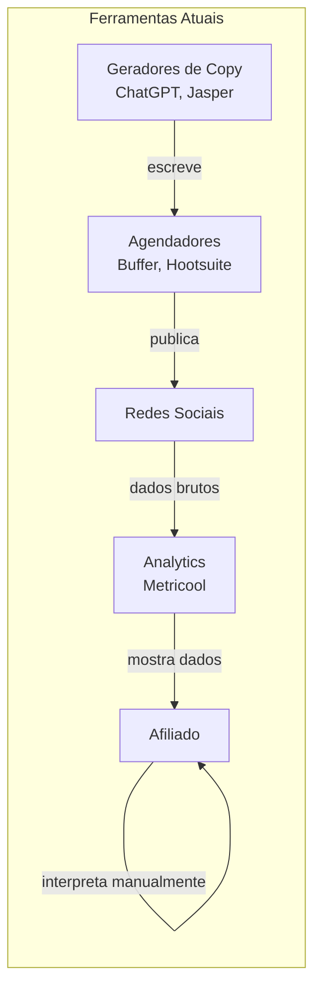
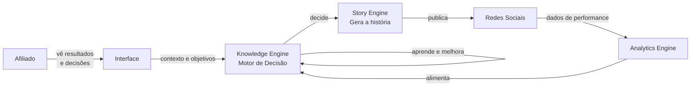
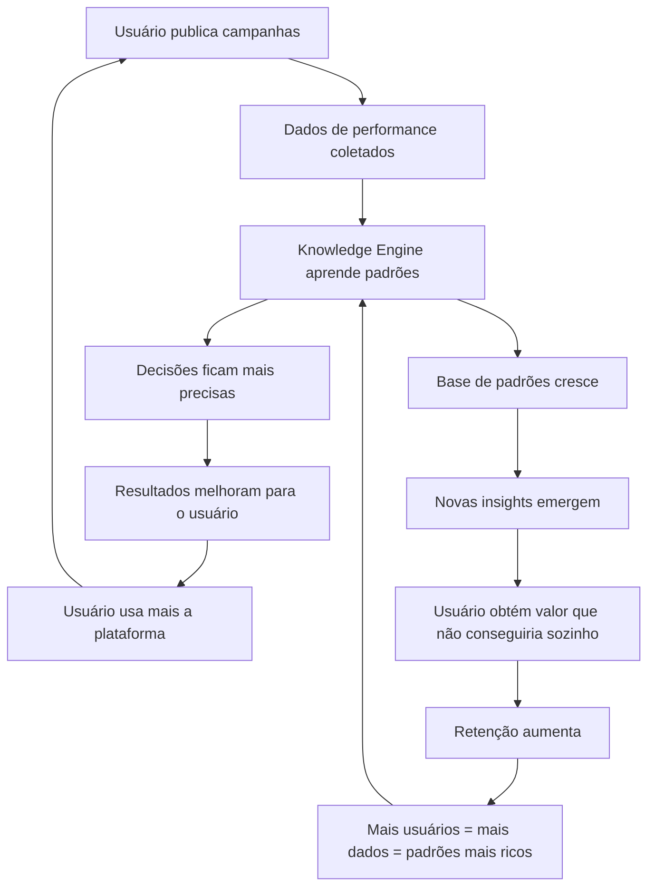

# 01 — Visão Geral

> *"Nenhuma ferramenta no mercado se importa se você vendeu. A [PLATAFORMA] importa."*

---

## Objetivo deste Documento

Estabelecer o contexto completo do produto: o mercado em que opera, o problema que resolve, o reframe filosófico que o diferencia, as personas que serve, o posicionamento competitivo e a visão de futuro.

Este documento é a primeira leitura obrigatória para qualquer pessoa que entre no projeto — seja engenheiro, designer, investidor ou parceiro. Ele responde à pergunta: **por que este produto precisa existir?**

---

## Contexto de Mercado

### O Mercado de Afiliados Digitais no Brasil

O Brasil é um dos maiores mercados de afiliados digitais do mundo.

O ecossistema de afiliação brasileiro é maduro, diversificado e crescente:
- Plataformas de produtos digitais (Hotmart, Eduzz, Monetizze, Braip) movimentam bilhões de reais por ano
- Marketplaces de produtos físicos com programas de afiliados em expansão acelerada (Shopee, Amazon, Mercado Livre)
- Uma comunidade massiva de "afiliados digitais" — criadores de conteúdo, influenciadores e empreendedores que monetizam audiências via comissão de vendas

O afiliado digital brasileiro opera principalmente em:
- Redes sociais de texto (X/Twitter, Threads)
- Redes de vídeo curto (Instagram Reels, TikTok, YouTube Shorts)
- WhatsApp e grupos de mensageria
- Email marketing
- Blogs e SEO

### A Realidade Operacional do Afiliado

A maioria dos afiliados opera com um processo que pode ser descrito assim:

```
1. Escolhe um produto para promover (por intuição ou hype)
2. Escreve um post ou cria um conteúdo (por tentativa e erro)
3. Publica (em horário aleatório ou por costume)
4. Espera resultados (passivamente)
5. Analisa superficialmente ("esse não funcionou")
6. Começa do zero com outra abordagem
7. Repete indefinidamente
```

Não há aprendizado sistemático.  
Não há memória entre ciclos.  
Não há método científico.  
Não há acumulação de conhecimento.

Cada afiliado reinventa a roda a cada campanha.

### O Mercado de Ferramentas para Afiliados

O ecossistema de ferramentas disponíveis hoje para afiliados pode ser dividido em categorias:

| Categoria | Exemplos | O que fazem | O que não fazem |
|---|---|---|---|
| Agendadores | Buffer, Hootsuite, Later, Metricool | Publicam no horário certo | Não se importam se vendeu |
| Geradores de copy | ChatGPT, Jasper, Copy.ai | Escrevem textos | Não aprendem com resultados |
| Painéis de analytics | Metricool, Sprout Social | Mostram o que aconteceu | Não decidem o que fazer a seguir |
| Trackers de afiliados | Voluum, ClickMagick | Rastreiam cliques e conversões | Não geram conteúdo, não aprendem |
| Dashboards de marketplace | Painéis das próprias plataformas | Mostram comissões | Não conectam conteúdo com resultado |

**O gap fundamental:** nenhuma ferramenta fecha o loop entre publicar → medir → aprender → decidir melhor → publicar mais inteligente.

Cada categoria de ferramenta resolve um pedaço isolado do problema. O afiliado é forçado a ser o cérebro que conecta tudo — e ele não tem os dados, o tempo, nem o método para fazer isso com rigor.

---

## O Problema Central

### A Ilusão do "Criador de Conteúdo"

O setor trata o afiliado como um criador de conteúdo.  
Plataformas são construídas para ajudá-lo a criar e publicar mais.

Essa é a premissa errada.

O afiliado não é um criador de conteúdo.  
O afiliado é um **vendedor** que usa conteúdo como instrumento de vendas.

A distinção é crítica: um criador de conteúdo quer engajamento. Um afiliado quer conversão.  
Engajamento e conversão não são a mesma coisa.  
Um post pode ter 10 mil curtidas e zero vendas.  
Outro pode ter 80 curtidas e 50 vendas.

O mercado de ferramentas foi construído para maximizar engajamento.  
O afiliado precisa maximizar conversão.  
Ninguém resolve esse problema corretamente hoje.

### Os Três Problemas Reais

**Problema 1: O afiliado não sabe o que funciona antes de testar**

Cada campanha começa com uma hipótese não declarada: "Acho que esse produto, com essa abordagem, vai vender." Sem método, sem dados, sem referência. Pura intuição.

Quando funciona, ele não sabe exatamente por quê.  
Quando não funciona, ele também não sabe por quê.  
O aprendizado não acontece de forma estruturada.

**Problema 2: O afiliado não consegue escalar com consistência**

Quando algo funciona, o instinto natural é "vou fazer mais disso." Mas "mais disso" sem entender o padrão que gerou o resultado leva à saturação, à repetição sem variação e à queda de performance.

O afiliado experiente sabe que copiar um post que funcionou quase nunca funciona da mesma forma.  
Mas ele não sabe *o quê* mudar para preservar o que funcionou e criar variações eficazes.

**Problema 3: O conhecimento não acumula**

Este é o mais sutil e o mais devastador.

Cada campanha que um afiliado faz é um experimento. Mas sem um sistema para capturar os resultados desse experimento e transformá-los em conhecimento aplicável, cada novo ciclo começa do zero.

Um afiliado com cinco anos de experiência tem cinco anos de tentativas e erros na memória — mas essa memória é falha, incompleta e não está estruturada para ser acessada de forma útil na hora de tomar decisões.

Ele *acha* que sabe o que funciona. Mas não tem dados que provem.  
E quando alguém da equipe sai, esse conhecimento some junto.

### A Consequência

O resultado desses três problemas combinados é que o afiliado digital, mesmo experiente, permanece perpetuamente em modo de tentativa e erro — apenas com tentativas mais caras e erros mais difíceis de detectar.

A rentabilidade é imprevisível.  
A escalabilidade é frágil.  
O crescimento é linear, não composto.

---

## O Reframe Fundamental

### Histórias São o Meio. Padrões São o Produto.

Este é o princípio mais importante do produto inteiro, e precisa estar presente em cada decisão de produto, UX e arquitetura.

A [PLATAFORMA] **não é uma plataforma de geração de histórias**.

Histórias são o veículo.  
O que a plataforma realmente produz é **conhecimento sobre padrões de comportamento de compra**.

Pense assim:

> Quando um afiliado publica uma história sobre um produto de organização doméstica às 20h numa quinta-feira, usando uma narrativa de transformação pessoal com um CTA baseado em escassez — e essa história gera 12 conversões —, a [PLATAFORMA] não registra "essa história funcionou."
>
> Ela registra: *"Pessoas que consomem conteúdo de narrativa de transformação pessoal sobre produtos de organização doméstica, às 20h em dias úteis, com CTA de escassez, têm alta probabilidade de comprar."*
>
> Essa afirmação — validada com dados suficientes — é um **padrão comportamental de compra**.
>
> É isso que a plataforma acumula.  
> É isso que nenhum concorrente pode copiar.  
> É isso que o usuário leva para sempre.

### A História como Instrumento de Medição

Dentro deste reframe, a história muda de papel:

| Perspectiva tradicional | Perspectiva [PLATAFORMA] |
|---|---|
| A história é o produto final | A história é o instrumento de coleta de dados |
| O objetivo é criar uma boa história | O objetivo é testar uma hipótese comportamental |
| Sucesso = engajamento | Sucesso = validação de padrão |
| Uma boa história é aquela que o usuário acha criativa | Uma boa história é aquela que comprova ou refuta uma hipótese com precisão |

Isso não significa que a qualidade da escrita não importa — importa muito. Uma história mal escrita contamina o experimento porque o fracasso pode ser da execução, não da hipótese. A qualidade narrativa é uma condição necessária para que o experimento seja válido.

Mas a qualidade narrativa é um meio para um fim, não o fim em si.

### Por Que Este Reframe Cria o Moat

Se a [PLATAFORMA] fosse "apenas" um bom gerador de histórias, qualquer concorrente com acesso à mesma API da OpenAI poderia nos copiar em semanas.

Mas se a [PLATAFORMA] é um **sistema que acumula padrões comportamentais de compra**, o moat cresce com o tempo:

- Quanto mais campanhas rodadas → mais padrões descobertos
- Quanto mais padrões descobertos → mais precisas as próximas decisões
- Quanto mais precisas as decisões → melhores os resultados
- Quanto melhores os resultados → mais o usuário usa a plataforma
- Quanto mais o usuário usa → mais dados → mais padrões → ciclo

E mais importante: **o padrão que a plataforma descobreu sobre o público de um afiliado específico é intransferível**. Nenhum outro afiliado tem esse dado. Nenhum concorrente pode oferecer esse histórico.

O produto fica mais valioso com o tempo. Isso é raro. Isso é o negócio.

---

## Como a Plataforma Pensa

*Esta seção descreve a inteligência comportamental da plataforma — como ela raciocina, não como ela é construída tecnicamente.*

### A Mentalidade Científica

A [PLATAFORMA] pensa como um cientista, não como um criativo.

Um cientista não publica conteúdo. Ele formula hipóteses, projeta experimentos para testá-las, coleta dados com rigor, analisa resultados e atualiza seu modelo de mundo com base no que aprendeu.

Cada publicação gerada pela plataforma é, fundamentalmente, um experimento com uma hipótese implícita:

```
"Se publicarmos [narrativa X] sobre [produto Y] para [audiência Z] 
 em [horário H] no [perfil P], então [resultado R] tem probabilidade [P%]."
```

A plataforma pensa assim o tempo todo. O usuário nunca precisa ver essa formulação — mas ela está por baixo de cada decisão.

### Como a Plataforma Aprende

A plataforma aprende por **observação + comparação + atualização**.

```
Observação:    O que aconteceu com esta publicação?
Comparação:    Como isso se compara com publicações similares?
Atualização:   O que esse resultado muda no que acreditamos?
```

Ela não aprende por regras fixas. Ela aprende por padrões emergentes nos dados.

Uma única conversão não prova nada. Ela atualiza ligeiramente a probabilidade.  
Cem conversões com o mesmo padrão provam muito. Elas estabelecem um padrão com alta confiança.  
Uma queda repentina após semanas de sucesso sinaliza saturação ou mudança de mercado. Ela degrada a confiança no padrão.

### Como a Plataforma Decide

Antes de gerar qualquer conteúdo, a plataforma responde internamente a estas perguntas em sequência:

```
1. Qual é o estado atual do Knowledge Engine para este perfil?
   → Quais padrões já foram validados?
   → Quais hipóteses ainda estão em teste?
   → Há saturação detectada em algum padrão?

2. Qual é o objetivo atual?
   → Estamos em modo TESTE (descobrir novos padrões)?
   → Estamos em modo ESCALA (explorar padrões validados)?

3. Qual a melhor decisão dado o objetivo e o estado atual?
   → Qual produto tem maior potencial de conversão agora?
   → Qual narrativa tem maior Intelligence Score para este produto?
   → Qual horário maximiza a probabilidade de alcançar a audiência certa?
   → Qual perfil é mais adequado para este experimento ou escala?

4. Execute.
   → Gere a história que implementa esta decisão com precisão.
   → Agende para o momento correto.
   → Publique.
   → Monitore.
   → Atualize o modelo.
```

O usuário vê apenas o resultado final: uma campanha bem planejada que começa a rodar. Ele não precisa responder a nenhuma dessas perguntas. A plataforma responde por ele.

### Como a Plataforma Evolui

A plataforma tem três estados de maturidade:

**Estado 1: Aprendendo** (0–30 dias de uso, ou perfil novo)  
A plataforma tem poucos dados. Os Intelligence Scores são baixos. Ela prioriza descoberta: testa mais variáveis, observa padrões iniciais, constrói o DNA do Perfil. Os resultados são mais imprevisíveis neste estado, mas cada publicação é um investimento em aprendizado.

**Estado 2: Desenvolvendo** (30–90 dias, ou após primeiras validações)  
Padrões iniciais começam a emergir. O DNA do Perfil começa a ganhar forma. A plataforma começa a tomar decisões com mais confiança em algumas dimensões (ex: horário) enquanto ainda testa outras (ex: novas narrativas). Os resultados tornam-se mais consistentes.

**Estado 3: Maduro** (90+ dias, com histórico rico)  
A plataforma conhece profundamente este perfil e seus padrões. Ela pode escalar campanhas validadas com alta eficiência e ainda manter um fluxo controlado de testes para descobrir novos padrões antes que os atuais saturem. É aqui que o produto entrega seu máximo valor.

---

## Personas

### Persona 1 — O Explorador

**Perfil:** Afiliado iniciante ou com menos de 6 meses de experiência ativa.

**Contexto:**
- 1–2 perfis sociais, geralmente ainda crescendo
- Testa produtos e abordagens por intuição
- Já viu casos de sucesso de outros afiliados e quer replicar
- Não tem método. Não tem dados históricos.
- Provavelmente veio de um curso de afiliados

**Frustração central:** "Tento muita coisa, gasto tempo e dinheiro, e não vejo resultado consistente. Não sei o que estou fazendo de errado."

**O que quer da plataforma:** "Me diga o que fazer. Não quero pensar em estratégia — quero executar e ver resultado."

**Risco para a plataforma:** Cold start. Nenhum dado histórico. O DNA do Perfil precisa ser construído do zero. A plataforma precisa gerenciar a expectativa de que os primeiros 30 dias são de aprendizado, não de escala.

**Gatilho de ativação:** Primeiro resultado acima da média gerado pelo Motor TESTE.

**Jornada:**
```
Onboarding → Declara nicho → Plataforma entra em modo exploratório
→ Primeiros testes → Primeiros padrões detectados → DNA inicial formado
→ Primeiras vitórias → Confiança cresce → Usuário vê valor → Retém
```

---

### Persona 2 — O Desbravador

**Perfil:** Afiliado com experiência moderada (6 meses a 2 anos). Já teve sucessos, não consegue replicar.

**Contexto:**
- 2–5 perfis, em uma ou duas redes
- Já gerou vendas antes, mas de forma inconsistente
- Sabe que "algo funciona" mas não sabe o quê especificamente
- Usa ChatGPT para gerar textos e algum agendador básico
- Passa horas por semana tentando analisar o que deu certo

**Frustração central:** "Quando algo funciona, não sei por quê. Quando algo não funciona, também não sei por quê. Cada semana é uma aposta."

**O que quer da plataforma:** "Ajude-me a entender o padrão por trás do que funcionou. Quero parar de apostar e começar a saber."

**Risco para a plataforma:** Já tem opiniões formadas sobre o que funciona (que podem estar erradas). A plataforma pode contradizer crenças estabelecidas — o que pode gerar resistência ou, se manejado bem, um momento de revelação poderoso.

**Gatilho de ativação:** Plataforma identifica um padrão que ele intuía mas nunca tinha conseguido provar.

**Jornada:**
```
Onboarding → Importa histórico → Plataforma analisa padrões existentes
→ Primeiras decisões baseadas em dados → Contradição com crença anterior
→ Resultado prova a plataforma → "Aha moment" → Engajamento profundo
```

---

### Persona 3 — O Escalador

**Perfil:** Afiliado avançado ou semi-profissional. Já tem processo. Quer crescer.

**Contexto:**
- 5–20+ perfis em uma ou mais redes
- Já tem campanhas que funcionam consistentemente
- O gargalo é a capacidade de escalar sem perder qualidade
- Quando escala manualmente, a qualidade cai
- Pode ter assistentes ou pequena equipe

**Frustração central:** "Eu sei o que funciona. Mas quando tento escalar, perco o DNA. A qualidade cai, a performance cai. Escalar parece sempre ser um passo atrás em qualidade."

**O que quer da plataforma:** "Escale o que funciona sem que eu precise supervisionar. Preserve o DNA. Não me dê trabalho extra."

**Risco para a plataforma:** Alta expectativa de resultado imediato. Pouca tolerância para "período de aprendizado". Precisa de uma migração suave do seu processo atual para o da plataforma.

**Gatilho de ativação:** Plataforma gera variações de uma campanha vencedora que mantêm a performance sem intervenção manual.

**Jornada:**
```
Onboarding → Mapeia campanhas vencedoras existentes → Extrai DNA
→ Plataforma gera variações → Usuário compara performance
→ Variações automáticas superam variações manuais → Confiança total
→ Delegação crescente → Full autonomy mode
```

---

> **Decisão de produto [2026-07-11]:** O MVP foca exclusivamente nas Personas 1, 2 e 3 — o afiliado individual. Gestores, agências e multi-tenant são escopo de V2/V3. Nenhuma feature do MVP deve ser projetada pensando em gestão de múltiplas contas. Detalhes da Persona 4 registrados na seção de Melhorias Futuras.

---

## Posicionamento Competitivo

### O que Existe Hoje



O afiliado é o único elo que conecta geração → publicação → análise → decisão.  
E ele faz isso sem método, sem dados estruturados, sem aprendizado acumulado.

### O que a [PLATAFORMA] Faz



O afiliado sai do loop operacional.  
Ele define objetivos. A plataforma executa, mede e aprende.  
Ele vê resultados e insights. A plataforma decide o próximo passo.

### Mapa Competitivo

| Dimensão | Agendadores | Geradores de Copy | Analytics | [PLATAFORMA] |
|---|---|---|---|---|
| Gera conteúdo | ❌ | ✅ | ❌ | ✅ |
| Publica automaticamente | ✅ | ❌ | ❌ | ✅ |
| Mede resultados | ❌ | ❌ | ✅ | ✅ |
| Aprende com resultados | ❌ | ❌ | ❌ | ✅ |
| Toma decisões automaticamente | ❌ | ❌ | ❌ | ✅ |
| Descobre padrões comportamentais | ❌ | ❌ | ❌ | ✅ |
| Escala o que funciona | ❌ | ❌ | ❌ | ✅ |
| Acumula conhecimento | ❌ | ❌ | ❌ | ✅ |
| Fica mais inteligente com o tempo | ❌ | ❌ | ❌ | ✅ |

### Posicionamento

**Não somos:** Uma ferramenta de criação de conteúdo.  
**Não somos:** Um agendador inteligente.  
**Não somos:** Um dashboard de métricas.

**Somos:** O único sistema que fecha o loop completo entre publicar, medir, aprender e decidir — de forma autônoma e contínua — para afiliados digitais.

**Tagline de produto (interno, para orientar decisões):**  
*"A plataforma que aprende quais padrões fazem pessoas comprarem e usa esse conhecimento para escalar suas vendas automaticamente."*

---

## O Flywheel de Aprendizado

O crescimento da [PLATAFORMA] — tanto do produto quanto do negócio — funciona em ciclos compostos:



**O efeito de rede:** Os dados de um usuário melhoram as recomendações para todos os usuários do mesmo nicho. Não o dado bruto — o padrão extraído dele. Privacidade e performance não estão em conflito aqui.

---

## O Momento de Revelação

Todo produto de sucesso tem um momento em que o usuário percebe, visceralmente, o valor do produto.

Para a [PLATAFORMA], esse momento ocorre em **duas fases** que evoluem com o tempo de uso:

### Fase 1 — Revelação do MVP (dias 1–30)

No MVP, o momento de revelação não é sobre padrões comportamentais profundos. É sobre **clareza e estrutura onde antes havia caos**.

> *"Pela primeira vez, eu sei exatamente o que estou testando, quando vai ser publicado, e por quê. Eu não preciso mais tomar essas decisões sozinho. A plataforma organiza tudo — e os primeiros resultados já estão chegando."*

O usuário percebe valor através de:
- **Organização:** campanhas bem estruturadas, sem esforço manual de planejamento
- **Primeiros insights simples:** "Este horário está funcionando melhor para este produto"
- **Autonomia inicial:** a plataforma publicando, monitorando e reportando sem intervenção

Este é o valor mínimo que o MVP deve entregar. É acessível nos primeiros dias de uso.

### Fase 2 — Revelação Profunda (30–90+ dias)

Conforme os dados acumulam e o Knowledge Engine amadurece, o momento de revelação evolui:

> *"A plataforma identificou um padrão que eu sentia existir mas nunca conseguia provar. Narrativas de transformação pessoal sobre produtos de organização doméstica, publicadas às 20h em dias úteis, têm 3.4x mais conversão do que publicações similares em outros horários. E agora ela vai usar esse conhecimento automaticamente em todas as campanhas futuras."*

Este é o North Star de longo prazo do produto. O MVP cria as condições para que ele aconteça naturalmente.

> **Decisão de produto [2026-07-11]:** O momento de revelação do MVP é sobre organização, estrutura e primeiros insights simples — não sobre descoberta de padrões comportamentais complexos. A descoberta profunda é consequência natural do uso contínuo, não uma promessa de onboarding.

Toda decisão de UX, de produto e de engineering deve ser avaliada pela pergunta: **isso acelera ou atrasa o momento de revelação — da fase em que o usuário se encontra?**

---

## Visão de Futuro

### Horizonte 1 — Brasil (MVP → V1)
A plataforma mais inteligente do Brasil para afiliados em Threads e X, integrando Shopee, Amazon e Mercado Livre. A base de padrões comportamentais de compra mais rica do ecossistema brasileiro.

### Horizonte 2 — América Latina (V2)
Expansão para outros mercados latino-americanos. A base de dados de padrões comportamentais torna-se um ativo de inteligência de mercado regional — o que pessoas em diferentes países, com diferentes culturas, respondem a diferentes narrativas.

### Horizonte 3 — Global (V3+)
A maior base de dados de padrões comportamentais de compra via conteúdo de afiliados do mundo. Neste ponto, a [PLATAFORMA] não é mais apenas uma ferramenta — é uma infraestrutura de inteligência de mercado que pode informar decisões de produto, precificação e marketing para os próprios marketplaces.

### O Ativo Mais Valioso em Escala

Quando temos dados de milhares de afiliados, em dezenas de nichos, em múltiplas redes, ao longo de anos — temos algo que nenhum marketplace tem: **inteligência sobre o que faz pessoas comprarem, contada por quem as convenceu a comprar**.

Isso é potencialmente um produto em si, com um modelo de negócio separado.

---

## Métricas de Sucesso

As métricas evoluem junto com o produto. O MVP usa métricas simples e diretas. Métricas mais sofisticadas são introduzidas à medida que a plataforma amadurece.

> **Decisão de produto [2026-07-11]:** MVP usa métricas operacionais simples. Métricas comportamentais avançadas (Knowledge Depth, Decision Accuracy, Autonomy Rate) entram em V1/V2 quando há dados suficientes para que sejam significativas.

### Métricas do MVP (Operacionais)

| Métrica | O que mede |
|---|---|
| **Campanhas criadas** | Volume de campanhas ativas por usuário |
| **Cliques** | Cliques nos links de afiliado gerados pelas campanhas |
| **CTR** | Taxa de cliques em relação ao alcance |
| **Conversões** | Número de vendas atribuídas às campanhas |
| **Comissão gerada** | Valor total de comissões acumuladas |
| **Campanhas ativas vs. pausadas** | Saúde geral do portfólio de campanhas |

### Métricas de Negócio (MVP e além)

| Métrica | O que mede |
|---|---|
| **MRR** | Receita recorrente mensal |
| **Churn Rate** | % de usuários que cancelam por mês |
| **NPS** | Net Promoter Score |
| **DAU/MAU** | Engajamento relativo — usuários diários vs. mensais |

### Métricas Avançadas (V1/V2)

Introduzidas quando o Knowledge Engine tiver dados suficientes para que sejam significativas:

| Métrica | O que mede | Quando introduzir |
|---|---|---|
| **Time to First Validated Pattern** | Tempo até a primeira campanha com Intelligence Score ≥ 81 | V1 |
| **Knowledge Velocity** | Velocidade de acumulação de padrões por usuário | V1 |
| **Decision Accuracy Rate** | % de decisões da plataforma que superam baseline histórica do usuário | V1 |
| **Autonomy Rate** | % de campanhas publicadas sem intervenção manual | V2 |
| **Knowledge Depth per User** | Profundidade do Knowledge Engine: padrões validados, confiança média, dimensões cobertas | V2 |

### A Métrica de Retenção mais Importante (horizonte de longo prazo)

**Knowledge Depth per User** permanece sendo o proxy mais fiel de dificuldade de churn. Um usuário com alto Knowledge Depth estaria descartando meses de aprendizado irrecuperável ao cancelar. Mas ela só se torna relevante como métrica operacional quando a plataforma tiver maturidade suficiente para calculá-la com precisão.

---

## Casos Extremos e Riscos

### Risco 1: Cold Start do DNA do Perfil

**Problema:** Perfis novos não têm dados. A plataforma não sabe nada sobre eles.  
**Impacto:** Primeiros resultados podem ser mediocres, gerando frustração precoce.  
**Mitigação planejada:** Onboarding estruturado com declaração de nicho + bootstrap por padrões médios do nicho + modo exploratório explícito com expectativas gerenciadas.  
**Documento responsável:** 09 — Knowledge Engine.

---

### Risco 2: Dependência de APIs Externas

**Problema:** Threads e X podem mudar, limitar ou encerrar suas APIs a qualquer momento.  
**Impacto:** A camada de publicação pode ser interrompida.  
**Mitigação:** Arquitetura de Publisher modular. Perda de uma rede não afeta o aprendizado nem as outras redes. O Knowledge Engine continua operando.  
**Documento responsável:** 12 — APIs, 13 — Integrações.

---

### Risco 3: Saturação do Mercado de Nicho *(Risco de Escala — Não impacta MVP)*

**Problema:** Se muitos afiliados do mesmo nicho usam a plataforma, os mesmos padrões são explorados simultaneamente, causando saturação acelerada.  
**Impacto:** Redução da eficácia dos padrões validados para todos os usuários do mesmo nicho.  
**Status no MVP:** Irrelevante. Com poucos usuários, a probabilidade de concentração crítica em um nicho é desprezível.  
**Mitigação futura:** O Knowledge Engine monitorará saturação por nicho e emitirá alertas. A estratégia de distribuição de padrões entre usuários do mesmo nicho é um problema de design de produto sério (implicações éticas + de produto) e será tratado em profundidade quando a escala justificar.  
**Decisão [2026-07-11]:** Registrar como questão futura. Não impacta MVP. Endereçar em 18 — Regras de Negócio quando a plataforma atingir densidade de usuários por nicho que torne o risco real.  
**Documento responsável:** 18 — Regras de Negócio (fase de escala).

---

### Risco 4: Usuário que Quer Controle Total

**Problema:** Alguns usuários (especialmente a Persona 3 — Escalador) resistem a delegar decisões para a plataforma.  
**Impacto:** Uso parcial do produto, frustração, potencial churn.  
**Mitigação:** UX de transparência — a plataforma mostra o raciocínio por trás de cada decisão. O usuário pode revisar e aprovar antes de publicar (modo de aprovação). Mas o objetivo de longo prazo é que ele confie o suficiente para delegar.  
**Documento responsável:** 05 — UX, 18 — Regras de Negócio.

---

### Risco 5: Qualidade Narrativa Insuficiente Contamina o Aprendizado

**Problema:** Se uma história é mal escrita, um mau resultado pode ser atribuído à hipótese quando na verdade o problema foi a execução.  
**Impacto:** Falsos negativos — padrões válidos são descartados por causa de má execução.  
**Mitigação:** Quality Score separado de Performance Score. A plataforma avalia a qualidade da execução narrativa e filtra resultados contaminados por baixa qualidade antes de alimentar o Knowledge Engine.  
**Documento responsável:** 06 — Story Engine, 09 — Knowledge Engine.

---

## Melhores Práticas de Produto

1. **Nunca mostrar complexidade desnecessária.** Se uma decisão pode ser tomada pela plataforma, ela deve ser tomada pela plataforma — não delegada ao usuário como uma opção de configuração.

2. **Cada insight deve ser acionável.** A plataforma não informa por informar. Cada insight que ela apresenta ao usuário deve vir acompanhado de uma ação recomendada.

3. **Transparência sem complexidade.** O usuário pode sempre perguntar "por que a plataforma decidiu isso?" e receber uma resposta em linguagem simples. Mas ele nunca é forçado a entender o mecanismo para usar o produto.

4. **Resultados antes de processo.** A plataforma comunica resultados, não processos. "Sua campanha descobriu que narrativas de escassez convertem 2.3x melhor para este produto" — não "o algoritmo de scoring bayesiano recalculou os pesos do Intelligence Score para este cluster de hipóteses."

5. **Falha é dado, não fracasso.** Uma campanha que não converte não é um erro — é um experimento que gerou um resultado negativo valioso. A UX deve comunicar isso ativamente para evitar que o usuário interprete aprendizado como falha.

---

## Possíveis Melhorias Futuras

1. **Intelligence Feed:** Um feed personalizado de insights de mercado baseado nos padrões descobertos pela plataforma em toda a base de usuários (anonimizado por nicho).

2. **Product Intelligence:** Recomendação proativa de produtos com maior potencial de conversão baseada nos padrões do perfil do usuário — antes mesmo de o afiliado escolher o produto.

3. **Competitive Intelligence:** Detecção de padrões virais no nicho antes que se tornem saturados — alertando o usuário para testar novos territórios antes da concorrência.

4. **Behavioral Cohorts:** Agrupamento de audiências por padrão de comportamento de compra — não por demografia. Isso permitiria uma segmentação muito mais precisa.

5. **API de Insights:** Uma API que permite que outros sistemas (ou os próprios marketplaces) consumam os padrões descobertos pela plataforma — abrindo um novo modelo de negócio B2B.

6. **Persona 4 — O Gestor (V2/V3):** Gestor de afiliados ou agência que gerencia 20–200+ perfis para clientes distintos. Demanda: visibilidade centralizada, relatórios automáticos por cliente, permissionamento multi-tenant, alertas de performance por conta. Não entra no MVP. Sua existência não deve influenciar nenhuma decisão de arquitetura de V1 — mas a arquitetura de V1 deve ser desenhada sem criar impedimentos para suportar multi-tenancy em V2.

---

## O que [PLATAFORMA] Não É

É importante explicitar esses limites para que nenhuma decisão de produto contradiga o posicionamento.

| Não é | Por que importa |
|---|---|
| Um ChatGPT para afiliados | O ChatGPT não aprende com resultados, não toma decisões, não fecha o loop |
| Um Buffer ou Hootsuite inteligente | Agendadores são agnósticos a resultados. Nós não somos. |
| Um gerador de copy | Copy é um subproduto, nunca o objetivo principal |
| Um dashboard financeiro | Faturamento é consequência, não o produto |
| Um painel de afiliados | Não substituímos os painéis dos marketplaces — integramos com eles |
| Um curso de afiliados | Não ensinamos o afiliado a ser melhor. Fazemos o trabalho por ele. |
| Uma ferramenta de automação de posts | Automação sem inteligência é apenas mais ruído. |

---

---

## Decisões Registradas

| Data | Decisão | Impacto |
|---|---|---|
| 2026-07-11 | MVP foca no afiliado individual (Personas 1, 2, 3). Gestor/Agência → V2/V3. | Sem features de multi-tenant ou multi-conta no MVP |
| 2026-07-11 | Momento de revelação do MVP = organização + estrutura + insights simples. Padrões comportamentais profundos emergem naturalmente com uso. | Onboarding e UX devem entregar valor nos primeiros dias, sem prometer descobertas complexas |
| 2026-07-11 | Risco de saturação por nicho = questão de escala, não de MVP. Endereçar em Regras de Negócio quando densidade de usuários por nicho justificar. | Sem lógica de distribuição de padrões por nicho no MVP |
| 2026-07-11 | Métricas do MVP = operacionais simples (campanhas, cliques, CTR, conversões, comissão). Knowledge Depth e métricas avançadas → V1/V2. | Dashboard do MVP prioriza clareza operacional, não sofisticação analítica |

---

*Documento criado em: 2026-07-11*  
*Versão: 0.2 — Aprovado*
