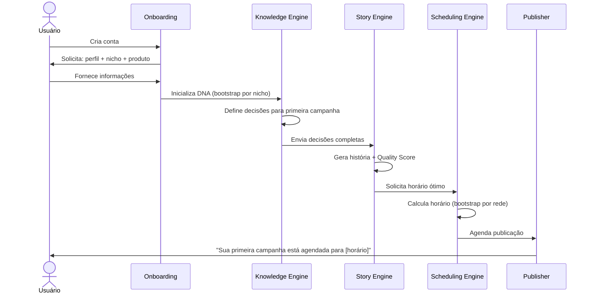
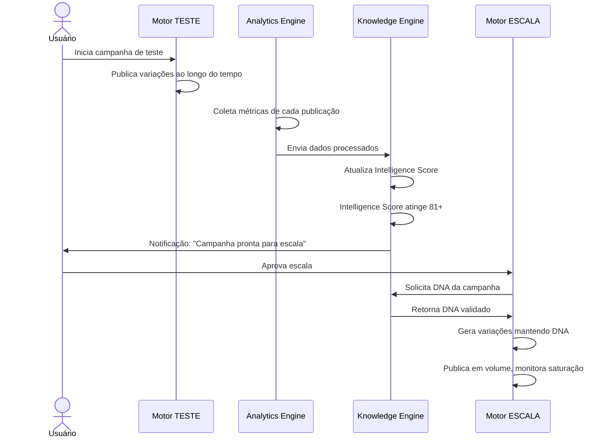
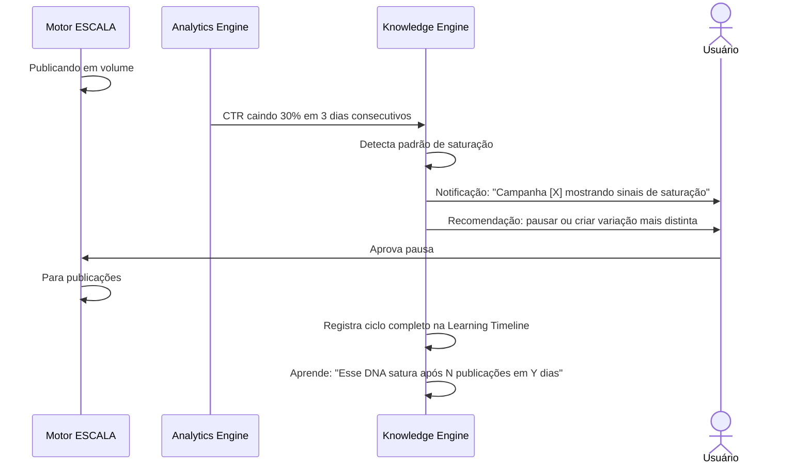

# 03 — Product Requirements Document (PRD)

> *"Um requisito que não pode ser testado não é um requisito — é uma intenção."*

---

## Objetivo deste Documento

Definir com precisão o que a [PLATAFORMA] deve fazer, para quem, sob quais condições e com quais restrições.

Este documento é a ponte entre a filosofia (o que acreditamos) e a arquitetura (como construímos). Todo requisito aqui deve ser rastreável a um princípio filosófico do documento 02. Toda feature de engenharia deve ser rastreável a um requisito aqui.

**Escopo deste documento:** MVP e V1. Funcionalidades de V2/V3 são mencionadas apenas para garantir que a arquitetura do MVP não crie impedimentos futuros.

---

## Modelo de Negócio

### Decisão: Trial com Conversão para Assinatura

**[Decisão P004 resolvida aqui]**

O modelo escolhido é **trial com acesso completo** por período limitado, seguido de conversão para assinatura mensal.

**Por que não freemium:**  
Freemium cria dois produtos — um gratuito (subótimo, para não canibalizar o pago) e um pago. Para uma plataforma cujo valor cresce com dados acumulados, um produto gratuito limitado jamais consegue demonstrar o valor real. O usuário gratuito vive no cold start permanente. Churn é alto. O momento de revelação nunca acontece.

**Por que trial:**  
O trial dá ao usuário acesso ao produto completo. Se o produto entrega valor dentro do período de trial, a conversão é natural. Se não entrega, o problema é de produto — não de modelo de negócio.

**Estrutura do trial:**
- Duração: 14 dias (ponto de partida; a ser validado com dados de conversão)
- Acesso: completo, sem restrições de feature
- Limitação: volume de publicações (teto que evita abuso, não que limita a experiência real)
- Cartão de crédito: não exigido para trial (reduz atrito de aquisição)

**Planos pós-trial:**

| Plano | Perfis | Publicações/mês | Preço estimado | Para quem |
|---|---|---|---|---|
| Starter | 1–2 | 60 | A definir | Persona 1 (Explorador) |
| Growth | 3–5 | 200 | A definir | Persona 2 (Desbravador) |
| Scale | 6–15 | Ilimitado | A definir | Persona 3 (Escalador) |

> **Nota:** Preços são placeholders. Serão definidos com base em benchmarks de mercado e análise de unit economics no documento 17 (Roadmap).

**Decisão registrada:** DECISIONS.md #P004 resolvida → nova entrada será criada.

---

## Usuários e Contexto de Uso

### Usuário Principal (MVP)
Afiliado individual, operando 1–15 perfis em Threads e X, promovendo produtos de Shopee, Amazon e Mercado Livre.

### Contexto de Uso Típico
- Acessa a plataforma 3–5 vezes por semana
- Passa 10–30 minutos por sessão revisando resultados e aprovando direções estratégicas
- Delega toda execução operacional para a plataforma
- Quer ver progresso claro: "o que a plataforma aprendeu? O que está funcionando? O que está ganhando?"

### Contexto de Uso Não Suportado no MVP
- Gestão de múltiplas contas de clientes (multi-tenant)
- Colaboração em equipe no mesmo workspace
- API para integração com sistemas externos

---

## Requisitos Funcionais

Os requisitos são organizados por módulo. Cada requisito tem:
- **ID** único para rastreabilidade
- **Prioridade:** P0 (bloqueador de MVP), P1 (MVP), P2 (V1), P3 (V2+)
- **Critério de aceitação:** condição verificável de que o requisito foi atendido

---

### Módulo 1: Autenticação e Onboarding

#### RF-001 — Cadastro de Conta
**Prioridade:** P0  
**Descrição:** O usuário deve poder criar uma conta com email e senha, ou via OAuth (Google).  
**Critério de aceitação:** Conta criada em menos de 60 segundos, email de confirmação recebido, sessão iniciada automaticamente após confirmação.

#### RF-002 — Onboarding Guiado
**Prioridade:** P0  
**Descrição:** Após criar a conta, o usuário passa por um onboarding estruturado de no máximo 5 passos que conecta seus primeiros perfis, declara seu nicho e inicia o trial.  
**Critério de aceitação:** Usuário chega ao dashboard principal com pelo menos 1 perfil conectado e 1 nicho declarado em menos de 10 minutos.

#### RF-003 — Declaração de Nicho no Onboarding
**Prioridade:** P0  
**Descrição:** No onboarding, o usuário declara o nicho principal de cada perfil (ex: produtos de beleza, tecnologia, casa e decoração). Essa declaração é usada como ponto de partida para o DNA do Perfil antes que dados reais estejam disponíveis (estratégia de cold start — ver DECISIONS P001).  
**Critério de aceitação:** Lista de nichos disponíveis cobre os principais mercados dos três marketplaces integrados. Nicho é salvo e visível no perfil.

#### RF-004 — Conexão de Perfis Sociais
**Prioridade:** P0  
**Descrição:** O usuário deve poder conectar perfis de Threads e X via OAuth. A plataforma solicita apenas as permissões necessárias para publicação e leitura de métricas.  
**Critério de aceitação:** Perfil conectado com sucesso, token armazenado com segurança, primeira publicação de teste possível.

#### RF-005 — Conexão de Contas de Afiliado
**Prioridade:** P1  
**Descrição:** O usuário conecta suas contas de afiliado de Shopee, Amazon e Mercado Livre para importação automática de links e dados de conversão.  
**Critério de aceitação:** Links de afiliado importados automaticamente, conversões reportadas pelos marketplaces sincronizadas com as campanhas correspondentes.

#### RF-006 — Tour do Produto pós-Onboarding
**Prioridade:** P1  
**Descrição:** Após o onboarding, o usuário recebe um tour interativo curto (máximo 5 telas) que explica os dois motores (TESTE e ESCALA) e onde ver resultados.  
**Critério de aceitação:** Tour completado, usuário capaz de criar sua primeira campanha sem ajuda.

---

### Módulo 2: Gestão de Perfis

#### RF-010 — Listagem de Perfis
**Prioridade:** P0  
**Descrição:** Dashboard central mostra todos os perfis conectados com status, rede social, nicho declarado e Intelligence Score atual do DNA do Perfil.  
**Critério de aceitação:** Todos os perfis visíveis com dados atualizados.

#### RF-011 — Detalhes do Perfil e DNA
**Prioridade:** P1  
**Descrição:** Página individual de cada perfil mostra: DNA atual (versão simplificada e legível), histórico de performance, campanhas ativas, Learning Timeline do perfil e Intelligence Score por dimensão.  
**Critério de aceitação:** DNA exibido em linguagem compreensível (não como dado bruto). Usuário entende o que a plataforma sabe sobre aquele perfil.

#### RF-012 — Adição de Novo Perfil
**Prioridade:** P0  
**Descrição:** Usuário pode adicionar novos perfis a qualquer momento, com fluxo de onboarding de perfil equivalente ao onboarding inicial.  
**Critério de aceitação:** Novo perfil operacional em menos de 3 minutos.

#### RF-013 — Desconexão de Perfil
**Prioridade:** P1  
**Descrição:** Usuário pode desconectar um perfil sem perder o histórico de aprendizado associado. Se reconectar no futuro, o DNA e a Learning Timeline são preservados.  
**Critério de aceitação:** Histórico preservado após desconexão. Reconexão restaura estado anterior completo.

---

### Módulo 3: Motor TESTE

#### RF-020 — Criação de Campanha de Teste
**Prioridade:** P0  
**Descrição:** O usuário inicia uma campanha de teste definindo apenas: produto (link de afiliado ou busca no marketplace), perfil e rede. A plataforma decide todas as outras dimensões (narrativa, horário, CTA, estrutura, etc.).  
**Critério de aceitação:** Campanha criada em menos de 2 minutos. Usuário não precisa tomar mais de 3 decisões para iniciar.

#### RF-021 — Visualização de Decisões da Campanha
**Prioridade:** P1  
**Descrição:** Após criar uma campanha, o usuário pode ver quais decisões a plataforma tomou e por quê (narrativa escolhida, horário, CTA, etc.). Mecanismo de transparência (ver DECISIONS #015).  
**Critério de aceitação:** Usuário entende as decisões sem precisar de suporte. Linguagem simples, sem jargão técnico.

#### RF-022 — Aprovação Manual de Publicação (Modo Revisão)
**Prioridade:** P1  
**Descrição:** Usuários que preferem revisar antes de publicar podem ativar o Modo Revisão para uma campanha. Nesse modo, a plataforma prepara o conteúdo mas aguarda aprovação explícita antes de publicar.  
**Critério de aceitação:** Conteúdo apresentado para revisão com contexto claro (por que essa história, por que esse horário). Aprovação em um clique.  
**Regra de aprendizado:** Aprovações e rejeições no Modo Revisão são sinais de aprendizado distintos para o Knowledge Engine. Uma história rejeitada carrega informação sobre o que o DNA do Perfil não tolera — não deve ser ignorada. O KE registra o sinal de rejeição com o motivo (quando fornecido) e pondera em futuras gerações. Detalhes no documento `09 — Knowledge Engine`.

#### RF-023 — Acompanhamento de Testes em Andamento
**Prioridade:** P0  
**Descrição:** Dashboard do Motor Teste mostra todas as campanhas em andamento com: número de publicações realizadas, métricas básicas (cliques, CTR, conversões), Intelligence Score atual e status (aprendendo / padrão emergindo / validando).  
**Critério de aceitação:** Usuário consegue ver o estado de todos os testes em um único painel.

#### RF-024 — Pausa e Encerramento de Teste
**Prioridade:** P0  
**Descrição:** Usuário pode pausar ou encerrar um teste a qualquer momento. A plataforma também pode recomendar pausa ou encerramento com base em critérios definidos (ver DECISIONS P008).  
**Critério de aceitação:** Pausa para publicações dentro de 15 minutos da ação. Histórico do teste preservado.

#### RF-025 — Aprovação Automática para Escala
**Prioridade:** P1  
**Descrição:** Quando um teste atinge Intelligence Score ≥ 81, a plataforma notifica o usuário e recomenda mover para o Motor Escala. O usuário pode aceitar, adiar ou rejeitar.  
**Critério de aceitação:** Notificação clara com contexto do que foi aprendido e por que a plataforma recomenda escala. Decisão do usuário registrada.

---

### Módulo 4: Motor ESCALA

#### RF-030 — Ativação de Campanha de Escala
**Prioridade:** P1  
**Descrição:** A partir de uma campanha validada (Intelligence Score ≥ 81), o usuário ativa o Motor Escala com um clique. A plataforma extrai o DNA da campanha vencedora e começa a gerar variações.  
**Critério de aceitação:** Primeiras variações geradas em menos de 5 minutos após ativação. DNA preservado nas variações.

#### RF-031 — Variações com DNA Preservado
**Prioridade:** P0 (dentro do Motor Escala)  
**Descrição:** Cada variação gerada pelo Motor Escala preserva os elementos essenciais da campanha original (narrativa, estrutura, emoção, produto) enquanto varia elementos de superfície (vocabulário, abertura, CTA secundário).  
**Critério de aceitação:** Variações são reconhecivelmente "da mesma família" que a original. Nenhuma variação contradiz o DNA validado.

#### RF-032 — Controle de Volume de Escala
**Prioridade:** P1  
**Descrição:** O usuário define o volume de publicações por dia/semana para o Motor Escala. A plataforma respeita o limite definido e distribui publicações de forma otimizada.  
**Critério de aceitação:** Volume real de publicações não excede o limite definido em mais de 10%. Distribuição temporal segue recomendações do Scheduling Engine.

#### RF-033 — Detecção de Saturação
**Prioridade:** P1  
**Descrição:** O Motor Escala monitora continuamente indicadores de saturação (queda de CTR, queda de conversão, queda de engajamento relativo). Quando saturação é detectada, o usuário é notificado e a plataforma recomenda pausa ou variação mais agressiva.  
**Critério de aceitação:** Saturação detectada antes de uma queda de 50% nos resultados médios. Notificação com contexto claro.

#### RF-034 — Encerramento de Campanha Saturada
**Prioridade:** P1  
**Descrição:** Campanha detectada como saturada pode ser encerrada automaticamente (com confirmação do usuário) ou manualmente. O aprendizado do ciclo de vida completo da campanha (incluindo saturação) é registrado na Learning Timeline.  
**Critério de aceitação:** Saturação registrada como dado de aprendizado, não como falha. Usuário entende o que aconteceu.

---

### Módulo 5: Story Engine (Geração de Histórias)

#### RF-040 — Geração de História Baseada em Decisões
**Prioridade:** P0  
**Descrição:** O Story Engine gera histórias somente após todas as dimensões de decisão estarem definidas pelo Knowledge Engine: produto, narrativa, público, emoção, horário, perfil, rede, CTA, blocos, tom, personagem e estrutura.  
**Critério de aceitação:** Nenhuma história é gerada sem o conjunto completo de decisões. Tentativas de geração sem decisões completas retornam erro interno (nunca chegam ao usuário como "história incompleta").

#### RF-041 — Quality Score por História
**Prioridade:** P1  
**Descrição:** Cada história gerada recebe um Quality Score automático antes de ser publicada ou apresentada para revisão. Histórias abaixo do mínimo de qualidade são regeneradas automaticamente (até 3 tentativas antes de notificar o usuário).  
**Critério de aceitação:** Histórias com Quality Score abaixo do mínimo nunca chegam ao usuário nem ao Publisher. Parâmetros de qualidade definidos no documento 06.

#### RF-042 — Variações de Estrutura Narrativa
**Prioridade:** P1  
**Descrição:** O Story Engine suporta múltiplas estruturas narrativas (transformação, mistério, urgência, curiosidade, problema-solução, etc.) e seleciona a estrutura baseada nas decisões do Knowledge Engine.  
**Critério de aceitação:** Mínimo de 8 estruturas narrativas distintas no MVP. Estruturas documentadas no documento 06.

#### RF-043 — Consistência com DNA do Perfil
**Prioridade:** P0  
**Descrição:** Toda história gerada é verificada contra o DNA do Perfil para garantir consistência de voz, tom e vocabulário. Histórias que contradizem o DNA são regeneradas.  
**Critério de aceitação:** Usuário que lê uma história gerada reconhece a voz do seu perfil. DNA sempre consultado antes de geração.

---

### Módulo 6: Scheduling Engine (Agendamento)

#### RF-050 — Decisão Autônoma de Horário
**Prioridade:** P0  
**Descrição:** O Scheduling Engine decide autonomamente o melhor horário para publicação de cada conteúdo. O usuário não configura horários. A plataforma explica sua escolha quando solicitada.  
**Critério de aceitação:** Horário calculado com base em dados do perfil, rede e produto. Usuário pode ver o raciocínio.

#### RF-051 — Preview de Agenda
**Prioridade:** P1  
**Descrição:** O usuário pode ver um calendário com as publicações agendadas para os próximos 7 dias, incluindo horário estimado, perfil, tipo de campanha e status.  
**Critério de aceitação:** Calendário atualizado em tempo real. Usuário pode ver o que vai ser publicado sem poder editar horários.

#### RF-052 — Resposta a Eventos Externos (V1)
**Prioridade:** P2  
**Descrição:** Em V1, o Scheduling Engine considera datas comemorativas e tendências de mercado detectadas ao recalcular horários e frequência de publicação.  
**Critério de aceitação:** Publicações de produtos sazonais são priorizadas nas datas relevantes. Configuração automática, sem intervenção do usuário.

---

### Módulo 7: Knowledge Engine e Aprendizado

#### RF-060 — Learning Timeline
**Prioridade:** P1  
**Descrição:** O usuário tem acesso a uma Learning Timeline que mostra cronologicamente o que a plataforma aprendeu sobre seus perfis e campanhas, em linguagem simples e não técnica.  
**Critério de aceitação:** Mínimo de uma entrada nova na Learning Timeline por semana de uso ativo. Entradas escritas em português claro, sem jargão.

#### RF-061 — Intelligence Score Visível por Campanha
**Prioridade:** P1  
**Descrição:** Cada campanha tem um Intelligence Score visível ao usuário, apresentado de forma simplificada (ex: "Em aprendizado", "Confiança moderada", "Alta confiança", "Validado para escala").  
**Critério de aceitação:** Usuário entende o status de cada campanha sem precisar saber o que é Intelligence Score tecnicamente.

#### RF-062 — Insights Proativos (V1)
**Prioridade:** P2  
**Descrição:** A plataforma envia insights proativos ao usuário quando detecta padrões relevantes: "Suas campanhas de quinta-feira têm 40% mais conversão. Aumentamos o volume nesse dia."  
**Critério de aceitação:** Insights acionáveis, não apenas informativos. Cada insight sugere ou confirma uma ação já tomada pela plataforma.

#### RF-063 — Decaimento e Revalidação (V1)
**Prioridade:** P2  
**Descrição:** Padrões com Intelligence Score decaindo são automaticamente sinalizados para revalidação pelo Motor Teste, sem intervenção do usuário.  
**Critério de aceitação:** Nenhum padrão com score abaixo do limiar de decaimento guia decisões de escala sem revalidação. Parâmetros no documento 15.

---

### Módulo 8: Publisher (Publicação)

#### RF-070 — Publicação em Threads
**Prioridade:** P0  
**Descrição:** A plataforma publica conteúdo em perfis de Threads no horário calculado pelo Scheduling Engine.  
**Critério de aceitação:** Taxa de sucesso de publicação ≥ 98%. Falhas registradas e notificadas ao usuário.

#### RF-071 — Publicação em X (Twitter)
**Prioridade:** P0  
**Descrição:** A plataforma publica conteúdo em perfis de X (Twitter) no horário calculado pelo Scheduling Engine.  
**Critério de aceitação:** Taxa de sucesso de publicação ≥ 98%. Falhas registradas e notificadas ao usuário.

#### RF-072 — Tratamento de Falhas de Publicação
**Prioridade:** P0  
**Descrição:** Falhas de publicação (API indisponível, rate limit, erro de autenticação) são tratadas com retry automático dentro de uma janela de tempo aceitável. Falhas persistentes notificam o usuário com contexto claro.  
**Critério de aceitação:** Retry automático em até 3 tentativas com backoff exponencial. Notificação após 3 falhas consecutivas.

#### RF-073 — Log de Publicações
**Prioridade:** P0  
**Descrição:** Todas as publicações (bem-sucedidas e falhas) são registradas com timestamp, conteúdo, perfil, rede e resultado.  
**Critério de aceitação:** Log acessível ao usuário via histórico de campanha. Dados preservados permanentemente.

---

### Módulo 9: Analytics e Métricas

#### RF-080 — Coleta de Métricas de Publicação
**Prioridade:** P0  
**Descrição:** O Analytics Engine coleta automaticamente impressões, alcance, engajamento (curtidas, comentários, compartilhamentos, reposts) e cliques em links para cada publicação.  
**Critério de aceitação:** Métricas atualizadas com delay máximo de 6 horas.

#### RF-081 — Rastreamento de Cliques em Links de Afiliado
**Prioridade:** P0  
**Descrição:** Cada link de afiliado publicado é rastreado para permitir atribuição de cliques a campanhas específicas.  
**Critério de aceitação:** 100% dos cliques rastreáveis atribuídos à campanha correta.  
**Restrição obrigatória:** A compatibilidade do mecanismo de rastreamento com os sistemas de atribuição de Shopee, Amazon e Mercado Livre deve ser **validada tecnicamente antes da implementação**. Qualquer mecanismo que quebre a atribuição de comissões do marketplace é inaceitável. Validação obrigatória no documento `13 — Integrações`.

#### RF-082 — Sincronização de Conversões dos Marketplaces
**Prioridade:** P1  
**Descrição:** Conversões reportadas pelos marketplaces (Shopee, Amazon, Mercado Livre) são sincronizadas e atribuídas às campanhas correspondentes via rastreamento de link.  
**Critério de aceitação:** Conversões sincronizadas dentro do prazo de reporte de cada marketplace. Atribuição com confiança auditável.

#### RF-083 — Dashboard de Performance Básico
**Prioridade:** P0  
**Descrição:** Dashboard principal mostra: total de campanhas ativas, publicações nas últimas 24h/7d, cliques, CTR médio, conversões e comissão acumulada no período selecionado.  
**Critério de aceitação:** Dashboard carrega em menos de 2 segundos. Dados do dia atual disponíveis.

---

### Módulo 10: Notificações

#### RF-090 — Notificações In-App
**Prioridade:** P1  
**Descrição:** O sistema notifica o usuário sobre eventos relevantes: campanha pronta para escala, saturação detectada, falha de publicação, insight importante, limite de plano próximo.  
**Critério de aceitação:** Notificações aparecem em menos de 5 minutos do evento. Cada notificação tem uma ação clara associada.

#### RF-091 — Notificações por Email (V1)
**Prioridade:** P2  
**Descrição:** Resumo semanal por email com highlights da semana: o que a plataforma aprendeu, melhores resultados, campanhas recomendadas para escala.  
**Critério de aceitação:** Email enviado toda segunda-feira. Conteúdo personalizado por usuário, não genérico.

---

### Módulo 11: Configurações e Conta

#### RF-100 — Gestão de Assinatura
**Prioridade:** P1  
**Descrição:** Usuário gerencia plano, método de pagamento e histórico de faturas dentro da plataforma.  
**Critério de aceitação:** Upgrade e downgrade de plano em menos de 2 minutos. Faturas acessíveis em PDF.

#### RF-101 — Configurações de Conta
**Prioridade:** P1  
**Descrição:** Usuário pode alterar email, senha, preferências de notificação e configurações de privacidade.  
**Critério de aceitação:** Alterações salvas imediatamente. Email de confirmação para mudança de email.

#### RF-102 — Exportação de Dados (V1)
**Prioridade:** P2  
**Descrição:** Usuário pode exportar histórico de campanhas, métricas e Learning Timeline em formato CSV ou JSON.  
**Critério de aceitação:** Exportação completa disponível em menos de 5 minutos para históricos de até 12 meses.

---

## Requisitos Não-Funcionais

### Performance

| Requisito | Métrica | Justificativa |
|---|---|---|
| **RNF-001** — Tempo de carregamento do dashboard | < 2 segundos (P95) | Experiência fluida no uso diário |
| **RNF-002** — Tempo de geração de história | < 30 segundos (P95) | Aceitável para geração assíncrona |
| **RNF-003** — Tempo de resposta da API interna | < 500ms (P95) | Consultas síncronas (CQRS — ver DECISIONS P003) |
| **RNF-004** — Taxa de sucesso de publicação | ≥ 98% | Core do produto |
| **RNF-005** — Disponibilidade da plataforma | ≥ 99.5% uptime | Publicações são agendadas; downtime causa atrasos |

### Escalabilidade

| Requisito | Métrica |
|---|---|
| **RNF-010** — Usuários simultâneos no MVP | Suportar até 1.000 usuários ativos sem degradação |
| **RNF-011** — Publicações por hora | Suportar 10.000 publicações/hora (estimativa V1 conservadora) |
| **RNF-012** — Crescimento do Knowledge DB | Arquitetura suporta crescimento ilimitado de dados históricos sem degradação de leitura |

### Segurança

| Requisito | Descrição |
|---|---|
| **RNF-020** — Tokens de API de redes sociais | Armazenados criptografados at rest. Nunca expostos em logs ou UI. |
| **RNF-021** — Dados de afiliado | Comissões e conversões são dados sensíveis. Acesso restrito ao usuário dono da conta. |
| **RNF-022** — Autenticação | JWT com refresh token. Sessões expiram em 30 dias. MFA opcional no MVP, planejado como obrigatório em V1. |
| **RNF-023** — LGPD | Plataforma em conformidade com LGPD desde o MVP. Direito de exclusão de dados implementado. |

### Confiabilidade

| Requisito | Descrição |
|---|---|
| **RNF-030** — Fallback de modelo de IA | Se o modelo primário falhar, a Intelligence Layer redireciona para modelo alternativo automaticamente. |
| **RNF-031** — Retry de publicação | Falhas de API de redes sociais têm retry com backoff exponencial (3 tentativas, 5min/15min/30min). |
| **RNF-032** — Preservação do Knowledge Engine | Dados do Knowledge Engine nunca podem ser perdidos em falha de sistema. Backup contínuo obrigatório. |
| **RNF-033** — Idempotência de publicação | O sistema nunca publica o mesmo conteúdo duas vezes por falha de retry. |

### Experiência do Usuário

| Requisito | Descrição |
|---|---|
| **RNF-040** — Onboarding | Novo usuário operacional em menos de 10 minutos |
| **RNF-041** — Curva de aprendizado | Qualquer pessoa usa o produto sem tutorial em 5 minutos |
| **RNF-042** — Estados de erro | Toda mensagem de erro tem: o que aconteceu, por que aconteceu, o que o usuário pode fazer |
| **RNF-043** — Estados de loading | Toda operação assíncrona tem feedback visual imediato |
| **RNF-044** — Responsividade | Interface usável em mobile (especialmente dashboard e aprovação de conteúdo) |

---

## Restrições

### Restrições Técnicas
- O MVP não suporta publicação em Instagram, TikTok, LinkedIn ou qualquer rede além de Threads e X
- O MVP não suporta conteúdo com imagens ou vídeos (apenas texto)
- O MVP não tem API pública para integrações externas
- **Rate limits de APIs de redes sociais:** A plataforma opera sempre dentro dos limites oficiais de cada rede. Nenhum número absoluto de publicações é prometido ao usuário — o volume efetivo depende dos rate limits vigentes de Threads e X para contas de aplicativo. Detalhes obrigatórios no documento `13 — Integrações`. (DECISIONS #P001-API)

### Restrições de Negócio
- O MVP não inclui funcionalidade de revenda ou white-label
- O MVP não suporta pagamento por uso (pay-per-publish) — apenas assinatura mensal
- Dados de usuários não são compartilhados com terceiros. Padrões de mercado extraídos são anonimizados.

### Restrições Regulatórias
- Conformidade com LGPD (Brasil) obrigatória desde o MVP
- Links de afiliado publicados devem ser identificados conforme resolução do CONAR quando aplicável
- Dados de conversão de marketplaces são de propriedade do afiliado — a plataforma é processadora, não controladora

---

## Casos Extremos

### CE-001: Usuário sem conversões após 30 dias de trial
**Situação:** Usuário completou trial sem nenhuma conversão registrada.  
**Comportamento esperado:** Plataforma comunica o que foi aprendido (mesmo sem conversões, há dados de cliques e engajamento). Apresenta o próximo passo recomendado. Não apresenta o trial como falha — apresenta como fase de aprendizado com valor acumulado.

### CE-002: API de rede social indisponível no horário de publicação
**Situação:** Threads ou X com API indisponível quando publicação está agendada.  
**Comportamento esperado:** Retry automático. Se persistir por mais de 2 horas, notificar usuário e reprogramar para o próximo horário ótimo calculado pelo Scheduling Engine.

### CE-003: Quality Score abaixo do mínimo após 3 tentativas de geração
**Situação:** Story Engine não consegue gerar história com Quality Score adequado após 3 tentativas.  
**Comportamento esperado:** Publicação é adiada. Usuário é notificado com contexto. Plataforma registra o evento para análise interna (pode indicar problema com o prompt ou com o modelo em uso).

### CE-004: Marketplace não reporta conversão (delay ou falha)
**Situação:** Conversão ocorreu mas o marketplace não reportou dentro do prazo esperado.  
**Comportamento esperado:** Analytics Engine mantém rastreamento de cliques atribuíveis. Quando a conversão é reportada com delay, é atribuída retroativamente à campanha correta. Usuário vê "conversão pendente de confirmação" quando o delay é detectado.

### CE-005: Usuário tenta manualmente mover campanha com score < 81 para escala
**Situação:** Interface não permite — mas usuário encontra uma forma (ex: bug ou edge case).  
**Comportamento esperado:** Validação de backend rejeita a operação mesmo que o frontend aceite. Regra de negócio implementada em duas camadas (UI + API). Log do evento para auditoria.

### CE-006: Perfil conectado perde autorização (token revogado)
**Situação:** Usuário revoga o acesso da plataforma nas configurações da rede social.  
**Comportamento esperado:** Publicações agendadas para esse perfil são pausadas automaticamente. Usuário notificado imediatamente. DNA e histórico preservados. Reativação com reconexão OAuth.

---

## Fluxos Críticos

### Fluxo 1: Primeira Campanha (Usuário Novo)

### Fluxo 2: Campanha de Teste → Validação → Escala

### Fluxo 3: Detecção e Resposta à Saturação

---

## Definição de Pronto (Definition of Done)

Uma feature está "pronta" quando:

1. ✅ Implementa exatamente o que está documentado no PRD (sem adições, sem omissões)
2. ✅ Tem testes automatizados cobrindo o critério de aceitação
3. ✅ Passa em todos os requisitos não-funcionais relevantes
4. ✅ Tem tratamento de erro para todos os casos extremos documentados
5. ✅ Foi revisada por pelo menos uma outra pessoa (code review)
6. ✅ A documentação correspondente foi atualizada se a implementação divergiu do documento
7. ✅ Funciona em ambiente de staging com dados reais de teste

---

## Requisitos Excluídos do MVP (Registro Explícito)

Estes requisitos foram deliberadamente excluídos do MVP para manter foco. Sua ausência é intencional, não um esquecimento.

| Requisito | Excluído até | Motivo |
|---|---|---|
| Publicação com imagens | V1 | Adiciona complexidade de geração de imagem sem validar o core |
| Publicação em Instagram | V1 | API restrita; foco em Threads/X primeiro |
| Publicação em TikTok | V2 | Requer geração de vídeo; fora do escopo inicial |
| Multi-tenant (gestão de clientes) | V2 | Persona 4 é V2/V3 (DECISIONS #009) |
| API pública | V2 | Produto precisa ser validado antes de criar dependências externas |
| Relatórios customizados | V1 | Dashboard padrão suficiente para MVP |
| Integração com Hotmart/Eduzz | V1 | Foco em marketplaces físicos primeiro |
| Modo de colaboração em equipe | V2 | Single-user no MVP |

---

## Decisões Registradas

| Data | Decisão |
|---|---|
| 2026-07-11 | Modelo de negócio: trial 14 dias com acesso completo → assinatura mensal (P004 resolvida) |
| 2026-07-11 | MVP: texto apenas, sem imagens ou vídeos |
| 2026-07-11 | MVP: Threads e X apenas |
| 2026-07-11 | MVP: Shopee, Amazon e Mercado Livre apenas |
| 2026-07-11 | Modo Revisão (RF-022) é opt-in; objetivo de longo prazo é full autonomy |

---

*Documento criado em: 2026-07-11*  
*Versão: 0.2 — Aprovado*
