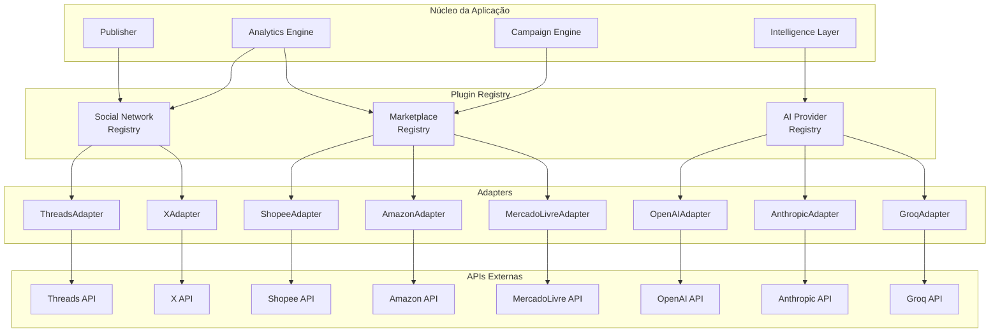
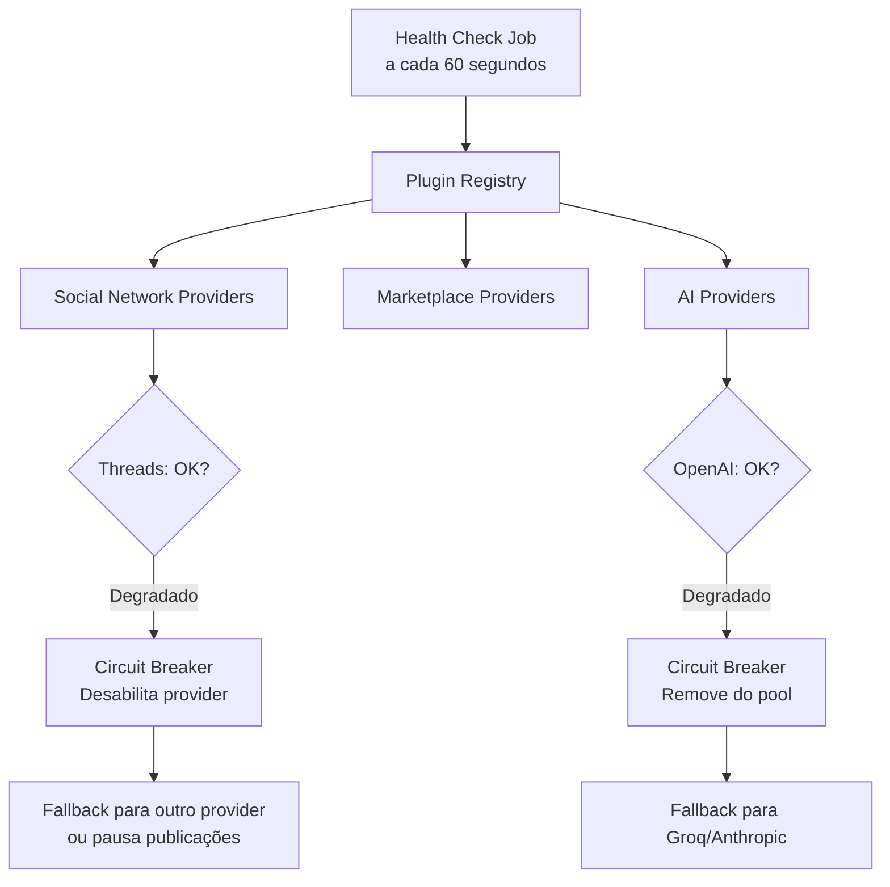
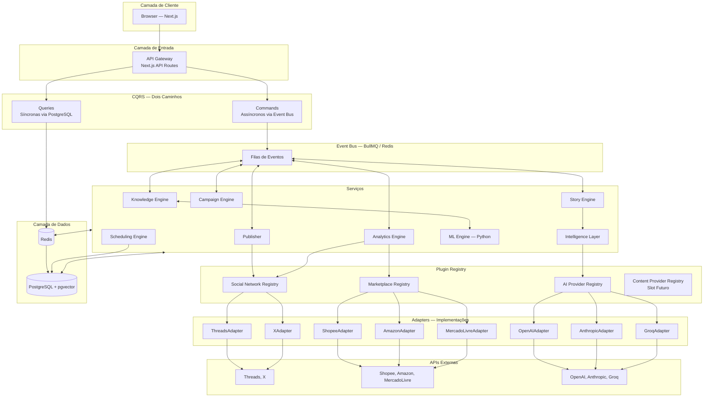
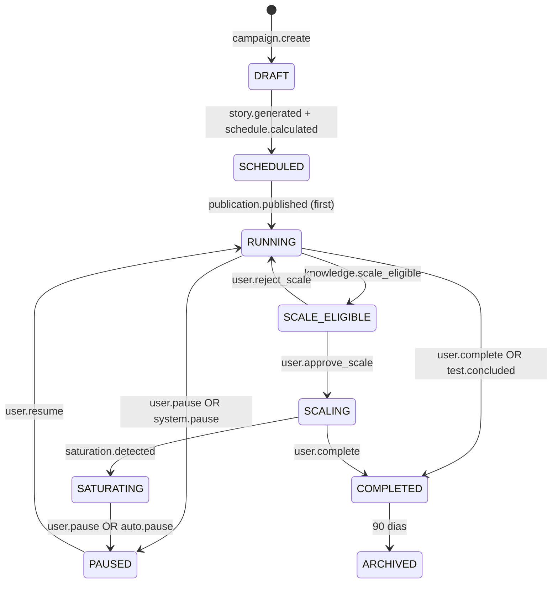
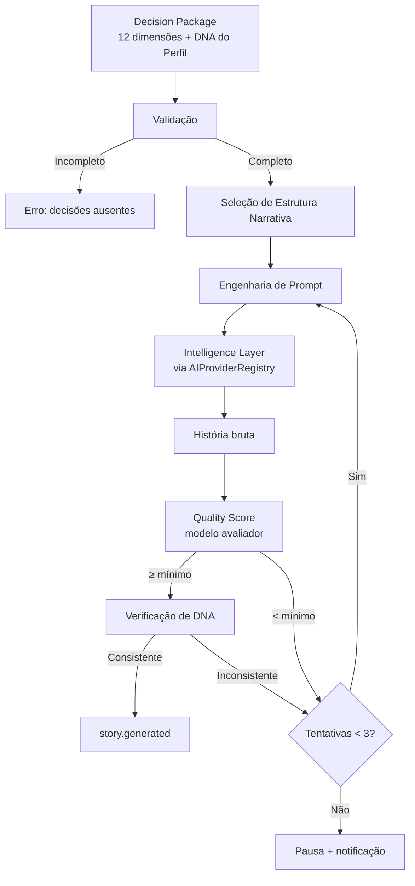
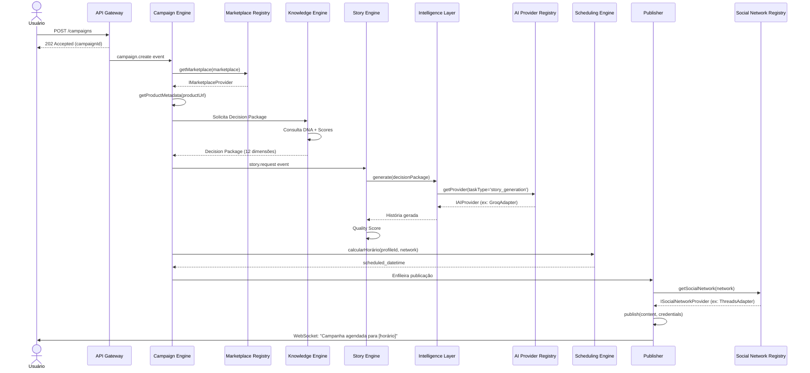
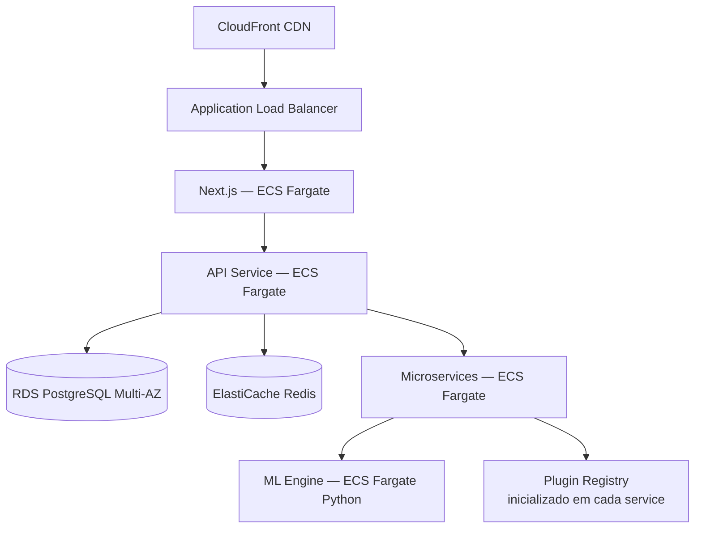

# 04 — Arquitetura Geral

> *"A arquitetura é o produto. Cada decisão técnica se acumula. Atalhos hoje são impostos amanhã."*

---

## Objetivo deste Documento

Definir a arquitetura técnica completa da [PLATAFORMA]: princípios, padrões de extensibilidade, componentes, comunicação, stack tecnológica, fluxos de dados, banco de dados, infraestrutura e observabilidade.

Este documento é a referência única para todo desenvolvedor que implementar qualquer parte do sistema. Toda feature deve ser rastreável a um componente definido aqui.

---

## Princípios Arquiteturais

1. **Desacoplamento sobre conveniência** — Componentes independentes sobrevivem a falhas individuais e escalam separadamente.
2. **Substituibilidade total** — Qualquer integração externa (rede social, marketplace, modelo de IA) pode ser substituída sem alterar o núcleo da aplicação.
3. **Dados nunca são perdidos** — Toda informação que entra no sistema pode ser recuperada. Sem deleção destrutiva.
4. **Observabilidade em primeiro lugar** — Se não pode ser medido, não existe.
5. **Contratos explícitos** — Toda comunicação entre componentes segue um contrato definido (TypeScript interface ou schema de evento).
6. **Escala progressiva** — A arquitetura do MVP suporta crescimento sem reescrita. O que cresce é a infraestrutura, não o design.
7. **Extensibilidade por design** — Adicionar suporte a uma nova rede social, marketplace ou modelo de IA nunca exige alteração do núcleo da aplicação.

---

## Stack Tecnológica

| Camada | Tecnologia | Alternativas Consideradas | Motivo |
|---|---|---|---|
| **Backend (serviços principais)** | TypeScript / Node.js | Python, Go | I/O assíncrono excelente. Tipagem end-to-end com frontend. |
| **Backend (ML Engine)** | Python | Node.js | Ecossistema científico: scikit-learn, pandas, numpy. |
| **Frontend** | Next.js 14+ (App Router) | Vue/Nuxt, SvelteKit | Melhor React framework. SSR nativo. TypeScript first. |
| **UI** | Tailwind CSS + shadcn/ui | Chakra UI, MUI | Sem runtime CSS. Rápido de construir, fácil de customizar. |
| **Banco primário** | PostgreSQL | MySQL, MongoDB | ACID, queries complexas, extensível (pgvector). |
| **Busca vetorial** | pgvector (extensão PostgreSQL) | Pinecone, Weaviate | Evita banco de dados adicional. Padrões vivem no PostgreSQL. |
| **Cache** | Redis | Memcached | Versátil: cache + queue + pub/sub. |
| **Event Queue (MVP)** | BullMQ (Redis-based) | Kafka, SQS | Zero infraestrutura adicional além do Redis. Migração para Kafka em V2 possível. |
| **Plugin Registry** | TypeScript nativo | — | Sem framework. Contrato por interface TypeScript. |
| **Containerização** | Docker | — | Padrão sem alternativa relevante. |
| **Cloud** | AWS | GCP, Azure | Ecossistema mais amplo para startups. |
| **CI/CD** | GitHub Actions | CircleCI | Nativo ao GitHub. |
| **Monitoramento** | AWS CloudWatch + Sentry | Datadog | Integrado ao AWS. Custo zero até escala. |
| **Rastreamento distribuído** | OpenTelemetry | Zipkin | Padrão aberto, agnóstico de backend. |
| **Auth** | JWT + Refresh Token | Session-based | Stateless, escalável horizontalmente. |

---

## Plugin Architecture

Este é o padrão arquitetural mais importante do sistema. Toda integração com o mundo externo passa por ele.

### O Problema que Resolve

Sem Plugin Architecture, adicionar suporte ao TikTok exigiria:
- Modificar o Publisher (adicionar `if network === 'tiktok'`)
- Modificar o Analytics Engine (adicionar coleta de métricas do TikTok)
- Possivelmente tocar o Scheduling Engine, Story Engine e Campaign Engine

Com Plugin Architecture, adicionar suporte ao TikTok exige:
- Implementar `ISocialNetworkProvider`
- Registrar `TikTokAdapter` no Plugin Registry
- Fim. Zero alterações no núcleo.

### A Garantia Técnica

A Plugin Architecture transforma a filosofia de agnositicismo (de IA, de rede, de marketplace) de uma **intenção** em uma **garantia verificável em compilação**. Um desenvolvedor que tente integrar Threads diretamente no Publisher receberá um erro de TypeScript — não vai descobrir o problema em produção.

### Visão Geral das Interfaces



---

### Interface 1: ISocialNetworkProvider

Define o contrato que qualquer rede social deve implementar para ser suportada pela plataforma.

```typescript
interface ISocialNetworkProvider {
  // Identificação
  readonly id: string;           // 'threads', 'x', 'tiktok', 'instagram'
  readonly name: string;         // 'Threads', 'X (Twitter)'
  readonly version: string;      // versão do adapter

  // Capacidades da rede
  readonly capabilities: SocialNetworkCapabilities;

  // Autenticação
  getOAuthConfig(): OAuthConfig;
  validateCredentials(credentials: NetworkCredentials): Promise<CredentialValidationResult>;
  refreshToken(credentials: NetworkCredentials): Promise<NetworkCredentials>;

  // Limites
  getRateLimits(): Promise<RateLimitConfig>;
  getCurrentRateLimit(credentials: NetworkCredentials): Promise<RateLimitStatus>;

  // Publicação
  publish(
    content: PublicationContent,
    credentials: NetworkCredentials
  ): Promise<PublicationResult>;

  // Métricas
  getPostMetrics(
    postId: string,
    credentials: NetworkCredentials
  ): Promise<PostMetrics>;

  getAccountMetrics(
    accountId: string,
    dateRange: DateRange,
    credentials: NetworkCredentials
  ): Promise<AccountMetrics>;

  // Saúde
  healthCheck(): Promise<ProviderHealth>;
}

interface SocialNetworkCapabilities {
  supportsText: boolean;
  supportsImages: boolean;
  supportsVideo: boolean;
  supportsCarousel: boolean;
  supportsThreads: boolean;     // publicação em thread/sequência
  maxTextLength: number;
  maxImagesPerPost: number;
  supportsWebhooks: boolean;    // se suporta webhooks para métricas em tempo real
}
```

**Implementações no MVP:**
- `ThreadsAdapter implements ISocialNetworkProvider`
- `XAdapter implements ISocialNetworkProvider`

**Implementações futuras (sem alterar nada no núcleo):**
- `InstagramAdapter`, `TikTokAdapter`, `LinkedInAdapter`, `BlueskyAdapter`

---

### Interface 2: IMarketplaceProvider

Define o contrato que qualquer marketplace de afiliados deve implementar.

```typescript
interface IMarketplaceProvider {
  // Identificação
  readonly id: string;           // 'shopee', 'amazon', 'mercadolivre'
  readonly name: string;
  readonly version: string;

  // Compatibilidade de rastreamento (DECISIONS #020 — obrigatório)
  validateTrackingCompatibility(): Promise<TrackingCompatibilityResult>;

  // Links
  generateAffiliateLink(
    productUrl: string,
    affiliateToken: string,
    trackingParams: TrackingParams
  ): Promise<AffiliateLink>;

  validateLink(url: string): boolean;
  extractProductId(url: string): string | null;

  // Produtos
  getProductMetadata(productId: string): Promise<ProductMetadata>;
  searchProducts(query: string, category?: string): Promise<ProductSearchResult[]>;

  // Conversões
  getConversions(
    accountId: string,
    dateRange: DateRange,
    credentials: MarketplaceCredentials
  ): Promise<Conversion[]>;

  getCommissionRate(productId: string): Promise<CommissionInfo>;

  // Configuração
  getAuthConfig(): MarketplaceAuthConfig;
  validateCredentials(credentials: MarketplaceCredentials): Promise<boolean>;

  // Saúde
  healthCheck(): Promise<ProviderHealth>;
}
```

**Implementações no MVP:**
- `ShopeeAdapter implements IMarketplaceProvider`
- `AmazonAdapter implements IMarketplaceProvider`
- `MercadoLivreAdapter implements IMarketplaceProvider`

**Implementações futuras:**
- `HotmartAdapter`, `EduzzAdapter`, `ClickBankAdapter`

---

### Interface 3: IAIProvider

Define o contrato que qualquer provedor de IA deve implementar. Esta interface formaliza o que a Intelligence Layer já implementava informalmente.

```typescript
interface IAIProvider {
  // Identificação
  readonly id: string;           // 'openai', 'anthropic', 'groq', 'google'
  readonly name: string;
  readonly version: string;

  // Modelos disponíveis
  readonly availableModels: AIModel[];
  getModel(modelId: string): AIModel | null;

  // Capacidades
  readonly capabilities: AIProviderCapabilities;

  // Geração
  generate(request: AIGenerationRequest): Promise<AIGenerationResponse>;
  generateStream(request: AIGenerationRequest): AsyncIterable<AIStreamChunk>;

  // Custo e limites
  estimateCost(request: AIGenerationRequest): CostEstimate;
  getRateLimits(): RateLimitConfig;
  getCurrentUsage(): Promise<UsageInfo>;

  // Saúde
  healthCheck(): Promise<ProviderHealth>;
}

interface AIModel {
  id: string;                    // 'gpt-4o', 'claude-sonnet-4-5', 'llama-3.1-70b'
  contextWindow: number;
  maxOutputTokens: number;
  costPerInputToken: number;     // USD
  costPerOutputToken: number;    // USD
  capabilities: ModelCapabilities;
  speedTier: 'fast' | 'balanced' | 'powerful';
}

interface AIProviderCapabilities {
  supportsStreaming: boolean;
  supportsFunctionCalling: boolean;
  supportsVision: boolean;
  supportsSystemPrompts: boolean;
  maxConcurrentRequests: number;
}
```

**Implementações no MVP:**
- `OpenAIAdapter implements IAIProvider`
- `AnthropicAdapter implements IAIProvider`
- `GroqAdapter implements IAIProvider`

**Implementações futuras:**
- `GoogleAdapter`, `OllamaAdapter` (local), `OpenRouterAdapter`

---

### Interface 4: IContentProvider (Slot Futuro)

> **Por que incluir agora:** Quando adicionarmos geração de imagens (V1) e vídeos (V2), o Story Engine precisará solicitar conteúdo visual. Criar esse slot agora evita que o Story Engine seja reescrito quando chegar essa hora.

```typescript
interface IContentProvider {
  readonly id: string;           // 'stability', 'dalle', 'runway', 'sora'
  readonly name: string;
  readonly contentType: 'image' | 'video' | 'audio';

  generate(request: ContentGenerationRequest): Promise<ContentGenerationResult>;
  estimateCost(request: ContentGenerationRequest): CostEstimate;
  healthCheck(): Promise<ProviderHealth>;
}
```

No MVP, nenhum `IContentProvider` é implementado. O Story Engine verifica via Plugin Registry se há providers disponíveis — e, não havendo, opera em modo texto apenas. Quando Stability AI ou DALL-E for integrado em V1, o Story Engine já sabe como usá-lo.

---

### Plugin Registry

O Plugin Registry é o componente central de gerenciamento de todos os providers. É inicializado na startup da aplicação e injetado em todos os serviços que precisam de integrações externas.

```typescript
interface IPluginRegistry {
  // Registro
  registerSocialNetwork(provider: ISocialNetworkProvider): void;
  registerMarketplace(provider: IMarketplaceProvider): void;
  registerAIProvider(provider: IAIProvider): void;
  registerContentProvider(provider: IContentProvider): void;

  // Acesso
  getSocialNetwork(id: string): ISocialNetworkProvider;
  getMarketplace(id: string): IMarketplaceProvider;
  getAIProvider(id: string): IAIProvider;
  getContentProvider(id: string): IContentProvider | null; // null = não disponível

  // Listagem
  listSocialNetworks(): ISocialNetworkProvider[];
  listMarketplaces(): IMarketplaceProvider[];
  listAIProviders(): IAIProvider[];

  // Saúde
  getRegistryHealth(): Promise<RegistryHealthReport>;
  getProviderHealth(type: ProviderType, id: string): Promise<ProviderHealth>;

  // Feature flags de provider
  isProviderEnabled(type: ProviderType, id: string): boolean;
  enableProvider(type: ProviderType, id: string): void;
  disableProvider(type: ProviderType, id: string): void;
}
```

**Inicialização na startup:**

```typescript
// bootstrap/plugins.ts — executado uma vez na inicialização

import { PluginRegistry } from '../core/plugin-registry';
import { ThreadsAdapter } from '../adapters/social/threads';
import { XAdapter } from '../adapters/social/x';
import { ShopeeAdapter } from '../adapters/marketplace/shopee';
import { AmazonAdapter } from '../adapters/marketplace/amazon';
import { MercadoLivreAdapter } from '../adapters/marketplace/mercadolivre';
import { OpenAIAdapter } from '../adapters/ai/openai';
import { AnthropicAdapter } from '../adapters/ai/anthropic';
import { GroqAdapter } from '../adapters/ai/groq';

export function bootstrapPlugins(config: AppConfig): IPluginRegistry {
  const registry = new PluginRegistry();

  // Redes sociais
  registry.registerSocialNetwork(new ThreadsAdapter(config.threads));
  registry.registerSocialNetwork(new XAdapter(config.x));

  // Marketplaces
  registry.registerMarketplace(new ShopeeAdapter(config.shopee));
  registry.registerMarketplace(new AmazonAdapter(config.amazon));
  registry.registerMarketplace(new MercadoLivreAdapter(config.mercadolivre));

  // Provedores de IA
  registry.registerAIProvider(new OpenAIAdapter(config.openai));
  registry.registerAIProvider(new AnthropicAdapter(config.anthropic));
  registry.registerAIProvider(new GroqAdapter(config.groq));

  return registry;
}
```

**Como o Publisher usa o registry:**

```typescript
// Antes (acoplamento direto — PROIBIDO):
if (publication.network === 'threads') {
  await threadsApi.post(content); // ❌
} else if (publication.network === 'x') {
  await xApi.tweet(content); // ❌
}

// Depois (via Plugin Registry — CORRETO):
const provider = registry.getSocialNetwork(publication.network);
await provider.publish(content, credentials); // ✅
```

**Como adicionar uma nova rede social (exemplo: Bluesky):**

```
1. Criar BlueskyAdapter implements ISocialNetworkProvider
2. Implementar todos os métodos da interface
3. Adicionar BlueskyAdapter ao bootstrap/plugins.ts
4. Adicionar credenciais ao config
5. Done.
```

Zero alterações no Publisher, Analytics Engine, Campaign Engine, Story Engine, Scheduling Engine, ou Knowledge Engine.

---

### Health Monitoring do Registry

O Plugin Registry monitora continuamente a saúde de todos os providers registrados.



**Estados de saúde de um provider:**
- `HEALTHY` — respondendo normalmente
- `DEGRADED` — respondendo com latência acima do normal ou erros ocasionais
- `UNHEALTHY` — falhas consistentes, removido do pool ativo
- `DISABLED` — desabilitado manualmente via feature flag

---

## Visão Geral da Arquitetura (Completa)



---

## Padrão CQRS — Separação de Comandos e Consultas

**[Decisão P003 resolvida aqui]**

O sistema segue CQRS com dois caminhos explicitamente separados:

### Commands (Escrita — Assíncrono)

Toda operação que modifica estado vai para o Event Bus. O chamador recebe `202 Accepted` imediatamente.

```
Cliente → API Gateway → Event Bus (BullMQ) → Serviço responsável → PostgreSQL (write)
```

### Queries (Leitura — Síncrono)

Toda operação que apenas lê estado vai direto ao banco, com cache Redis.

```
Cliente → API Gateway → Redis Cache → PostgreSQL (read) → Resposta
```

### Por que CQRS

Forçar queries pelo Event Bus criaria latência inaceitável no dashboard (500ms–2s vs. < 100ms com cache). CQRS mantém escrita assíncrona e leitura síncrona — a melhor performance em cada direção.

---

## Event Bus — Filas e Contratos

### Tecnologia: BullMQ sobre Redis

Zero infraestrutura adicional além do Redis já necessário. Retry com backoff exponencial nativo. Dead letter queue nativa. Migração para Kafka em V2 possível — os contratos de evento não mudam, apenas o transporte.

### Filas Principais

| Fila | Produtores | Consumidores |
|---|---|---|
| `campaign.commands` | API Gateway | Campaign Engine |
| `story.requests` | Campaign Engine | Story Engine |
| `publications.scheduled` | Scheduling Engine | Publisher |
| `analytics.collection` | Publisher | Analytics Engine |
| `knowledge.updates` | Analytics Engine | Knowledge Engine |
| `ml.processing` | Knowledge Engine | ML Engine |
| `notifications` | Knowledge Engine, Campaign Engine | Notification Service |

### Envelope Padrão de Evento

```typescript
interface Event<T> {
  id: string;           // UUID v4
  type: string;         // 'campaign.created', 'story.generated', etc.
  version: string;      // '1.0' — versionamento de schema
  timestamp: string;    // ISO 8601
  source: string;       // serviço emitente
  correlationId: string; // rastreamento end-to-end
  payload: T;
}
```

### Tratamento de Falhas

Retry com backoff exponencial (5s → 30s → 2min). Após máximo de tentativas: Dead Letter Queue → alerta para equipe → análise e reprocessamento manual.

---

## Componentes — Arquitetura Interna

### Knowledge Engine

O cérebro da plataforma. O único componente com visibilidade de todo o sistema.

**Responsabilidades:**
- Processar todos os eventos de resultado (analytics, revisões, conclusões)
- Manter e atualizar Intelligence Scores por entidade e dimensão
- Detectar padrões emergentes
- Gerenciar DNA de cada perfil
- Escrever na Learning Timeline (append-only)
- Emitir decisões para novas campanhas
- Detectar saturação
- Delegar processamento estatístico ao ML Engine

**Fluxo de processamento de analytics:**

```
1. analytics.collected recebido
2. Event Handler valida schema e roteia internamente
3. Pattern Detector verifica padrões emergentes
4. Score Calculator atualiza Intelligence Score da campanha
5. Decision Maker: score ≥ 81?
   → Sim: emite campaign.scale.eligible
   → Não: score está decaindo? → Verifica saturação
6. Saturation Monitor: CTR caindo por N dias consecutivos?
   → Sim: emite saturation.detected
7. Timeline Manager: resultado é insight significativo?
   → Sim: escreve na Learning Timeline
8. DNA Manager: atualiza DNA do perfil
```

---

### Campaign Engine

Gerencia o ciclo de vida de campanhas com uma máquina de estados explícita.

**Máquina de estados:**



O Campaign Engine usa `IMarketplaceProvider` (via Plugin Registry) para buscar metadados de produto no momento de criação da campanha.

---

### Story Engine

Gera histórias exclusivamente a partir de um pacote completo de decisões.

**Pipeline:**



O Story Engine **nunca chama modelos de IA diretamente**. Toda geração passa pela Intelligence Layer, que usa o Plugin Registry para selecionar e chamar o modelo adequado.

Para conteúdo visual (V1+), o Story Engine verificará o `IContentProvider Registry`:
```typescript
const contentProvider = registry.getContentProvider('image');
if (contentProvider) {
  const image = await contentProvider.generate(imageRequest);
}
// Se null: opera em modo texto apenas (comportamento padrão do MVP)
```

---

### Scheduling Engine

Calcula horários de publicação. Opera sincronamente (query ao banco).

**Algoritmo (MVP):**
```
1. Buscar últimos 90 dias de publicações do perfil na rede
2. Calcular engajamento médio por hora × dia da semana
3. Identificar Top 5 janelas de melhor performance
4. Filtrar janelas com publicações já agendadas
5. Aplicar delay mínimo (1 hora a partir de agora)
6. Retornar próxima janela disponível
```

**Cold start:** Perfis sem histórico usam padrões médios do nicho na rede, fornecidos pelo Knowledge Engine.

> **Débito técnico planejado para V1:** Extrair cache de padrões de horário para memória do serviço (atualizado a cada hora), eliminando queries ao banco em tempo real quando o volume de cálculos simultâneos crescer.

---

### Intelligence Layer

Abstração formal sobre todos os provedores de IA. Usa o `AIProviderRegistry` do Plugin Registry.

**Responsabilidades:**
- Selecionar o modelo certo para cada tipo de tarefa
- Montar e versionar prompts
- Cachear respostas idênticas (Redis, TTL 24h)
- Controlar custos por usuário e por tarefa
- Gerenciar circuit breakers por provider
- Avaliar qualidade da saída antes de retornar

**Matriz de seleção de modelo:**

| Tipo de Tarefa | Critério | Modelo Padrão | Fallback |
|---|---|---|---|
| Geração de história (volume) | Velocidade + custo | Groq llama-3.1-70b | GPT-4o-mini |
| Geração de história (qualidade) | Capacidade narrativa | Claude Sonnet | GPT-4o |
| Quality Score (avaliação) | Consistência | GPT-4o-mini | Groq |
| Análise de padrão (KE) | Raciocínio complexo | Claude Opus | GPT-4o |
| Classificação rápida | Velocidade extrema | Groq llama-3.1-8b | GPT-4o-mini |

**Como seleciona o provider:**

```typescript
// A Intelligence Layer pergunta ao AIProviderRegistry:
const providers = registry.listAIProviders()
  .filter(p => p.healthCheck() === 'HEALTHY')
  .filter(p => p.capabilities.supportsSystemPrompts)
  .sort((a, b) => scoreForTask(a, taskType) - scoreForTask(b, taskType));

const selectedProvider = providers[0]; // melhor provider saudável para esta tarefa
const model = selectedProvider.getModel(preferredModelId);
const response = await selectedProvider.generate(request);
```

---

### Analytics Engine

Coleta e processa dados de performance. Usa `ISocialNetworkProvider` e `IMarketplaceProvider` via Plugin Registry.

**Modelo de coleta (pull):**
```
Publicação publicada → Agenda coletas em: T+30min, T+2h, T+6h, T+24h, T+72h
```

**Abstração sobre redes via Plugin Registry:**
```typescript
// O Analytics Engine não sabe qual rede é. Pergunta ao registry:
const provider = registry.getSocialNetwork(publication.network);
const metrics = await provider.getPostMetrics(publication.networkPostId, credentials);
```

Quando o Bluesky for adicionado, o Analytics Engine já saberá coletar métricas — sem alteração.

**Coleta de conversões via IMarketplaceProvider:**
```typescript
const marketplace = registry.getMarketplace(conversion.marketplace);
const conversions = await marketplace.getConversions(accountId, dateRange, credentials);
```

---

### Publisher

Publica conteúdo nas redes sociais. Usa `ISocialNetworkProvider` via Plugin Registry.

**O Publisher não contém nenhuma lógica específica de rede social.** Toda interação com APIs externas passa pelo adapter correspondente.

```typescript
// Publisher.publish() — independente de rede:
const provider = registry.getSocialNetwork(publication.network);
const health = await provider.healthCheck();

if (health.status === 'UNHEALTHY') {
  throw new ProviderUnavailableError(publication.network);
}

const result = await provider.publish(content, credentials);
```

**Rastreamento de links:**
O Publisher gera URLs rastreadas antes de publicar. O redirect preserva parâmetros de atribuição de cada marketplace (validação obrigatória — DECISIONS #020).

---

### ML Engine

Serviço Python separado. Não está no caminho crítico de publicação.

**Chamado pelo Knowledge Engine para:**
- Detecção de correlações entre variáveis
- Cálculo de decaimento do Intelligence Score
- Clustering de publicações por similaridade de performance
- Identificação de perfis com DNA similar (cold start bootstrap)

**Interface:** HTTP REST para análises simples; Event Bus para processamento pesado.

---

## Fluxos de Dados Principais

### Fluxo 1: Criação de Campanha até Primeira Publicação



### Fluxo 2: Adicionando Nova Rede Social (Exemplo: Bluesky)

```
1. Criar BlueskyAdapter implements ISocialNetworkProvider
   └── Implementar: publish(), getPostMetrics(), getRateLimits(), etc.

2. bootstrap/plugins.ts:
   └── registry.registerSocialNetwork(new BlueskyAdapter(config.bluesky))

3. OAuth: implementar getOAuthConfig() → sistema de auth já sabe lidar

4. Done. Testes passam. Deploy.
   └── Publisher: sem alteração
   └── Analytics Engine: sem alteração
   └── Campaign Engine: sem alteração
   └── Knowledge Engine: sem alteração
```

---

## Estratégia de Banco de Dados

### Schema Overview

```
Schema: auth
  users, sessions, oauth_tokens (criptografados)

Schema: plugins
  registered_providers       → registro de providers disponíveis
  provider_health_logs       → histórico de saúde dos providers
  provider_feature_flags     → enable/disable por provider

Schema: profiles
  social_profiles, profile_dna (JSONB), profile_network_stats

Schema: campaigns
  campaigns, campaign_decisions, stories (+ quality_score)
  scheduled_publications, publications

Schema: analytics
  analytics_snapshots, conversion_attributions, tracked_links

Schema: knowledge
  intelligence_scores, knowledge_patterns
  learning_timeline (append-only), pattern_evidences

Schema: ml
  ml_jobs, ml_results, feature_vectors (pgvector)
```

### Plugin Registry no Banco

O Plugin Registry mantém estado no banco para health logs e feature flags:

```sql
-- plugins.registered_providers
CREATE TABLE registered_providers (
  id            VARCHAR(50) PRIMARY KEY,
  type          VARCHAR(20) NOT NULL, -- 'social', 'marketplace', 'ai', 'content'
  name          VARCHAR(100) NOT NULL,
  version       VARCHAR(20) NOT NULL,
  is_enabled    BOOLEAN DEFAULT true,
  registered_at TIMESTAMPTZ DEFAULT NOW()
);

-- plugins.provider_health_logs
CREATE TABLE provider_health_logs (
  id            UUID PRIMARY KEY DEFAULT gen_random_uuid(),
  provider_id   VARCHAR(50) REFERENCES registered_providers(id),
  status        VARCHAR(20) NOT NULL, -- 'HEALTHY', 'DEGRADED', 'UNHEALTHY'
  latency_ms    INTEGER,
  error_message TEXT,
  checked_at    TIMESTAMPTZ DEFAULT NOW()
);
```

### Estratégia de Cache Redis

| Dado | TTL | Invalidação |
|---|---|---|
| Dashboard metrics | 5 minutos | `analytics.collected` |
| Profile DNA | 1 hora | `profile.dna.updated` |
| Learning Timeline (últimas 20) | 30 minutos | `learning.timeline.entry.added` |
| Provider health status | 60 segundos | Health check job |
| AI response cache | 24 horas | Manualmente ou TTL |

---

## Infraestrutura

### MVP: AWS com ECS Fargate



**Serviços AWS:**
ECS Fargate, RDS PostgreSQL, ElastiCache Redis, ALB, CloudFront, SES, S3, CloudWatch, Secrets Manager, OpenTelemetry (via ADOT).

**Sizing inicial:**
- Next.js + API: 2 × t3.small cada
- Serviços core (KE, CE, Story, Publisher, Analytics): 1–2 × t3.small cada
- ML Engine: 1 × t3.medium
- RDS: db.t3.medium Multi-AZ
- Redis: cache.t3.micro

### Ambientes

| Ambiente | Propósito | Diferenças |
|---|---|---|
| Local | Desenvolvimento | Docker Compose, sem Multi-AZ |
| Staging | QA e integração | AWS sizing reduzido, providers mock disponíveis |
| Production | Usuários reais | AWS sizing completo, Multi-AZ, backups |

### PgBouncer (MVP — não V1)

**Decisão:** PgBouncer entra no MVP como medida preventiva. Com múltiplos serviços conectando ao PostgreSQL, o limite de conexões pode ser atingido rapidamente. O custo de configuração é baixo. O custo de uma crise de conexões em produção é alto.

---

## Observabilidade

### Logs (JSON estruturado)

```json
{
  "timestamp": "2026-07-11T20:30:00Z",
  "level": "INFO",
  "service": "story-engine",
  "correlationId": "abc-123",
  "userId": "user-456",
  "campaignId": "campaign-789",
  "provider": "groq",
  "model": "llama-3.1-70b",
  "event": "story.generated",
  "qualityScore": 87,
  "latencyMs": 1240
}
```

### Métricas de Provider (Novidade da Plugin Architecture)

| Métrica | Descrição | Alerta |
|---|---|---|
| `ProviderHealthStatus` | Saúde de cada provider | UNHEALTHY por > 5 min |
| `ProviderLatencyP95` | Latência P95 por provider | > 10s para IA, > 5s para redes |
| `ProviderErrorRate` | Taxa de erro por provider | > 5% em 5 minutos |
| `ProviderCostPerHour` | Custo de IA por hora | > threshold configurado |
| `ProviderFallbackRate` | Frequência de uso de fallback | > 20% indica problema primário |

### Rastreamento Distribuído (OpenTelemetry)

```
request → traceId: abc-123
  → Campaign Engine: span campaign.create
    → Plugin Registry: span registry.getMarketplace
    → Knowledge Engine: span knowledge.decide
    → Story Engine: span story.generate
      → Intelligence Layer: span il.select_provider
      → Plugin Registry: span registry.getAIProvider
      → Groq Adapter: span groq.generate (latência, tokens, custo)
    → Publisher: span publication.publish
      → Plugin Registry: span registry.getSocialNetwork
      → Threads Adapter: span threads.publish
```

---

## Segurança Arquitetural

1. **Credenciais de providers:** armazenadas no AWS Secrets Manager. Cada adapter recebe sua credencial via injeção de dependência na inicialização. Nunca em variáveis de ambiente diretas ou logs.

2. **Comunicação interna:** todos os serviços em VPC privada. Plugin Registry nunca exposto à internet.

3. **Tokens OAuth:** o `oauth_tokens` table usa criptografia at rest (AWS RDS encryption). Campos de token são criptografados em nível de aplicação antes de persistir.

4. **Isolamento de providers:** cada adapter é responsável apenas pela sua integração. Falha em um adapter não cascadeia para outros.

---

## Escalabilidade

| Gargalo | Solução |
|---|---|
| Alto volume de publicações | Scale out do Publisher (mais ECS tasks) |
| Alto volume de geração de histórias | Scale out do Story Engine + budget de API de IA |
| Muitas integrações ativas | Plugin Registry é stateless em memória; sem gargalo |
| Event Bus saturado | Migrar BullMQ → Kafka (contratos de evento não mudam) |
| Analytics de muitas redes | Scale out do Analytics Engine; providers são independentes |

### Como Adicionar uma Nova Integração em Produção

1. Implementar a interface correspondente
2. Escrever testes do adapter (unitários + integração com API real no staging)
3. Registrar no `bootstrap/plugins.ts`
4. Deploy com feature flag `disabled` — testar em staging
5. Habilitar feature flag em produção gradualmente
6. Monitorar health check e error rate

---

## Melhores Práticas

1. **Adapter deve ser thin** — a única lógica que o adapter contém é a tradução entre a interface do sistema e a API externa. Nenhuma lógica de negócio.
2. **Idempotência em event handlers** — processar o mesmo evento duas vezes produz o mesmo resultado.
3. **Nunca assumir ordem de eventos** — handlers devem funcionar com eventos fora de ordem.
4. **Feature flags para providers** — toda nova integração entra com `disabled=true`. Ativada manualmente após testes.
5. **Circuit breaker por adapter** — um adapter degradado não deve impactar a disponibilidade do sistema.
6. **Fail fast nos adapters** — timeout agressivo (ex: 10s para redes sociais, 30s para IA). Melhor retornar erro rápido e ir para fallback do que aguardar uma resposta que não vem.

---

## Casos Extremos

### CE-ARQT-001: Todos os providers de IA indisponíveis
**Situação:** OpenAI, Anthropic e Groq todos com health `UNHEALTHY`.  
**Comportamento:** Intelligence Layer sem providers disponíveis. Story Engine retém requests na fila. Publisher continua com publicações já geradas. Usuário notificado via dashboard. Quando qualquer provider se recuperar, fila é processada.

### CE-ARQT-002: Marketplace remove suporte ao tracking
**Situação:** Shopee muda sua política de links e quebra a compatibilidade de rastreamento.  
**Comportamento:** ShopeeAdapter.`validateTrackingCompatibility()` retorna falha. Campanhas com links Shopee são pausadas automaticamente. Usuário notificado. Adapter é atualizado para nova lógica. Nenhuma outra integração é impactada.

### CE-ARQT-003: Nova rede social lançada com alta demanda
**Situação:** Nova rede viral é lançada e usuários pedem suporte urgente.  
**Comportamento:** Um desenvolvedor implementa o adapter em paralelo sem tocar em nada do sistema existente. Deploy com feature flag desativado. Testes em staging. Ativação controlada. Sistema existente não é impactado em nenhum momento.

### CE-ARQT-004: Plugin Registry falha na inicialização
**Situação:** Erro ao carregar um adapter (ex: credencial inválida) na startup.  
**Comportamento:** Startup falha de forma explícita com log detalhado do adapter problemático. O sistema não sobe em estado parcialmente configurado — fail fast, fail explicit.

---

## Possíveis Melhorias Futuras

1. **Plugin Registry com hot reload:** adicionar providers em produção sem restart da aplicação (registrar via API interna + reload do registry em memória).

2. **Marketplace adapter para conversão bidirecional:** em V2, o `IMarketplaceProvider` pode incluir capacidade de receber webhooks de conversão em tempo real, não apenas polling.

3. **Community adapters:** em V3, abrir o sistema de adapters para desenvolvedores externos criarem suas próprias integrações — modelo similar ao Zapier ou n8n.

4. **AI Provider com fine-tuning:** criar um adapter especializado para modelos fine-tuned no domínio de afiliados, potencialmente treinados com dados anonimizados da plataforma.

5. **Content Provider para imagens (V1):** Stability AI ou DALL-E como primeiro `IContentProvider`. O slot já existe no Plugin Registry.

---

## Decisões Registradas

| Data | Decisão |
|---|---|
| 2026-07-11 | Stack: TypeScript/Node.js (serviços), Python (ML), Next.js (frontend) |
| 2026-07-11 | Event Bus: BullMQ/Redis (MVP) → Kafka (V2+) |
| 2026-07-11 | CQRS: Commands async via Event Bus; Queries sync via PostgreSQL + Redis (P003 resolvida) |
| 2026-07-11 | Infraestrutura: AWS ECS Fargate (MVP) → EKS (V2+) |
| 2026-07-11 | Busca vetorial: pgvector (extensão PostgreSQL, sem banco adicional) |
| 2026-07-11 | Intelligence Layer: implementação custom, sem LangChain/LlamaIndex |
| 2026-07-11 | **Plugin Architecture**: toda integração externa via interface tipada + Plugin Registry |
| 2026-07-11 | **ISocialNetworkProvider**: interface contratual para todas as redes sociais |
| 2026-07-11 | **IMarketplaceProvider**: interface contratual para todos os marketplaces |
| 2026-07-11 | **IAIProvider**: formalização da Intelligence Layer como plugin registry de IA |
| 2026-07-11 | **IContentProvider**: slot futuro para provedores de imagem/vídeo (MVP: não implementado) |
| 2026-07-11 | **Plugin Registry**: componente de gerenciamento, health monitoring e feature flags de providers |
| 2026-07-11 | PgBouncer: entra no MVP (não V1) como medida preventiva de connection pooling |
| 2026-07-11 | Scheduling Engine: operação síncrona no MVP; extrair para cache próprio em V1 |

---

*Documento criado em: 2026-07-11*  
*Versão: 0.2 — Aprovado*
