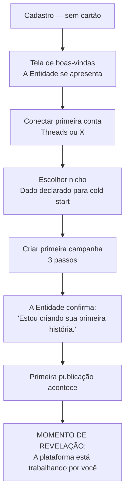

# 05 — UX: Experiência do Usuário

> *"O usuário não deve perceber o sistema. Ele deve perceber apenas os resultados."*

---

## Objetivo deste Documento

Definir a filosofia, os princípios, a arquitetura de informação, os fluxos de usuário, o sistema de comunicação e os padrões de interação da [PLATAFORMA].

Este documento é a referência para qualquer decisão de interface, microcopy, notificação ou fluxo. Toda escolha de design é rastreável a um princípio definido aqui.

---

## 1. Filosofia de UX

### 1.1 O Produto Invisível

A [PLATAFORMA] é tecnicamente um dos produtos mais complexos do mercado de afiliados: dezenas de serviços, motores de decisão, integrações com APIs externas, processamento assíncrono, aprendizado contínuo. O usuário não precisa saber de nada disso.

**O produto deve ser invisível na sua complexidade e presente nos seus resultados.**

O usuário experencia a plataforma como quatro verbos:

```
Conectar → Escolher → Criar → Ver
```

Qualquer fluxo, tela, mensagem ou interação que não se encaixa nesses quatro verbos é complexidade que escapou para a superfície — e deve ser eliminada ou abstraída.

### 1.2 A Única Inteligência

Para o usuário, existe uma única entidade trabalhando por ele. Não um conjunto de módulos, não uma coleção de ferramentas, não um dashboard de métricas. Uma inteligência singular que:

- **aprende** com cada campanha que cria
- **cria** histórias a partir desse aprendizado
- **publica** no momento certo
- **analisa** os resultados automaticamente
- **melhora** continuamente sem que o usuário precise pedir

O usuário não percebe que existem Story Engine, Campaign Engine, Knowledge Engine, Publisher ou qualquer outro componente. Ele percebe apenas *ela* — a inteligência da plataforma — trabalhando de forma silenciosa e contínua por ele.

Esta é a maior diferenciação da plataforma em relação a qualquer produto existente no mercado.

### 1.3 A Hierarquia de Comunicação

Toda comunicação da plataforma com o usuário segue três níveis, em ordem de preferência:

| Nível | Situação | Comportamento | Exemplo |
|---|---|---|---|
| **1 — Silêncio** | Sistema resolve sozinho | Usuário não é interrompido | Retentativa automática de publicação |
| **2 — Consequência** | Sistema precisa de tempo | Informa consequência, nunca causa técnica | "Estou tentando publicar sua campanha." |
| **3 — Ação** | Sistema precisa do usuário | Instrui o que fazer e por que importa | "Reconecte sua conta do Threads para continuar publicando." |

**Regra de ouro:** se o sistema pode resolver sozinho, o usuário nunca fica sabendo. Se não pode, ele recebe uma instrução — não uma explicação técnica.

### 1.4 A Fronteira do Aprovado

O usuário tem controle em pontos específicos e deliberados:
- Criar ou pausar uma campanha
- Aprovar ou rejeitar uma história (quando Modo Revisão está ativo)
- Aprovar ou rejeitar uma recomendação de escala
- Conectar ou desconectar contas

Fora desses pontos, a plataforma decide e age. Não pede permissão. Não pergunta. Não exibe opções de configuração desnecessárias. Fazer mais perguntas ao usuário não é segurança — é transferência de responsabilidade.

---

## 2. A Entidade — A Voz da Plataforma

Este é o conceito mais importante deste documento. A [PLATAFORMA] se comunica como uma entidade inteligente, não como um software emitindo notificações.

### 2.1 O que é a Entidade

A Entidade não é um chatbot. O usuário não conversa com ela — ela reporta a ele. A diferença é fundamental:

**Chatbot:** o usuário faz perguntas e o bot responde.  
**Entidade:** a entidade observa, aprende, age e reporta. O usuário acompanha.

A Entidade é como um analista brilhante que trabalha em tempo integral para o usuário e, de tempos em tempos, aparece com um insight, uma atualização ou uma pergunta específica. Ela não está esperando instruções. Ela está trabalhando.

### 2.2 Gramática da Entidade

**Tempo verbal:** primeira pessoa do singular.

| Situação | ✅ Entidade fala | ❌ Software notifica |
|---|---|---|
| Publicação concluída | "Publiquei sua história no melhor horário disponível." | "Publicação enviada com sucesso." |
| Aprendizado novo | "Percebi que histórias de transformação estão performando melhor hoje." | "Novo padrão detectado no Analytics Engine." |
| Campanha em teste | "Estou testando uma nova narrativa para esse produto." | "Campanha em execução." |
| Resultado positivo | "Essa história está convertendo acima da média. Vou guardar esse padrão." | "CTR: 8.4% (acima da média de 6.2%)" |
| Problema resolvido internamente | *(silêncio)* | "Erro 429: rate limit exceeded. Retry in 60s." |
| Precisa de ação | "Reconecte sua conta do Threads para que eu possa continuar publicando." | "Erro de autenticação. Token expirado." |
| Insight sobre horário | "Encontrei um bom horário para publicar essa história." | "Horário ótimo calculado: 19:30." |

### 2.3 Vocabulário Autorizado

**Verbos de ação concluída:**
encontrei · percebi · aprendi · testei · publiquei · descobri · analisei · identifiquei · criei · agendei · pausei · guardei · aprendi · registrei

**Verbos de ação em andamento:**
estou testando · estou criando · estou analisando · estou aprendendo · estou aguardando · estou verificando

**Verbos de intenção:**
vou publicar · vou tentar novamente · vou verificar · vou aguardar · vou guardar esse padrão

**Vocabulário de domínio (traduzido para o usuário):**

| Conceito interno | Palavra para o usuário |
|---|---|
| Story (gerada pelo Story Engine) | "história" |
| Campaign | "campanha" |
| Intelligence Score alto | "tenho bastante confiança nesse padrão" |
| Intelligence Score baixo | "ainda estou aprendendo sobre esse produto" |
| DNA do Perfil | "seu estilo" / "sua voz" |
| Learning Timeline entry | "aprendi algo novo" |
| Saturation detected | "esse padrão parece estar esgotando" |
| Scale eligible | "encontrei uma oportunidade de escala" |

**Jamais usar:**
erro · falha · sistema · engine · provider · adapter · queue · processando · módulo · componente · API · token · autenticação técnica · rate limit · retry · timeout · exception · `#IDs` de entidades

### 2.4 Identificador Visual da Entidade

Toda mensagem proveniente da Entidade carrega um identificador visual consistente — um elemento gráfico pequeno que ancora a percepção de que é a mesma inteligência falando em todos os contextos da plataforma.

O identificador específico (ícone, cor, tipografia) é definido no sistema de design, mas o princípio é: **o usuário deve reconhecer imediatamente que "ela" está falando**, independentemente de onde a mensagem aparece (dashboard, notificação, e-mail, toast).

### 2.5 Tom por Contexto

A Entidade mantém a mesma voz mas ajusta o tom conforme a situação:

| Contexto | Tom | Exemplo |
|---|---|---|
| Descoberta positiva | Entusiasta, mas contido | "Percebi algo interessante sobre essa audiência." |
| Publicação bem-sucedida | Confiante, direto | "Publiquei sua história no melhor horário disponível." |
| Resultado acima do esperado | Curioso, analítico | "Essa história está convertendo bem. Vou entender por quê." |
| Aprendizado em andamento | Paciente, honesto | "Ainda estou aprendendo sobre esse produto. Preciso de mais dados." |
| Problema resolvido sozinho | *(silêncio)* | — |
| Problema que precisa de ação | Claro, direto, sem drama | "Reconecte sua conta do Threads para continuar." |
| Oportunidade de escala | Deliberado, não urgente | "Encontrei uma oportunidade. Você quer escalar essa campanha?" |

A Entidade nunca é ansiosa, nunca é catastrófica, nunca é excessivamente entusiasmada. Ela é uma inteligência madura que trabalha com seriedade.

---

## 3. Arquitetura de Informação

### 3.1 Navegação Principal

```
[PLATAFORMA]
│
├── Início (Dashboard)
│   ├── Feed da Entidade (o que ela está fazendo / aprendeu)
│   ├── Campanhas ativas
│   └── Oportunidades (recomendações de escala pendentes)
│
├── Campanhas
│   ├── Em Teste
│   ├── Em Escala
│   └── Encerradas
│
├── Criar Campanha
│   ├── Passo 1: Produto
│   ├── Passo 2: Rede
│   └── Passo 3: Confirmar
│
├── Aprendizados
│   └── O que a plataforma descobriu sobre o seu perfil
│
└── Configurações
    ├── Contas conectadas
    └── Preferências
```

### 3.2 Estrutura da Área de Campanha

Toda campanha existe em um dos dois motores visíveis ao usuário:

```
Motor TESTE
└── A plataforma está descobrindo o que funciona para esse produto
    ├── Histórias publicadas
    ├── O que a entidade está testando
    └── Insights coletados até agora

Motor ESCALA
└── A plataforma está multiplicando o que funcionou
    ├── Campanhas em escala ativa
    ├── Volume multiplicado vs. original
    └── Rentabilidade acumulada
```

O usuário nunca vê nomes como "Campaign Engine" ou "Scheduling Engine". Ele vê "Em Teste" e "Em Escala."

---

## 4. Fluxos de Usuário

### 4.1 Onboarding: Primeiros 14 Dias (Trial)

O onboarding tem um único objetivo: levar o usuário ao momento em que a Entidade faz sua primeira publicação autônoma. Tudo antes disso é preparação. Tudo depois é o produto em funcionamento.



**Tela de boas-vindas:**
Não é um carrossel de features. Não é uma lista de funcionalidades. É a Entidade se apresentando:

> *"Olá. Sou a inteligência da [PLATAFORMA].*  
> *Vou aprender o que funciona para o seu perfil e multiplicar.*  
> *Preciso de uma coisa para começar: conecte sua conta do Threads ou X."*

**Por que começar com nicho:**
É o único dado declarado que o sistema usa para cold start. A Entidade precisa de um ponto de partida — e o nicho do usuário é o mais honesto disponível. Isso nunca é chamado de "configuração de DNA" — é apenas "qual é o seu nicho?".

### 4.2 Criação de Campanha

A criação de campanha é propositalmente simples. Três passos. Sem configurações avançadas. Sem escolha de "tom" ou "estilo" — a Entidade aprende isso sozinha.

```
Passo 1: Produto
─────────────────
Cole o link do produto ou busque por nome.
A Entidade exibe: "Encontrei esse produto na [loja]. Confirmar?"

Passo 2: Rede
─────────────
Escolha onde publicar: Threads / X
(Apenas redes conectadas aparecem aqui. Sem menção a "providers".)

Passo 3: Revisar e criar
────────────────────────
Resumo: produto + rede + modo (automático ou revisão manual)
Botão: "Criar campanha"

Após criação:
"Estou criando sua primeira história para esse produto.
Ela será publicada em breve."
```

**O que NÃO existe no fluxo de criação:**
- Escolha de horário de publicação (a Entidade decide)
- Escolha de "tom" ou "estilo" narrativo (a Entidade aprende)
- Configuração de frequência de publicação (a Entidade decide com base nos rate limits)
- Escolha de modelo de IA (invisível ao usuário)

### 4.3 Modo Revisão

O Modo Revisão é uma opção por campanha — não padrão. Quando ativado, o usuário aprova cada história antes de publicação.

```
[Modo Revisão ativado]

A Entidade criou uma história:
─────────────────────────────
[Texto da história completo]

[Publicar]  [Não publicar]
```

Se o usuário rejeitar, a Entidade pergunta opcionalmente:

> *"O que você não gostou? (Opcional)"*

Opções simples (não técnicas):
- Não está no meu tom
- Não representa bem o produto
- Prefiro uma abordagem diferente
- Prefiro não dizer

A razão de rejeição vai como sinal de aprendizado para o Knowledge Engine. O usuário nunca sabe disso — ele simplesmente rejeitou.

### 4.4 Momento de Escala

Quando o Intelligence Score de uma campanha atinge o threshold de elegibilidade, a Entidade apresenta uma recomendação. É uma decisão do usuário — mas a Entidade propõe.

```
[Feed da Entidade]

🧠 "Encontrei uma oportunidade."

Essa campanha está funcionando consistentemente há [N] dias.
Identifico confiança suficiente para multiplicar os resultados.

Resultados até agora:
• X histórias publicadas
• CTR médio: [valor]
• [N] conversões geradas

Você quer que eu escale essa campanha?

[Escalar]  [Manter como está]  [Ver mais detalhes]
```

**Por que o usuário ainda decide:**
Escala tem implicações de custo (mais publicações = mais uso de créditos de IA) e de risco percebido (mais exposição). A plataforma recomenda, o usuário autoriza. Uma vez autorizado, a Entidade age de forma autônoma.

### 4.5 Transparência — O Mecanismo "Por quê?"

Em qualquer ponto de decisão visível, o usuário pode tocar em "Por quê?" para entender a razão da Entidade em linguagem simples.

```
[Recomendação de escala]                    [Por quê?] ←

───────────────────────────────────────────────────────
Por que estou recomendando isso?

Nos últimos 14 dias, histórias que usam narrativa de
transformação pessoal tiveram CTR 3,2× maior no seu perfil.
Testei esse padrão em 8 histórias diferentes. Funcionou em 7.
Agora tenho confiança de que vale a pena multiplicar.
───────────────────────────────────────────────────────
```

O "Por quê?" nunca menciona Intelligence Score, threshold, Knowledge Engine ou qualquer conceito interno. Menciona apenas evidências observáveis: histórias testadas, padrão identificado, confiança construída.

---

## 5. Área de Aprendizados

Esta é a tela que materializa a Learning Timeline para o usuário — mas nunca com esse nome.

Para o usuário, é simplesmente: **"O que aprendi sobre o seu perfil."**

```
Aprendizados
────────────

📌 Histórias de transformação pessoal convertem 3× melhor no seu perfil.
   ── descoberto em 28/06 · ainda válido

📌 Sua audiência responde melhor a publicações entre 19h e 21h.
   ── descoberto em 15/06 · ainda válido

📌 Chamadas diretas para ação ("Clique no link") funcionam melhor do que
   chamadas implícitas para o seu perfil no X.
   ── descoberto em 02/06 · ainda válido

────────────
Aprendizados expirados

○ Histórias longas (>300 palavras) convertiam bem em março.
   ── descoberto em 10/03 · parece não funcionar mais desde 01/05
```

**Por que mostrar aprendizados expirados:**
Porque mostrar que a Entidade atualiza seu conhecimento cria confiança. Ela não está presa em padrões antigos. Ela aprende que o mercado muda — e isso é uma feature, não um bug.

O usuário nunca vê a palavra "Learning Timeline", "expired entry" ou "Intelligence Score".

---

## 6. Estados Especiais

### 6.1 Cold Start — Primeiros Dias

O usuário acabou de criar sua conta e não tem histórico. A Entidade não tem DNA para trabalhar. Mas não pode parecer vazia ou lenta.

**Tela de campanha criada (cold start):**

> *"Criei sua primeira história para esse produto.*  
> *Como é o início, ainda estou aprendendo o seu estilo.*  
> *Cada publicação vai me ensinar mais sobre o que funciona para você."*

**O que não dizer:**
- "Aguarde enquanto o sistema coleta dados iniciais."
- "Seu DNA de perfil ainda não foi gerado."
- "Modo de exploração ativo."

**O que acontece internamente (invisível ao usuário):**
A plataforma usa padrões médios do nicho declarado como bootstrap do DNA até que haja dados próprios suficientes (DECISIONS P001 — a ser resolvida no documento 09).

### 6.2 Campanha sem resultados suficientes

```
[Campanha em teste]

"Ainda estou aprendendo sobre esse produto.
Preciso de mais algumas publicações para identificar padrões."

Publicações realizadas: 3 de ~8 estimadas
```

Nunca: "Dados insuficientes para análise estatística."

### 6.3 Saturação detectada

Quando a Entidade percebe queda consistente de performance de um padrão:

> *"Esse padrão parece estar perdendo força. Vou testar abordagens diferentes para esse produto."*

A Entidade não pausa a campanha sem avisar. Ela avisa e age. O usuário pode intervir se quiser — mas não precisa.

### 6.4 Falha de publicação (resolvida automaticamente)

*(Nível 1 — Silêncio)*

O usuário nunca fica sabendo. A Entidade retentou, esperou, e publicou em seguida.

### 6.5 Falha de publicação (precisa de ação do usuário)

*(Nível 3 — Ação)*

> *"Reconecte sua conta do Threads para que eu possa continuar publicando."*

Botão: **Reconectar conta**

Após reconectar: *"Obrigado. Vou retomar as publicações agora."*

Jamais: "OAuth token expired for ISocialNetworkProvider 'threads'. Please reauthorize."

### 6.6 Rede social com instabilidade

*(Nível 2 — Consequência, apenas se a instabilidade for prolongada)*

> *"O Threads está com instabilidade no momento. Suas publicações estão na fila e serão enviadas assim que possível."*

Se a instabilidade for breve (< 30 minutos), o usuário não é notificado — a Entidade aguarda e publica quando a rede se normaliza.

---

## 7. Notificações

### 7.1 Hierarquia de canais

| Tipo de evento | Canal | Urgência |
|---|---|---|
| Publicação realizada | Feed in-app (não push) | Baixa — usuário vê quando abre o app |
| Novo aprendizado significativo | Feed in-app | Baixa |
| Oportunidade de escala | In-app + push opcional | Média — requer decisão |
| Conta desconectada (precisa de ação) | In-app + push + e-mail | Alta — bloqueia publicações |
| Primeiro resultado de campanha | In-app | Baixa |

### 7.2 Frequência de notificações

A plataforma não bombardeia o usuário com atualizações. A Entidade fala quando tem algo relevante a dizer — não a cada ação do sistema.

**Silencioso por padrão:** publicações individuais não geram notificação push. O usuário vê o histórico quando abre o app.

**Agrupamento:** múltiplos eventos do mesmo dia são agrupados em um único resumo diário, não em notificações individuais.

---

## 8. Dashboard — Visão Geral

O Dashboard é o único lugar onde o usuário pode ter uma visão completa do que a Entidade está fazendo. Não é um painel de métricas — é um feed de inteligência.

```
┌─────────────────────────────────────────────────┐
│  [PLATAFORMA]                    [Campanhas] [+] │
├─────────────────────────────────────────────────┤
│                                                 │
│  🧠 O que estou fazendo agora                   │
│  ────────────────────────────────────────────   │
│  • Publiquei uma história sobre [produto A]      │
│    hoje às 19:30.                               │
│                                                 │
│  • Estou testando uma nova narrativa para        │
│    [produto B].                                 │
│                                                 │
│  • Percebi que histórias curtas estão indo       │
│    melhor na última semana.                     │
│                                                 │
├─────────────────────────────────────────────────┤
│  Campanhas ativas                               │
│  ────────────────────────────────────────────   │
│  [Produto A] · Em escala · Threads              │
│  [Produto B] · Em teste · X                     │
│  [Produto C] · Em teste · Threads               │
│                                                 │
├─────────────────────────────────────────────────┤
│  Oportunidade                                   │
│  ────────────────────────────────────────────   │
│  🧠 "Encontrei uma oportunidade para [Produto A].│
│  Você quer que eu escale essa campanha?"        │
│  [Escalar]  [Manter]  [Ver detalhes]           │
└─────────────────────────────────────────────────┘
```

**O que o Dashboard NÃO tem:**
- Tabelas densas de métricas sem contexto
- Gráficos de todos os dados disponíveis
- CTR em destaque sem comparação significativa
- Qualquer número que o usuário não saiba interpretar sem treinamento

**O que o Dashboard TEM:**
- O que a Entidade fez nas últimas 24h (em linguagem simples)
- Status de cada campanha (em teste / em escala)
- Oportunidades de decisão (escala, reconexão de conta)
- Acesso rápido a criar nova campanha

---

## 9. Métricas Visíveis ao Usuário

O usuário vê métricas quando elas têm contexto. Nunca números isolados.

**Regra:** todo número aparece com sua referência.

| ❌ Sem contexto | ✅ Com contexto |
|---|---|
| CTR: 8.4% | CTR 8.4% · 36% acima da sua média |
| 12 conversões | 12 conversões · melhor semana em 30 dias |
| 47 cliques | 47 cliques nessa história |
| R$ 234 em comissões | R$ 234 em comissões esta semana |

**Métricas disponíveis no MVP** (Decisão #012):
- Histórias publicadas
- Cliques
- CTR (cliques / impressões)
- Conversões
- Comissão gerada

**Métricas que aparecem no MVP mas com interpretação da Entidade:**
A Entidade não só exibe o número — ela comenta o que significa:

> *"Essa história teve CTR 3× maior que a sua média. Vou usar esse padrão de novo."*

---

## 10. Contas Conectadas

A área de configurações de contas usa apenas linguagem do usuário — nunca termos arquiteturais.

```
Contas conectadas
─────────────────

Redes sociais
● Threads    [conta: @usuário]    [Desconectar]
● X          [conta: @usuário]    [Desconectar]
  [+ Conectar nova rede]

Lojas
● Shopee     [ID de afiliado: xxx]    [Desconectar]
● Amazon     [ID de afiliado: xxx]    [Desconectar]
  [+ Conectar nova loja]
```

**O que NÃO aparece:**
- "ISocialNetworkProvider"
- "Plugin Registry"
- "Adapter status"
- Detalhes técnicos de OAuth

**O que aparece quando uma conta tem problema:**
> *"Sua conta do Threads parece estar desconectada. Reconecte para continuar publicando."*

---

## 11. Acessibilidade e Responsividade

### 11.1 Mobile-first

O usuário típico do MVP é um afiliado individual que gerencia seu negócio pelo celular. A interface deve funcionar completamente em mobile — não apenas ser "responsiva" mas ser projetada primeiro para mobile.

**Implicações:**
- Navegação principal no rodapé (mobile) e lateral (desktop)
- Toque como interação primária: áreas de toque mínimas de 44×44px
- Textos legíveis sem zoom: mínimo 16px para corpo de texto
- Feed do Dashboard otimizado para leitura vertical

### 11.2 Velocidade percebida

O usuário não deve esperar por nada. Se o sistema está processando, a Entidade preenche a espera com uma mensagem de ação em andamento.

**Enquanto a história está sendo gerada:**
> *"Estou criando uma história para esse produto. Leva alguns segundos."*

Não: spinner genérico sem contexto.

### 11.3 Acessibilidade básica (MVP)

- Contraste mínimo WCAG AA (4.5:1 para texto normal)
- Navegação por teclado nos fluxos principais
- Labels descritivos em todos os inputs
- Textos alternativos em ícones funcionais

---

## 12. O que Nunca Fazer na Interface

Esta lista é tão importante quanto as diretrizes positivas. Qualquer um dos itens abaixo é um bug de produto — não uma escolha de design.

1. **Nunca mostrar IDs internos** de campanhas, usuários, stories ou qualquer entidade do sistema
2. **Nunca mostrar mensagens de erro técnicas** — sempre traduzir para consequência do usuário
3. **Nunca pedir ao usuário que configure** o que a Entidade pode descobrir sozinha (tom, estilo, horário)
4. **Nunca usar jargão arquitetural** na interface (provider, adapter, engine, queue, registry)
5. **Nunca mostrar dados sem contexto** — todo número vem com sua referência
6. **Nunca perguntar mais de uma coisa ao mesmo tempo** — cada tela tem uma decisão central
7. **Nunca abrir múltiplos modais encadeados** — uma ação, uma consequência, um retorno
8. **Nunca punir o usuário por inatividade** — se o usuário não usa o app por uma semana, o produto simplesmente está aguardando, não degradado
9. **Nunca mostrar o Intelligence Score como número** para o usuário — traduzir sempre para linguagem de confiança ("ainda aprendendo" / "confiança suficiente para escalar")
10. **Nunca nomear os motores internos** — nem como feature, nem como explicação, nem em mensagens de erro

---

## 13. Casos Extremos de UX

### CE-UX-001: Usuário tenta criar uma segunda campanha para o mesmo produto
**Comportamento:** A Entidade detecta o produto duplicado e pergunta: *"Você já tem uma campanha para esse produto. Quer criar uma versão diferente ou gerenciar a existente?"*  
**Não:** erro técnico de constraint de banco.

### CE-UX-002: Todos os providers de IA estão indisponíveis
**Comportamento (Nível 2):** *"Estou com dificuldade para criar histórias agora. Vou tentar novamente em breve."*  
**Não:** "Story Engine indisponível: AIProvider registry returned no healthy providers."

### CE-UX-003: Usuário no Modo Revisão não aprova nem rejeita por 7 dias
**Comportamento:** A Entidade envia uma notificação discreta: *"Tenho histórias esperando sua revisão para [campanha]. Elas estão pausadas até você decidir."*  
**Não:** "Campanha bloqueada por inatividade de revisão por 168 horas."

### CE-UX-004: Usuário tenta conectar uma rede social que ainda não é suportada
**Comportamento:** A rede simplesmente não aparece na lista de opções disponíveis.  
**Não:** "Provider não encontrado no Plugin Registry."

### CE-UX-005: Intelligence Score cai abaixo do threshold após escala iniciada
**Comportamento:** A Entidade notifica: *"Esse padrão parece estar perdendo força. Pausei a escala automaticamente para evitar desperdício."*  
**Não:** "Intelligence Score: 73 (abaixo do threshold de 81). Scaling automaticamente pausado."

---

## 14. Possíveis Melhorias Futuras

1. **Resumo semanal da Entidade:** um e-mail ou notificação que resume o que foi aprendido na semana, em linguagem da Entidade — não uma planilha de métricas.

2. **Visualização de padrões comparativos:** quando o usuário tem múltiplas campanhas, a Entidade compara padrões entre elas: *"Esse produto converte melhor de manhã. Aquele converte melhor à noite. Posso otimizar ambos automaticamente."*

3. **Onboarding guiado pela Entidade:** em vez de telas de tutorial, a Entidade acompanha o usuário pelos primeiros dias com mensagens contextuais: *"Sua primeira publicação saiu. Vou monitorar os resultados e te avisar quando aprender algo."*

4. **Modo silencioso:** para usuários avançados que preferem não receber nenhuma notificação — a Entidade age de forma completamente autônoma e o usuário abre o app quando quiser ver o que aconteceu.

---

## Decisões Registradas

| Data | Decisão |
|---|---|
| 2026-07-11 | Quatro verbos de UX: Conectar, Escolher, Criar, Ver |
| 2026-07-11 | Entidade: única inteligência percebida pelo usuário (DECISIONS #040) |
| 2026-07-11 | Voz: primeira pessoa, proativa, vocabulário definido (DECISIONS #041) |
| 2026-07-11 | Hierarquia de comunicação: Silêncio / Consequência / Ação (DECISIONS #042) |
| 2026-07-11 | Intelligence Score: nunca exibido como número ao usuário |
| 2026-07-11 | Modo Revisão: opcional por campanha, não padrão |
| 2026-07-11 | Dashboard: feed de inteligência, não painel de métricas |
| 2026-07-11 | Métricas: sempre com referência contextual, nunca números isolados |
| 2026-07-11 | Mobile-first: projetado para celular, adaptado para desktop |

---

*Documento criado em: 2026-07-11*  
*Versão: 0.1 — Aprovado*
