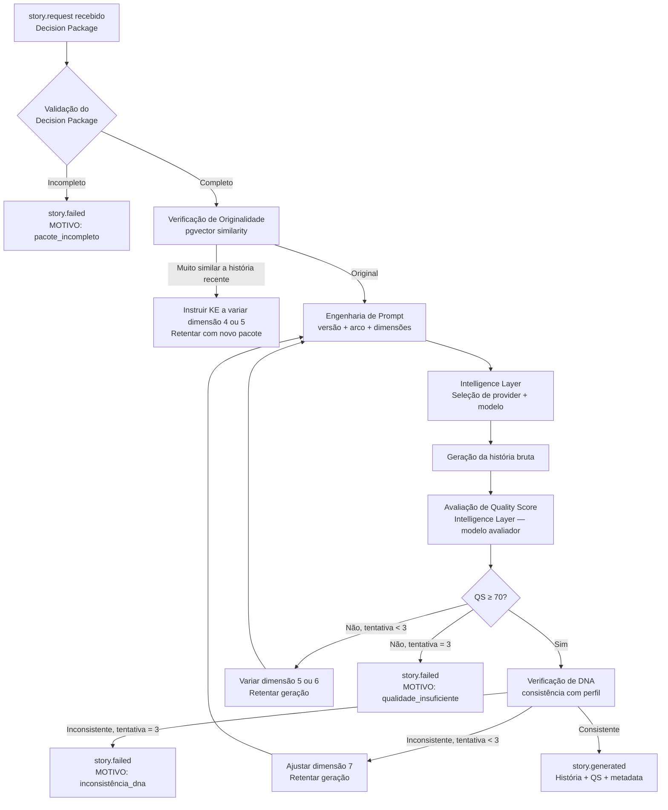

# 06 — Story Engine

> *"A história não é o produto. É o instrumento de medição. O que importa é o que ela revela."*

---

## Objetivo deste Documento

Definir o design, o comportamento, a lógica interna e os contratos do Story Engine: o componente responsável por gerar histórias de afiliado a partir de decisões do Knowledge Engine.

---

## 1. Posição na Arquitetura

O Story Engine é um consumidor de eventos e um produtor de histórias. Ele nunca toma decisões — executa. Quem decide o que gerar é o Knowledge Engine. Quem usa o que foi gerado é o Campaign Engine.

```
Campaign Engine
    → story.request (evento com Decision Package)
        → Story Engine
            → Intelligence Layer (geração)
            → Intelligence Layer (avaliação de QS)
            → story.generated (evento com história + QS)
        → Campaign Engine
            → Scheduling Engine (agenda publicação)
            → Publisher
```

**O Story Engine nunca:**
- Decide o que testar ou escalar (Knowledge Engine decide)
- Publica diretamente (Publisher publica)
- Acessa APIs externas diretamente (Intelligence Layer é o intermediário)
- Armazena dados permanentes de aprendizado (Knowledge Engine armazena)

---

## 2. O Decision Package — Os 12 Insumos de uma História

O Story Engine só funciona com um Decision Package completo. Um pacote incompleto é rejeitado — não é gerada nenhuma história com dados ausentes.

O Decision Package é montado inteiramente pelo Knowledge Engine a partir do DNA do Perfil, do histórico de campanhas e dos Scores de confiança por dimensão. O Story Engine nunca constrói o Decision Package.

### As 12 Dimensões

| # | Dimensão | Domínio | Exemplo de valor |
|---|---|---|---|
| 1 | **Produto** | Dados do marketplace | "Proteína Whey 900g - Integral Médica" · R$ 89,90 · Saúde/Suplementos |
| 2 | **Dor principal** | Descoberta pelo KE | "Falta de tempo para treinar e manter dieta" |
| 3 | **Público-alvo** | Descoberta pelo KE | "Homens 25–35 anos que treinam mas têm rotina intensa" |
| 4 | **Gatilho emocional** | Selecionado pelo KE | transformação · descoberta · prova social · curiosidade · autoridade |
| 5 | **Arco narrativo** | Selecionado pelo KE | transformação pessoal · problema→solução · antes e depois · descoberta inesperada · autoridade · curiosidade · prova social · urgência sutil |
| 6 | **Comprimento** | Calculado pelo KE | curto (80–150 palavras) · médio (150–250 palavras) · longo (250–350 palavras) |
| 7 | **Registro de voz** | Descoberto pelo KE | íntimo · casual · direto · reflexivo · entusiasmado |
| 8 | **Estilo de CTA** | Descoberto pelo KE | direto ("Clique no link") · implícito ("Deixo o link aqui") · por curiosidade ("Link com mais detalhes") |
| 9 | **Diferencial do produto** | Dados do marketplace | "Alto teor proteico com sabor aprovado" · "Entrega rápida via Shopee" |
| 10 | **Rede alvo** | Da campanha | Threads · X |
| 11 | **Restrições da rede** | Do ISocialNetworkProvider | limite de caracteres · formato suportado · convenções da plataforma |
| 12 | **Contexto de modo** | Do Campaign Engine | TESTE (explorar) · ESCALA (replicar o que funcionou) |

### Como o KE determina cada dimensão

**Dimensões 1 e 9:** dados factuais do produto via IMarketplaceProvider.

**Dimensões 2 e 3:** descobertas acumuladas ao longo do histórico de campanhas. Em cold start, bootstrap por dados médios do nicho declarado.

**Dimensões 4 e 5 no modo TESTE:** o KE escolhe combinações ainda não suficientemente testadas — maximize exploração.

**Dimensões 4 e 5 no modo ESCALA:** o KE escolhe as combinações com Intelligence Score mais alto — maximize replicação.

**Dimensões 6, 7 e 8:** descobertas pelo KE com base em performance histórica por rede. Em cold start: comprimento médio, registro casual, CTA direto.

**Dimensão 10 e 11:** definidas pela campanha. O Story Engine consulta `SocialNetworkCapabilities` via Plugin Registry para obter as restrições da rede.

**Dimensão 12:** definida pelo estado atual da campanha (máquina de estados do Campaign Engine).

---

## 3. Catálogo de Arcos Narrativos (MVP)

O Story Engine tem um conjunto fixo de arcos narrativos no MVP. O KE seleciona qual usar com base em histórico de performance e Intelligence Scores por arco.

### Arco 1 — Transformação Pessoal
**Estrutura:** Situação anterior → evento ou produto → nova realidade  
**Exemplo:** *"Por meses tentei ajustar minha dieta sem resultado. Quando adicionei [produto] na rotina, em 3 semanas a diferença foi visível. Não mudei mais nada."*  
**Gatilho emocional primário:** aspiração, identificação

### Arco 2 — Descoberta Inesperada
**Estrutura:** Contexto comum → detalhe surpreendente sobre o produto → convite à descoberta  
**Exemplo:** *"Eu não esperava que um suplemento fizesse tanta diferença assim em resistência. Mas os números não mentem."*  
**Gatilho emocional primário:** curiosidade, surpresa

### Arco 3 — Problema → Solução
**Estrutura:** Problema concreto → frustração anterior com outras soluções → esse produto resolve especificamente  
**Exemplo:** *"Testei várias proteínas que tinham gosto horrível. Essa foi a primeira que eu consegui tomar todos os dias sem enjoar."*  
**Gatilho emocional primário:** alívio, validação

### Arco 4 — Antes e Depois
**Estrutura:** Comparação explícita de dois estados — sem o produto vs. com o produto  
**Exemplo:** *"Antes: acordava sem energia, treino fraco, resultado nenhum. Depois de 30 dias usando [produto]: treinos mais intensos, recuperação mais rápida."*  
**Gatilho emocional primário:** transformação, prova

### Arco 5 — Autoridade por Experiência
**Estrutura:** Posição de quem testou muito → filtrou → recomenda com base em experiência real  
**Exemplo:** *"Já usei mais de 8 marcas diferentes de whey. Esse é o único que voltei a comprar espontaneamente."*  
**Gatilho emocional primário:** confiança, credibilidade

### Arco 6 — Curiosidade
**Estrutura:** Dado ou fato não óbvio sobre o produto ou categoria → gancho → convite para saber mais  
**Exemplo:** *"Sabia que a maioria das proteínas tem menos da metade do que promete no rótulo? Esse é um dos poucos que testei independentemente e bate o que promete."*  
**Gatilho emocional primário:** curiosidade, surpresa negativa → solução

### Arco 7 — Prova Social
**Estrutura:** Percepção coletiva → validação de grupo → recomendação  
**Exemplo:** *"Cada vez mais pessoas no meu nicho estão usando [produto]. Fui entender por quê e faz sentido."*  
**Gatilho emocional primário:** pertencimento, validação social

### Arco 8 — Urgência Sutil
**Estrutura:** Contexto temporal relevante → produto encaixa nesse momento → link  
**Exemplo:** *"Com o inverno chegando, manter a rotina de treino fica mais difícil. Esse produto tem ajudado bastante a não perder o ritmo."*  
**Gatilho emocional primário:** timing, relevância contextual

> **Nota:** Urgência manipulativa ("apenas hoje!", "últimas unidades!") é proibida — não pela Entidade, não por nenhuma história. Isso viola a confiança do usuário com sua audiência e, por consequência, a filosofia da plataforma.

---

## 4. Pipeline de Geração



### 4.1 Validação do Decision Package

Antes de qualquer geração, o Story Engine verifica que todas as 12 dimensões estão presentes e dentro dos valores esperados. Se qualquer dimensão estiver ausente ou inválida, emite `story.failed` com motivo `pacote_incompleto` e não tenta gerar. O erro é registrado no Knowledge Engine para investigação.

### 4.2 Verificação de Originalidade

Antes de gerar, o Story Engine busca por histórias recentes da mesma campanha com alta similaridade semântica (embedding via pgvector). O objetivo é evitar que a Entidade publique histórias muito parecidas em sequência — o que degradaria a percepção do usuário.

**Threshold de similaridade:** cosine similarity > 0.88 com qualquer história publicada nos últimos 21 dias = flag de repetição.

**Quando há repetição:** o Story Engine não rejeita o pedido — sinaliza ao Knowledge Engine para considerar variação nas dimensões 4 (gatilho emocional) ou 5 (arco narrativo) no próximo pacote. A geração continua com o pacote atual, mas com instrução adicional ao modelo de "gerar algo diferente das histórias anteriores."

### 4.3 Engenharia de Prompt

O prompt é composto de camadas fixas (instruções invariáveis) e camadas variáveis (as 12 dimensões do Decision Package). Todo prompt é versionado.

**Estrutura do prompt:**

```
[SISTEMA — FIXO]
Você é um escritor especialista em marketing de conteúdo para afiliados.
Sua tarefa é criar uma história autêntica baseada em experiência pessoal.
A história deve soar natural — como se uma pessoa real estivesse
compartilhando uma experiência genuína com sua audiência.
Nunca use linguagem de anúncio. Nunca prometa resultados garantidos.
Nunca use urgência manipulativa.

[PERFIL — DO DNA]
Voz: [dimensão 7]
Comprimento alvo: [dimensão 6]

[PRODUTO — DADOS REAIS]
Produto: [dimensão 1]
Dor que resolve: [dimensão 2]
Público: [dimensão 3]
Diferencial: [dimensão 9]
Rede de publicação: [dimensão 10]
Limite de caracteres: [dimensão 11]

[NARRATIVA — DECISÃO DO KE]
Arco: [dimensão 5]
Gatilho emocional: [dimensão 4]
Estilo de CTA: [dimensão 8]

[MODO — CONTEXTO]
Modo: [dimensão 12 — TESTE ou ESCALA]
[Se ESCALA: "Esse arco e gatilho já funcionaram bem. Seja fiel ao padrão."]
[Se TESTE: "Explore esse arco com autenticidade. Não replique histórias anteriores."]

[RESTRIÇÃO DE ORIGINALIDADE — CONDICIONAL]
[Se flag de repetição: "Histórias anteriores usaram [resumo dos padrões recentes].
Crie algo genuinamente diferente em abordagem."]
```

**Versionamento de prompt:**

Todo prompt tem uma versão (`prompt_version: "2.1.0"`). O Knowledge Engine armazena a versão junto com cada resultado. Comparações de performance entre histórias só são válidas dentro da mesma versão de prompt. Uma mudança de prompt é tratada como quebra de série histórica — o KE inicia uma nova série de aprendizado.

### 4.4 Geração via Intelligence Layer

O Story Engine não chama nenhum modelo de IA diretamente. Passa o prompt para a Intelligence Layer com o tipo de tarefa:

```typescript
const story = await intelligenceLayer.generate({
  task: 'story_generation',
  mode: decisionPackage.mode, // 'test' ou 'scale'
  prompt: compiledPrompt,
  maxTokens: calculateMaxTokens(decisionPackage.length),
  temperature: decisionPackage.mode === 'SCALE' ? 0.6 : 0.85,
});
```

**Temperature:**
- Modo TESTE: 0.85 — mais variação, mais exploração
- Modo ESCALA: 0.60 — mais fidelidade ao padrão que funcionou

A Intelligence Layer seleciona o modelo com base na tarefa, custo e health dos providers (Plugin Registry).

### 4.5 Quality Score

O Quality Score é calculado por uma chamada separada à Intelligence Layer, usando um modelo avaliador diferente do gerador. O avaliador é sempre um modelo rápido e barato — sua função é consistência de avaliação, não capacidade de geração.

**As 7 dimensões do Quality Score:**

| # | Dimensão | Peso | O que avalia |
|---|---|---|---|
| 1 | Coerência narrativa | 25% | A história tem início, meio e fim claros? O arco é completo? |
| 2 | Autenticidade de voz | 20% | Soa como experiência pessoal real ou como anúncio disfarçado? |
| 3 | Consistência de DNA | 20% | O registro, o tom e o estilo batem com o perfil estabelecido? |
| 4 | Representação do produto | 15% | O produto é apresentado corretamente sem promessas falsas? |
| 5 | Clareza do CTA | 10% | O convite à ação existe e está naturalizado na história? |
| 6 | Adequação à rede | 5% | O comprimento e o formato são apropriados para a rede-alvo? |
| 7 | Originalidade | 5% | É suficientemente diferente de histórias anteriores da campanha? |

**Cálculo:** cada dimensão recebe uma nota de 0 a 100. O QS final é a média ponderada.

**Threshold de publicação:** QS ≥ 70. Abaixo disso, a história não é publicada. (P005 resolvida: threshold = 70)

**O que o avaliador retorna:**

```typescript
interface QualityScoreResult {
  score: number;                    // 0–100, média ponderada
  dimensions: {
    narrativeCoherence: number;     // 0–100
    voiceAuthenticity: number;      // 0–100
    dnaConsistency: number;         // 0–100
    productRepresentation: number;  // 0–100
    ctaClarity: number;             // 0–100
    networkFit: number;             // 0–100
    originality: number;            // 0–100
  };
  feedback: string;                 // razão breve do QS (usada apenas em logs — nunca exibida ao usuário)
  recommendation: 'publish' | 'retry_vary_arc' | 'retry_vary_length' | 'retry_vary_voice';
}
```

O `recommendation` do avaliador instrui qual dimensão variar na próxima tentativa, tornando o retry inteligente em vez de aleatório.

### 4.6 Verificação de DNA

Após o QS ser aprovado, uma segunda verificação verifica se a história é consistente com o DNA estabelecido do perfil. Esta verificação é mais rígida do que a dimensão 3 do QS (que já avalia isso) porque usa como referência o embedding do DNA completo no banco — não apenas uma avaliação textual do modelo.

**Processo:**
1. Gerar embedding da história produzida
2. Calcular similaridade com o embedding do DNA do perfil (pgvector)
3. Se similaridade < 0.65 com o DNA estabelecido → flag de inconsistência

**Threshold de DNA:** similaridade mínima de 0.65 com o DNA do perfil para histórias em modo ESCALA; 0.50 para modo TESTE (mais liberdade para explorar).

**Em cold start:** sem DNA estabelecido, a verificação de DNA é desativada. A consistência começa a ser verificada após as primeiras 5 histórias publicadas.

---

## 5. Lógica de Retry

Cada tentativa de geração é registrada no banco com seu QS e o motivo de retry (se houver). Máximo de 3 tentativas por `story.request`.

```
Tentativa 1:
  QS < 70 + recommendation: 'retry_vary_arc'
  → Tentativa 2: mesmo pacote, arco narrativo alterado

Tentativa 2:
  QS < 70 + recommendation: 'retry_vary_length'
  → Tentativa 3: arco alterado + comprimento alterado

Tentativa 3:
  QS < 70
  → story.failed: MOTIVO = 'qualidade_insuficiente'
  → Knowledge Engine registra: 3 falhas consecutivas para este Decision Package
  → Campaign Engine pausa campanha
  → Comunicação Nível 3 ao usuário:
    "Estou com dificuldade para criar uma história adequada para esse produto.
    A campanha está pausada. Você quer tentar com uma abordagem diferente?"
```

**Por que 3 tentativas e não mais:**
Mais de 3 tentativas com o mesmo Decision Package sugere que o pacote em si tem algum problema (produto mal especificado, produto com restrições que tornam narrativa autêntica difícil). O problema é do pacote, não da geração — mais tentativas não resolvem.

---

## 6. Modo TESTE vs. Modo ESCALA

O Story Engine se comporta diferentemente dependendo do modo da campanha:

| Aspecto | Modo TESTE | Modo ESCALA |
|---|---|---|
| **Objetivo** | Descobrir o que funciona | Replicar o que já funcionou |
| **Seleção de arco** | KE escolhe combinações não validadas | KE escolhe dimensões com Intelligence Score mais alto |
| **Temperature** | 0.85 — mais variação | 0.60 — mais fidelidade |
| **Threshold DNA** | 0.50 — mais liberdade de exploração | 0.65 — mais fidelidade ao DNA estabelecido |
| **Frequência** | Definida pelo KE para exploração | Definida pelo KE para máxima cobertura sem saturação |
| **Falha de QS** | Retry com variação agressiva | Retry com variação mínima — preferir fidelidade ao padrão |

---

## 7. Cold Start

Quando um perfil não tem histórico suficiente (menos de 5 histórias publicadas), o Story Engine opera em modo de cold start:

**Comportamento cold start:**
- DNA check desativado (sem DNA para comparar)
- Arco narrativo: sistema inicia com Arco 3 (Problema → Solução) por ter menor dependência de voz estabelecida
- Registro de voz: casual por padrão
- Comprimento: médio (150–250 palavras) por padrão
- CTA: direto por padrão
- Temperature: 0.85 (exploração)

**Saída do cold start:** após 5 histórias publicadas com pelo menos 2 com dados de performance, o Knowledge Engine tem evidência suficiente para começar a tomar decisões reais sobre dimensões. O DNA check é ativado progressivamente.

---

## 8. Contratos de Evento

### Evento de entrada: `story.request`

```typescript
interface StoryRequestEvent extends Event<StoryRequestPayload> {
  type: 'story.request';
}

interface StoryRequestPayload {
  campaignId: string;
  profileId: string;
  requestId: string;          // UUID para idempotência
  decisionPackage: DecisionPackage;
  priority: 'normal' | 'high'; // high = usuário aguardando resposta imediata
}
```

### Evento de saída: `story.generated`

```typescript
interface StoryGeneratedEvent extends Event<StoryGeneratedPayload> {
  type: 'story.generated';
}

interface StoryGeneratedPayload {
  campaignId: string;
  profileId: string;
  requestId: string;
  story: {
    id: string;
    text: string;
    wordCount: number;
    characterCount: number;
  };
  qualityScore: {
    overall: number;          // 0–100
    dimensions: QSdimensions;
  };
  dnaConsistencyScore: number; // 0–1 (similaridade com DNA)
  generationMetadata: {
    promptVersion: string;
    narrativeArc: number;     // 1–8
    attemptNumber: number;    // 1, 2 ou 3
    modelUsed: string;
    tokensUsed: number;
    generationLatencyMs: number;
  };
}
```

### Evento de saída: `story.failed`

```typescript
interface StoryFailedEvent extends Event<StoryFailedPayload> {
  type: 'story.failed';
}

interface StoryFailedPayload {
  campaignId: string;
  profileId: string;
  requestId: string;
  reason: 'pacote_incompleto' | 'qualidade_insuficiente' | 'inconsistência_dna' | 'provider_unavailable';
  attemptsMade: number;
  lastQualityScore?: number;
  lastDnaScore?: number;
}
```

---

## 9. Persistência

O Story Engine não possui banco de dados próprio. Todas as histórias são persistidas pelo Campaign Engine ao receber o evento `story.generated`.

**Schema:** `campaigns.stories`

```sql
CREATE TABLE campaigns.stories (
  id                    UUID PRIMARY KEY DEFAULT gen_random_uuid(),
  campaign_id           UUID NOT NULL REFERENCES campaigns.campaigns(id),
  profile_id            UUID NOT NULL REFERENCES profiles.social_profiles(id),
  request_id            UUID NOT NULL UNIQUE,   -- idempotência

  -- Conteúdo
  text                  TEXT NOT NULL,
  word_count            INTEGER NOT NULL,
  character_count       INTEGER NOT NULL,

  -- Qualidade
  quality_score         SMALLINT NOT NULL,      -- 0–100
  qs_dimensions         JSONB NOT NULL,
  dna_consistency_score NUMERIC(4,3) NOT NULL,  -- 0.000–1.000

  -- Metadados de geração
  narrative_arc         SMALLINT NOT NULL,      -- 1–8
  prompt_version        VARCHAR(20) NOT NULL,
  attempt_number        SMALLINT NOT NULL,
  model_used            VARCHAR(100) NOT NULL,
  tokens_used           INTEGER NOT NULL,
  generation_latency_ms INTEGER NOT NULL,

  -- Decision Package (referência)
  decision_package      JSONB NOT NULL,

  -- Estado
  status                VARCHAR(20) NOT NULL DEFAULT 'generated',
  -- generated | scheduled | published | rejected | expired

  created_at            TIMESTAMPTZ NOT NULL DEFAULT NOW()
);
```

---

## 10. Performance

**Target (PRD #NF-002):** geração de história < 30s P95 end-to-end.

**Decomposição do tempo:**

| Etapa | Estimativa | Observações |
|---|---|---|
| Validação do pacote | < 10ms | Verificação em memória |
| Verificação de originalidade | 50–150ms | Query pgvector (indexado) |
| Engenharia de prompt | < 10ms | Template rendering |
| Geração via LLM | 2s–25s | Maior variável. Groq: 2–5s. GPT-4o: 8–20s |
| Avaliação de QS | 1s–5s | Modelo rápido (GPT-4o-mini ou Groq) |
| Verificação de DNA | 50–150ms | Query pgvector |
| Total (sucesso na 1ª tentativa) | 3s–30s | P50 ≈ 8s, P95 ≈ 25s |

**Mitigações de latência:**
- Preferência por modelos rápidos (Groq) para geração no MVP
- Avaliação de QS em paralelo com geração quando possível (pipelining futuro)
- Circuit breaker: se provider primário não responder em 25s, fallback para alternativa

---

## 11. Resolução de Decisão Pendente — P005

**P005 (Quality Score — parâmetros):** resolvida neste documento.

| Parâmetro | Valor | Justificativa |
|---|---|---|
| Threshold de publicação | 70/100 | Abaixo de 70 indica falha em pelo menos duas dimensões críticas; publicar seria ruído que contamina o aprendizado |
| Máximo de tentativas | 3 | Mais de 3 sugere problema no Decision Package, não na geração |
| Avaliador | Modelo rápido separado | GPT-4o-mini ou Groq — custo baixo, consistência alta |
| Threshold DNA (escala) | 0.65 cosine similarity | Suficientemente próximo do DNA sem ser cópia |
| Threshold DNA (teste) | 0.50 cosine similarity | Permite exploração de novas abordagens |
| Cold start stories para ativar DNA check | 5 publicações | Mínimo para ter um DNA representativo |

Esses parâmetros são calibráveis no documento 15 (Machine Learning) com dados reais. Eles entram no MVP como ponto de partida fundado em raciocínio, não como certeza.

---

## 12. Caminho para IContentProvider (V1+)

O Story Engine está preparado para incorporar conteúdo visual quando o `IContentProvider` Registry tiver implementações disponíveis (DECISIONS #035).

**Comportamento futuro:**

```typescript
// Após gerar o texto da história:
const contentProvider = pluginRegistry.getContentProvider('image');

if (contentProvider) {
  // V1: tentar gerar imagem complementar
  const imageRequest = buildImageRequest(story.text, decisionPackage);
  const image = await contentProvider.generate(imageRequest);
  // Adicionar imagem ao pacote de publicação
} else {
  // MVP: sem provider registrado, publicar apenas texto
  // Comportamento silencioso — sem aviso ao usuário
}
```

Zero alteração no fluxo de geração de texto. A adição de imagem é uma camada transparente.

---

## 13. Casos Extremos

### CE-SE-001: Decision Package com produto mal categorizado
**Situação:** Produto é registrado como "Saúde/Suplementos" mas o link leva a um produto de eletrônicos.  
**Comportamento:** A inconsistência se manifesta como QS baixo na dimensão "Representação do produto." Após 3 tentativas com QS < 70, `story.failed`. O KE registra a falha — não tenta gerar novamente até que o Campaign Engine receba uma correção.

### CE-SE-002: Todos os providers de IA indisponíveis
**Situação:** OpenAI, Anthropic e Groq todos com status UNHEALTHY no Plugin Registry.  
**Comportamento:** `story.failed` com reason `provider_unavailable` imediatamente. Zero tentativas. Campaign Engine é notificado. Comunicação Nível 2 ao usuário (silenciosa, sem push): *"Estou com dificuldade para criar histórias agora. Vou tentar novamente em breve."* A campanha não é pausada — apenas a geração aguarda normalização.

### CE-SE-003: Campanha com Modo Revisão ativado
**Situação:** Usuário tem Modo Revisão ligado para uma campanha específica.  
**Comportamento:** O Story Engine gera normalmente e avalia QS normalmente. A diferença está no Campaign Engine: histórias aprovadas pelo QS ficam em estado `pending_review` em vez de seguirem direto para o Scheduling Engine. O usuário aprova ou rejeita. A rejeição com feedback gera um sinal de aprendizado no Knowledge Engine (DECISIONS #021).

### CE-SE-004: Produto removido do marketplace durante geração
**Situação:** Um produto é descontinuado no Shopee enquanto uma `story.request` está em processamento.  
**Comportamento:** A verificação do IMarketplaceProvider ao tentar resolver metadados do produto retorna status de produto indisponível. `story.failed` com reason `produto_indisponível`. Campaign Engine pausa a campanha. Comunicação Nível 3: *"O produto dessa campanha parece não estar mais disponível na Shopee. Verifique o link do produto."*

### CE-SE-005: História gerada viola as restrições de caracteres da rede
**Situação:** Rede alvo tem limite de 500 caracteres; história gerada tem 620.  
**Comportamento:** A dimensão 11 do Decision Package contém o limite de caracteres. O prompt instrui explicitamente o modelo a respeitar o limite. Se mesmo assim a história exceder, o QS na dimensão "Adequação à rede" é penalizado severamente. No retry, o comprimento (dimensão 6) é reduzido. Se após 3 tentativas o limite ainda for excedido, `story.failed`.

---

## 14. Possíveis Melhorias Futuras

1. **Avaliação de QS em streaming:** iniciar a avaliação de qualidade assim que o modelo gerador estiver produzindo texto, em vez de aguardar a geração completa. Reduz latência total.

2. **Fine-tuning do modelo avaliador:** treinar um modelo especializado em avaliar histórias de afiliado com base nos dados acumulados de correlação entre QS e performance real. O avaliador atual usa um modelo genérico — um especializado seria mais preciso e mais barato.

3. **Aprendizado de estilo por campanha:** em vez de um único DNA de perfil, manter embeddings de estilo por produto/categoria. Uma conta pode ter diferentes "vozes" para diferentes nichos.

4. **Geração assistida:** para usuários que querem participar da criação, um modo futuro onde a Entidade gera uma história e o usuário pode editar partes — mantendo a análise de QS e DNA mesmo sobre o texto editado.

---

## Decisões Registradas

| Data | Decisão |
|---|---|
| 2026-07-11 | Quality Score: threshold de publicação = 70/100 (resolve P005) |
| 2026-07-11 | Quality Score: 7 dimensões com pesos definidos, avaliador separado do gerador |
| 2026-07-11 | Máximo de 3 tentativas de geração por request |
| 2026-07-11 | Temperature: 0.85 (TESTE) · 0.60 (ESCALA) |
| 2026-07-11 | DNA check: threshold 0.65 (ESCALA) · 0.50 (TESTE) · desativado em cold start (< 5 histórias) |
| 2026-07-11 | 8 arcos narrativos canônicos para MVP |
| 2026-07-11 | Urgência manipulativa proibida em qualquer história |
| 2026-07-11 | Prompts versionados; mudança de versão quebra série histórica de aprendizado |
| 2026-07-11 | Originalidade: threshold de similaridade 0.88 cosine similarity em janela de 21 dias |

---

*Documento criado em: 2026-07-11*  
*Versão: 0.1 — Aprovado*
