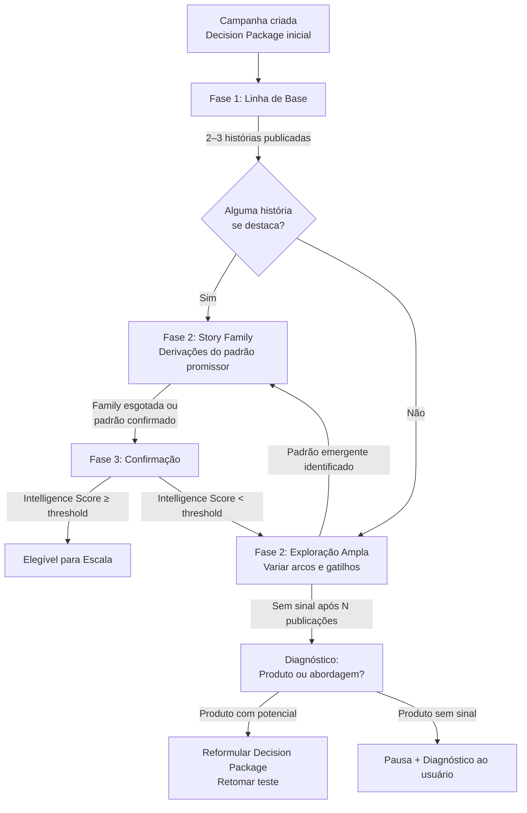
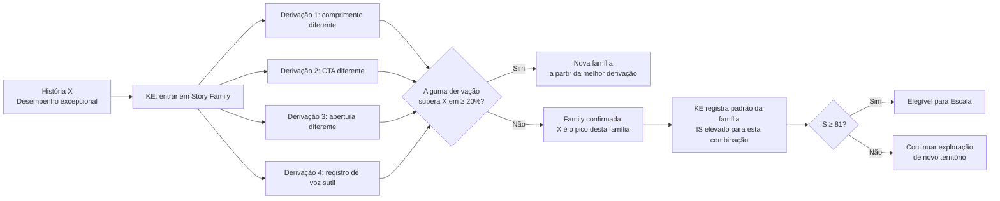
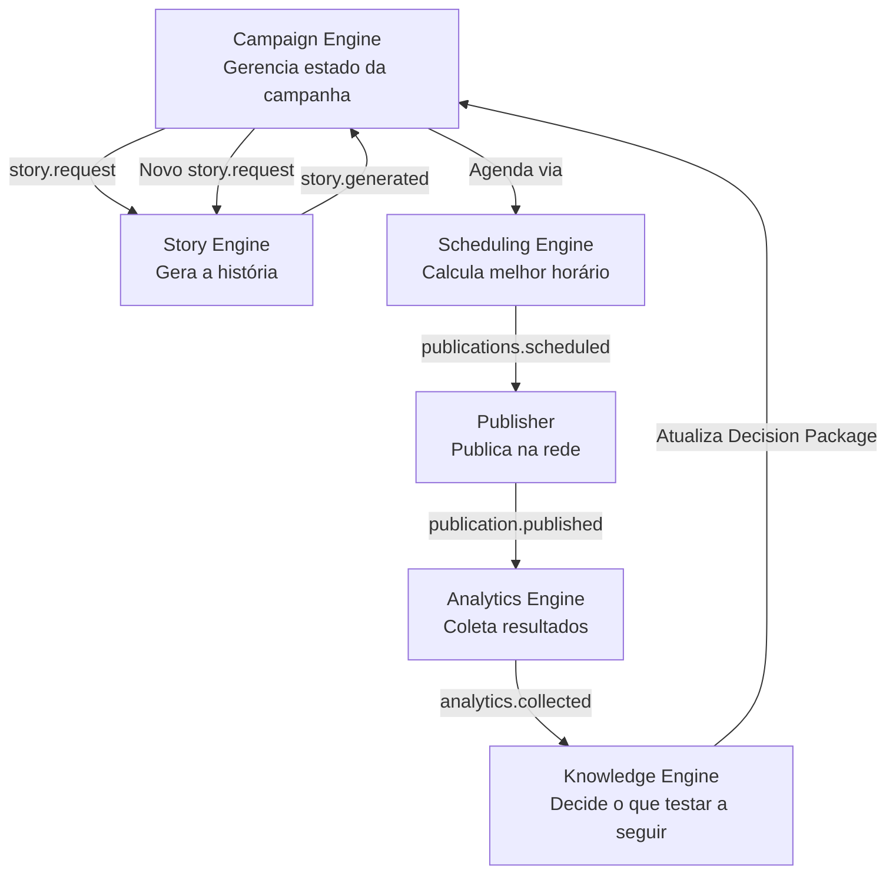

# 07 — Test Engine (Motor TESTE)

> *"Um teste que não pode falhar não é um teste. É uma esperança documentada."*

---

## Objetivo deste Documento

Definir o comportamento, a lógica de exploração, os critérios de encerramento e a relação com os demais componentes do Motor TESTE — o motor responsável por descobrir quais padrões narrativos funcionam para cada perfil, produto e audiência.

---

## 1. O que é o Motor TESTE

O Motor TESTE não é um componente técnico isolado. É o conjunto de regras e comportamentos que governa campanhas no estágio de descoberta. Tecnicamente, sua lógica vive distribuída entre o Campaign Engine (estado da campanha) e o Knowledge Engine (decisões de exploração). Para o usuário, aparece como um único motor com uma única pergunta: *o que funciona aqui?*

**O Motor TESTE responde a três perguntas:**
1. O que ainda não foi suficientemente testado para este produto e perfil?
2. O que testar a seguir para aprender o máximo possível com o menor número de publicações?
3. Quando há evidência suficiente para concluir — seja com sucesso (elevar à Escala) ou com pausa (problema a diagnosticar)?

O Motor TESTE **não toma decisões de negócio.** Ele descobre fatos. A decisão de escalar pertence ao usuário — mas o Motor TESTE fornece a evidência para que essa decisão seja fundamentada.

---

## 2. Anatomia de um Teste

Um teste é uma sequência estruturada de publicações projetada para gerar evidência sobre um conjunto específico de hipóteses narrativas para um produto em um perfil.

**Um teste completo tem:**
- Um produto definido
- Uma rede social definida
- Um conjunto de hipóteses a explorar (selecionadas pelo Knowledge Engine)
- Um critério de conclusão com sucesso (Intelligence Score ≥ threshold de escala)
- Um critério de pausa por performance insuficiente
- Um registro de cada publicação e seus resultados

**O que NÃO define um teste:**
- Número fixo de publicações (é dinâmico — depende da velocidade de aprendizado)
- Duração fixa em dias (é dinâmico — depende do volume de dados gerados)
- Uma única variável isolada (o teste explora combinações, não variáveis individuais)

---

## 3. Estratégia de Exploração

O Motor TESTE não testa arcos aleatoriamente nem em sequência fixa. O Knowledge Engine usa uma estratégia de exploração que balanceia dois objetivos opostos:

**Exploração** → testar combinações ainda desconhecidas para descobrir novos padrões  
**Exploração Local** → aprofundar o que já demonstrou potencial (Story Family — DECISIONS #050)

### 3.1 Fases de Exploração



### Fase 1 — Linha de Base (2–3 histórias)

O teste começa com 2–3 histórias usando os arcos com maior frequência de sucesso para o nicho do perfil (dado de bootstrap do cold start ou média acumulada do KE para o nicho). O objetivo é estabelecer um ponto de referência antes de explorar.

**Em cold start:** usa padrões médios do nicho. Arco padrão: Problema → Solução (Arco 3). As primeiras histórias são menos sobre descoberta e mais sobre estabelecer um baseline mínimo.

**Em perfil estabelecido:** usa os arcos com Intelligence Score mais alto para o nicho/produto similar. A linha de base já é informada pelo DNA.

### Fase 2A — Story Family (quando há sinal promissor)

Se uma história da linha de base supera a média do perfil em ≥ 50% no indicador primário (CTR), o Knowledge Engine entra em modo Story Family (DECISIONS #050):

**Modo Story Family:** criar 3–5 derivações da história de alto desempenho, variando em sequência:
1. Comprimento (mais curto / mais longo)
2. Estilo de CTA (direto / implícito / curiosidade)
3. Registro de voz (se aplicável)
4. Abertura da história (mesmo arco, entrada diferente)

O Knowledge Engine não sai da família até que:
- Todas as variações tenham sido testadas, **ou**
- Uma variação da família supere a original em ≥ 20% → nova família começa a partir desta, **ou**
- Performance da família em queda consistente (Family expirou)

**Por que Story Family antes de novo território?**
Um padrão que funciona provavelmente tem mais a revelar. Sair prematuramente desperdiça o potencial do padrão descoberto. Variar apenas o necessário é mais eficiente do que iniciar uma nova exploração — e preserva o DNA que gerou o resultado.

### Fase 2B — Exploração Ampla (sem sinal na linha de base)

Se nenhuma história da linha de base se destaca, o KE passa a variar dimensões sistematicamente para mapear o espaço de possibilidades:

**Ordem de variação (do mais provável ao menos provável de revelar sinal):**
1. Gatilho emocional (dimensão 4)
2. Arco narrativo (dimensão 5)
3. Comprimento (dimensão 6)
4. Registro de voz (dimensão 7)
5. Estilo de CTA (dimensão 8)

O KE não varia todas as dimensões ao mesmo tempo — isso tornaria impossível atribuir o resultado a uma causa. Cada sequência de 2–3 histórias varia uma dimensão por vez, mantendo as demais constantes.

### Fase 3 — Confirmação

Quando o Intelligence Score de uma combinação específica atinge a zona de confiança (> 65, abaixo do threshold de escala), o KE entra em fase de confirmação: publicar 2–3 histórias adicionais com a mesma combinação para confirmar ou refutar o sinal antes de recomendar escala.

Confirmação serve para filtrar resultados de sorte. Um único CTR alto pode ser ruído. Três CTRs altos com a mesma combinação é evidência.

---

## 4. Critérios de Conclusão

### 4.1 Conclusão com Sucesso — Elegível para Escala

**Condição:** Intelligence Score ≥ 81 (threshold provisório, DECISIONS #003 / P002) para pelo menos uma combinação de dimensões, confirmado em ≥ 2 publicações com QS ≥ 70.

**O que acontece:**
- O KE emite evento `campaign.scale_eligible`
- O Campaign Engine transiciona para o estado `SCALE_ELIGIBLE`
- A Entidade notifica o usuário com a recomendação de escala
- O usuário decide: escalar ou manter em teste

**O usuário não é obrigado a escalar.** A plataforma recomenda. Se o usuário mantiver em teste, o Motor TESTE continua explorando variações — mas o KE marca o padrão como "validado" e o usa como referência para refinamento futuro.

### 4.2 Conclusão com Pausa — Performance Insuficiente

**Condição:** após ≥ 8 histórias publicadas com QS ≥ 70, se a performance agregada (CTR médio das histórias válidas) estiver consistentemente abaixo de 50% da média do nicho por ≥ 3 semanas consecutivas.

**Por que essas condições em conjunto:**
- Mínimo 8 histórias com QS ≥ 70: garante que o teste teve histórias bem executadas. Histórias com QS < 70 não contam — o problema pode ter sido execução, não hipótese.
- 50% abaixo da média do nicho por 3 semanas: distingue variação normal (semana ruim) de sinal real de incompatibilidade.

**O que acontece:**
- O KE diagnostica o padrão de falha: é o produto? É o nicho? É a rede?
- A Entidade notifica o usuário com diagnóstico simples:

> *"Testei várias abordagens para esse produto e não encontrei um padrão que funcione bem. Pode ser que esse produto não seja o melhor fit para a sua audiência agora."*

> (Se o diagnóstico aponta para a rede:)  
> *"Esse produto parece não ter boa tração no Threads. Quer tentar no X?"*

O usuário pode:
- Pausar a campanha
- Tentar uma rede diferente (se disponível)
- Substituir o produto

### 4.3 Inconclusivo — Sinal Fraco mas Presente

**Condição:** após ≥ 8 histórias com QS ≥ 70, o Intelligence Score está entre 45 e 65 — sinal existe, mas não é forte o suficiente para confirmar ou refutar.

**O que acontece:** o KE continua o teste, prioriza exploração de novas dimensões e aguarda mais dados. O Motor TESTE não pausa automaticamente por falta de sinal forte — ele aguarda. A plataforma é paciente quando há sinal ambíguo; impaciência aqui levaria a descartar padrões que precisavam de mais tempo para se manifestar.

---

## 5. Resolução de Decisão Pendente — P008

**P008 (Critério de pausa de teste por baixa performance):** resolvida neste documento.

| Parâmetro | Valor | Justificativa |
|---|---|---|
| Mínimo de histórias válidas para avaliar pausa | 8 histórias com QS ≥ 70 | Menos de 8 é volume insuficiente para distinção entre ruído e sinal |
| Threshold de performance para pausa | CTR médio < 50% da média do nicho | Abaixo de 50% do nicho após volume suficiente = incompatibilidade real |
| Duração mínima antes de pausa | 3 semanas consecutivas abaixo do threshold | Uma semana ruim pode ser sazonalidade; 3 semanas é padrão |
| Histórias de QS < 70 | Não contam para o critério de pausa | Protege contra falsos negativos por execução ruim |
| Intelligence Score para elegibilidade de escala | ≥ 81 (provisório — P002 a calibrar) | Threshold confirmado em ≥ 2 publicações |

---

## 6. O Papel do Quality Score na Validade do Teste

Esta é a distinção mais importante do Motor TESTE: **uma história que performa mal com QS alto é uma hipótese refutada. Uma história que performa mal com QS baixo é uma execução falha — não diz nada sobre a hipótese.**

O Knowledge Engine processa os resultados com este filtro:

```
Para cada resultado de publicação:
  SE QS ≥ 70:
    → Resultado é válido: atualizar Intelligence Score da hipótese
    → Registrar na Learning Timeline (evidência válida)
  SE QS < 70:
    → Resultado é inválido para aprendizado de hipótese
    → Registrar como execução falha (não como falha da hipótese)
    → Incrementar contador de qualidade insuficiente (alerta se recorrente)
```

**Caso especial: muitas histórias com QS < 70 para a mesma campanha**

Se mais de 40% das histórias de uma campanha têm QS < 70, o KE investiga:
- Problema no produto (metadados ruins, difícil de representar narrativamente)?
- Problema no DNA do perfil (contradições no estilo que o Story Engine não consegue resolver)?
- Problema no Decision Package (dimensões conflitantes)?

A Entidade notifica o usuário com diagnóstico (Nível 3):
> *"Estou com dificuldade para criar histórias de qualidade para esse produto. Pode ser que as informações do produto estejam incompletas. Verifique o link."*

---

## 7. Story Family no Contexto do Motor TESTE

A Story Family (DECISIONS #050) é uma estratégia de exploração local que o Motor TESTE aplica automaticamente quando identifica potencial não esgotado em um padrão.



**O usuário nunca vê o conceito de "Story Family".** Ele vê histórias sendo publicadas e resultados sendo gerados. A Entidade pode comunicar: *"Percebi um padrão que funciona bem. Estou explorando variações para entender melhor o potencial."*

---

## 8. Frequência de Publicação no Motor TESTE

A frequência de publicação em modo TESTE é calculada pelo Scheduling Engine com base em:

1. **Rate limits da rede alvo** (via ISocialNetworkProvider) — limite máximo absoluto
2. **Espaçamento mínimo entre histórias da mesma campanha** — evitar saturação da audiência com o mesmo produto em sequência muito curta
3. **Janelas de melhor performance** identificadas pelo KE para o perfil nessa rede

**Espaçamento mínimo padrão no TESTE:**
- Mesma campanha, mesma rede: mínimo 48h entre publicações
- Campanhas diferentes, mesma rede: sem restrição (são produtos diferentes)

**Por que 48h mínimo no TESTE?**
Uma publicação muito próxima da anterior para o mesmo produto não dá tempo suficiente para que os dados de performance sejam gerados e processados antes da próxima. Publicar antes de ter o resultado da publicação anterior é desperdiçar uma decisão com evidência parcial.

---

## 9. Como o Motor TESTE se Relaciona com os Demais Componentes



**O loop de aprendizado:**
1. Campaign Engine solicita história → Story Engine gera → Publisher publica
2. Analytics Engine coleta resultados → Knowledge Engine atualiza Intelligence Scores
3. Knowledge Engine decide próxima hipótese → Campaign Engine solicita nova história
4. Repete

O Motor TESTE é este loop, governado pelas regras do Knowledge Engine.

---

## 10. Representação para o Usuário

### 10.1 Status de uma campanha em teste

```
[Produto A] · Threads

Em teste

A plataforma está descobrindo o que funciona para esse produto.

Publicações: 4 realizadas
O que aprendi até agora:
  • Histórias mais curtas têm mais cliques para esse produto.
  • Ainda explorando o gatilho emocional mais eficiente.

Próxima publicação: amanhã às 19:30.
```

### 10.2 Quando a Entidade encontra um padrão promissor

> *"Percebi que uma abordagem está funcionando bem para esse produto. Estou explorando variações para confirmar o padrão."*

(Sem mencionar "Story Family", "arco narrativo" ou "Intelligence Score".)

### 10.3 Quando o teste está sem sinal

> *"Ainda estou aprendendo o que funciona para esse produto. Cada publicação me traz mais informação."*

Nunca: *"Intelligence Score insuficiente após 6 histórias. Explorando dimensões 4 e 5 do Decision Package."*

### 10.4 Quando o teste resulta em pausa

> *"Testei várias abordagens para esse produto e não encontrei um padrão consistente com a sua audiência. A campanha está pausada. Quer tentar com um produto diferente ou uma rede diferente?"*

---

## 11. Contabilidade de Publicações — Implicação de Plano

Cada história publicada no Motor TESTE consome uma unidade do limite de publicações do plano (DECISIONS #022). O usuário deve saber que publicações de teste e publicações de escala consomem do mesmo limite.

**Implicação:** usuários no plano Starter com limite baixo precisam ser estratégicos sobre quantos testes simultâneos rodam. A Entidade não avisa isso automaticamente a cada publicação — mas o Dashboard mostra o consumo do período de forma visível.

---

## 12. Evolução Futura — Momento da Compra no Motor TESTE

Quando a dimensão Momento da Compra (DECISIONS #049) for implementada em V2+, o Motor TESTE evoluirá para incluir uma nova camada de exploração:

**Além de testar arcos narrativos,** o KE testará qual momento da jornada de compra predomina na audiência do perfil para cada produto. Uma campanha no TESTE V2 terá múltiplas sub-hipóteses:
- "Esta audiência está no estágio 2 (percebeu o problema)?"
- "Esta audiência está no estágio 4 (comparando produtos)?"

E o Story Engine gerará histórias deliberadamente calibradas para cada estágio, com o KE avaliando qual estágio gera mais conversões.

**Por que isso importa:** uma narrativa de transformação pessoal funciona bem para audiências no estágio 2. Uma narrativa de comparação direta funciona melhor para audiências no estágio 4. O Motor TESTE V2 aprenderá qual estágio predomina em cada perfil/produto/rede — e usará isso como insumo permanente do Decision Package.

**Dado coletado desde o MVP:** mesmo sem explorar o Momento da Compra ativamente, o schema de banco de dados deve registrar contexto suficiente (arco usado, resultado obtido, horário, nicho, produto) para que a dimensão possa ser computada retroativamente quando o modelo de Buying Stage for implementado.

---

## 13. Evolução Futura — Meta-Aprendizado (DECISIONS #052)

O Motor TESTE do MVP aprende **o quê** funciona. O Motor TESTE V2+ aprenderá **por quê** funciona e em **quais condições**.

**Exemplo de meta-aprendizado que o Motor TESTE V2 pode gerar:**

> *"Histórias de transformação pessoal convertem 3,2× melhor para produtos de saúde neste perfil quando publicadas às terças e quartas entre 19h–21h. Esse padrão é mais forte em semanas sem feriados. A audiência que converte tem como característica média tempo de 4 semanas desde a primeira interação com o perfil."*

Para chegar lá, o Motor TESTE precisa:
1. Registrar **contexto completo** desde o MVP (quem, quando, em que condição)
2. Acumular volume suficiente para que correlações contextuais sejam estatisticamente válidas
3. Ter um ML Engine capaz de processar dados multidimensionais (documento 15)

**Decisão de design do MVP:** o banco de dados do MVP registra contexto suficiente para o meta-aprendizado futuro. Nenhuma refatoração de coleta de dados será necessária quando o Nível 2 de aprendizado for implementado.

---

## 14. Casos Extremos

### CE-TE-001: Campanha com uma única publicação performando excepcionalmente bem
**Situação:** primeira história tem CTR 5× acima da média do nicho.  
**Comportamento:** o KE não entra em Story Family nem recomenda escala com base em uma publicação. Uma publicação pode ser sorte. A fase 3 (Confirmação) exige mínimo de 2 publicações confirmando o padrão. O KE marca o padrão como "promissor" e replica a mesma combinação para confirmação antes de qualquer ação.

### CE-TE-002: Usuário cria 5 campanhas simultâneas para o mesmo produto em redes diferentes
**Situação:** Threads + X + (futuramente) outras redes, todas para o mesmo produto.  
**Comportamento:** o KE trata cada rede como uma série de dados independente. Padrões aprendidos no Threads não são diretamente transferidos para o X — mas são usados como bootstrap da linha de base. Depois de suficiente volume em cada rede, o KE pode identificar padrões que funcionam em ambas (transferível) vs. padrões rede-específicos.

### CE-TE-003: Performance vai de excepcional para medíocre ao longo do teste
**Situação:** as primeiras 3 histórias têm CTR alto, as próximas 5 têm CTR médio.  
**Comportamento:** o KE detecta tendência de queda. Verifica: é a Story Family esgotada (variações não adicionaram valor) ou é saturação da audiência (mesmo produto publicado com frequência alta está cansando)? Com base no espaçamento das publicações e no período, o KE distingue os dois casos e ajusta a estratégia — sem intervenção do usuário.

### CE-TE-004: Intelligence Score oscila ao redor do threshold por semanas
**Situação:** IS sobe para 79, cai para 74, sobe para 82, cai para 78 — sem consolidar.  
**Comportamento:** o KE aplica uma janela deslizante de 14 dias. Se o IS médio estiver acima do threshold no período → elegível para escala provisória. Se abaixo → continua em teste. Volatilidade alta do IS sinaliza sinal fraco — o KE prioriza exploração de Family antes de recomendar escala definitiva.

### CE-TE-005: Usuário pausa manualmente uma campanha com IS alto
**Situação:** usuário pausa uma campanha que estava elegível para escala.  
**Comportamento:** o estado muda para PAUSED. O Intelligence Score não é resetado. Quando o usuário retomar, a elegibilidade é verificada: se o IS ainda está ≥ threshold (sem decaimento que o coloque abaixo), a campanha retorna para SCALE_ELIGIBLE. Se decaiu (DECISIONS #014), retorna para RUNNING em modo TESTE.

---

## 15. Possíveis Melhorias Futuras

1. **Teste multivariado explícito:** em V2, o KE pode gerenciar testes A/B formais entre dois arcos em paralelo, com análise estatística mais rigorosa. No MVP, a exploração é sequencial — mais simples de implementar e interpretar.

2. **Aceleração por similaridade de perfil:** se a plataforma tiver perfis com DNA similar testando o mesmo produto, os aprendizados podem ser compartilhados (com privacidade — sem expor dados de outros usuários). Um perfil novo com DNA similar a um perfil maduro poderia saltar as primeiras fases do teste. A ser endereçado em V2+ mediante validação ética e de privacidade.

3. **Story Family cross-campanha:** padrões de família de alta performance em uma campanha (produto A) podem ser usados como ponto de partida para campanhas de produtos similares (produto B na mesma categoria). O KE já acumula esse dado — a exploração cross-campanha é uma questão de regra de ativação.

4. **Teste com variação de horário:** além de variar conteúdo, o Motor TESTE pode variar sistematicamente os horários de publicação para o mesmo conteúdo. Em V2, quando o Scheduling Engine tiver mais dados históricos, essa camada de teste pode ser adicionada sem alterar a lógica narrativa.

---

## Decisões Registradas

| Data | Decisão |
|---|---|
| 2026-07-11 | P008 resolvida: critérios de pausa de teste formalizados neste documento |
| 2026-07-11 | Mínimo 8 histórias com QS ≥ 70 antes de avaliar pausa por performance |
| 2026-07-11 | Threshold de performance para pausa: CTR < 50% da média do nicho por 3 semanas |
| 2026-07-11 | QS < 70 não conta para critérios de pausa — evita falsos negativos |
| 2026-07-11 | Espaçamento mínimo no TESTE: 48h entre publicações da mesma campanha |
| 2026-07-11 | IS ≥ 81 confirmado em ≥ 2 publicações com QS ≥ 70 → elegível para Escala |
| 2026-07-11 | Story Family ativada quando desempenho ≥ 50% acima da média da campanha |
| 2026-07-11 | Story Family: 3–5 derivações; nova família quando derivação supera original em ≥ 20% |
| 2026-07-11 | Banco de dados do MVP coleta contexto suficiente para meta-aprendizado futuro |

---

*Documento criado em: 2026-07-11*  
*Versão: 0.1 — Aprovado*
