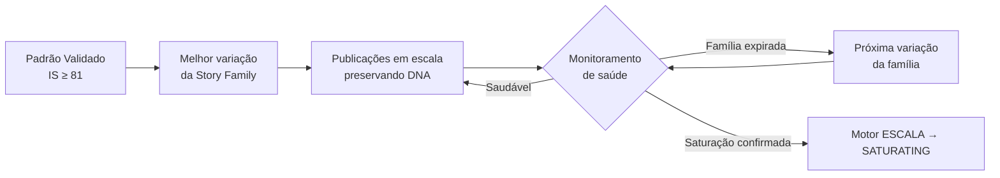
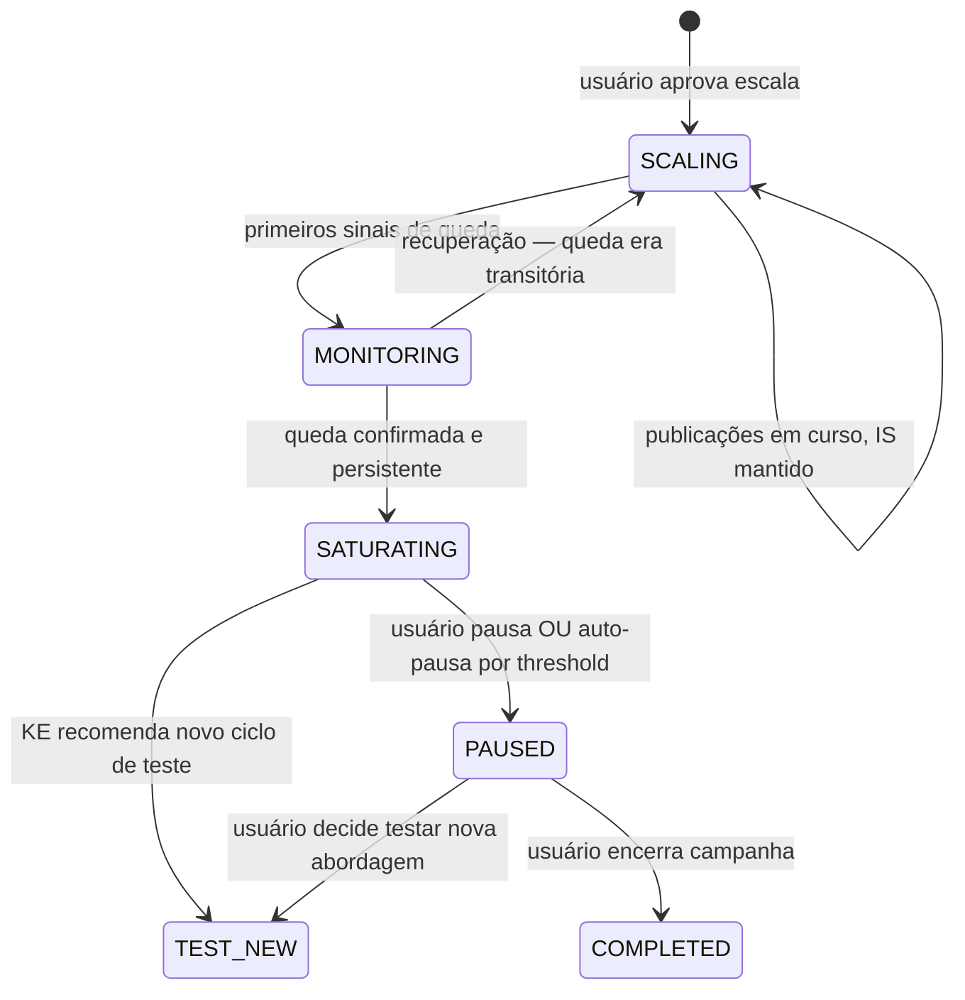
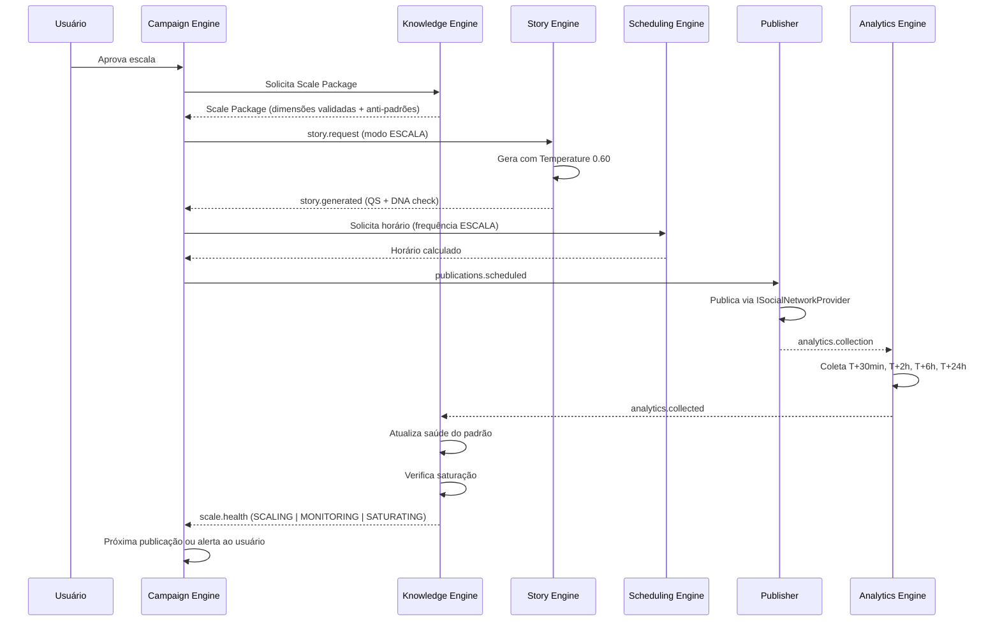

# 08 — Scale Engine (Motor ESCALA)

> *"Escala não é fazer mais do mesmo. É preservar o que funciona enquanto o mercado ainda deixa."*

---

## Objetivo deste Documento

Definir o comportamento, a lógica de replicação, o monitoramento de saturação, os critérios de degradação e a relação com os demais componentes do Motor ESCALA — o motor responsável por multiplicar padrões validados com máxima eficiência e mínimo desperdício.

---

## 1. O que é o Motor ESCALA

O Motor ESCALA é a segunda fase de vida de uma campanha. Ele entra em ação quando o Motor TESTE produziu evidência suficiente de que um padrão narrativo funciona para um produto, um perfil e uma rede específicos.

**A missão do Motor ESCALA é uma:**  
Multiplicar o retorno do padrão validado enquanto ele ainda é eficaz — e detectar quando ele começa a perder força antes que o desperdício se acumule.

**O Motor ESCALA não descobre.** Descobre é função do TESTE. O ESCALA replica, monitora e preserva. Quando o padrão começa a saturar, o ESCALA não tenta corrigi-lo — ele avisa e cede espaço para um novo ciclo de descoberta.

---

## 2. O que Muda na Transição para Escala

A transição TESTE → ESCALA não é uma mudança de intensidade. É uma mudança de paradigma operacional.

| Dimensão | Motor TESTE | Motor ESCALA |
|---|---|---|
| **Objetivo** | Descobrir o que funciona | Multiplicar o que funcionou |
| **Geração de histórias** | Exploração — variar dimensões | Replicação — preservar DNA validado |
| **Temperature do LLM** | 0.85 (exploração) | 0.60 (fidelidade) |
| **Seleção de arco** | KE explora subespaço não testado | KE usa dimensões com IS mais alto |
| **Frequência de publicação** | Espaçada — aguardar dados antes de decidir | Intensificada — dentro dos limites da rede e audiência |
| **Threshold de DNA** | 0.50 (mais liberdade) | 0.65 (mais fidelidade ao padrão) |
| **Variação esperada** | Alta — cada história é um experimento | Baixa — cada história é uma versão do mesmo padrão |
| **Pergunta central do KE** | "O que devo testar a seguir?" | "O padrão ainda está saudável?" |

---

## 3. Entrada no Motor ESCALA

A campanha entra no Motor ESCALA somente quando:

1. Intelligence Score ≥ threshold de escala (provisório: 81) para pelo menos uma combinação de dimensões
2. Esse IS foi confirmado em ≥ 2 publicações com QS ≥ 70 (não apenas uma publicação excepcional)
3. O usuário aprovou a recomendação de escala (DECISIONS #046 — a Entidade propõe; o usuário decide)

Sem os três critérios, a campanha permanece em TESTE.

**O que o Knowledge Engine transfere para o ESCALA:**

O KE produz um **Pacote de Escala** no momento da transição — um conjunto de dimensões validadas que o Motor ESCALA deve preservar:

```typescript
interface ScalePackage {
  campaignId: string;
  validatedDimensions: {
    narrativeArc: number;           // arco que gerou o IS alto
    emotionalTrigger: string;       // gatilho que funcionou
    lengthRange: [number, number];  // faixa de comprimento eficaz
    voiceRegister: string;          // registro de voz validado
    ctaStyle: string;               // estilo de CTA que converteu
  };
  intelligenceScore: number;        // IS no momento da transição
  confidenceLevel: number;          // nível de confiança do KE
  publishingPattern: {
    bestWindows: TimeWindow[];      // janelas de horário validadas
    minInterval: number;            // intervalo mínimo dinâmico (DECISIONS #054)
    maxFrequency: number;           // frequência máxima permitida sem saturar
  };
  storyFamily?: StoryFamilyConfig;  // se a Story Family foi identificada
  antiPatterns: DimensionCombination[]; // o que explicitamente evitar (DECISIONS #056)
}
```

---

## 4. Replicação com Variação Controlada

O Motor ESCALA não republica as mesmas histórias literalmente. Ele gera novas histórias que preservam o DNA do padrão validado enquanto introduzem variações mínimas o suficiente para evitar que a audiência reconheça repetição.

**O que é preservado (invariáveis do ESCALA):**
- Arco narrativo (dimensão 5)
- Gatilho emocional (dimensão 4)
- Registro de voz (dimensão 7)
- Faixa de comprimento (dimensão 6)
- Estilo de CTA (dimensão 8)

**O que pode variar (variáveis controladas do ESCALA):**
- Abertura específica da história (primeiras 1–2 frases)
- Detalhes concretos da narrativa (sem mudar o arco)
- Ordem de elementos dentro da estrutura
- Palavras e expressões específicas (mantendo o registro)

**Analogia:** o padrão validado é a receita; cada história em escala é uma nova preparação da mesma receita com pequenas adaptações de apresentação — nunca com troca de ingredientes principais.

### 4.1 Story Family no ESCALA

Se o Motor TESTE identificou uma Story Family (DECISIONS #050), o ESCALA começa pelas variações de maior desempenho dentro da família. A família define os limites da variação controlada: o ESCALA não sai da família enquanto ela se mantiver eficaz.



---

## 5. Frequência de Publicação no ESCALA

O ESCALA pode publicar com frequência maior do que o TESTE — o objetivo é maximizar o retorno do padrão enquanto ele é eficaz. Mas frequência sem critério é saturação acelerada.

**O Scheduling Engine calcula a frequência do ESCALA considerando:**

1. **Limites da rede** (via ISocialNetworkProvider) — nunca ultrapassar
2. **Capacidade de absorção da audiência** — estimada pelo KE com base em dados históricos de engajamento por intervalo
3. **Diversidade de publicações ativas** — se o usuário tem múltiplas campanhas na mesma rede, a frequência de cada uma é calibrada para não saturar o feed com conteúdo de afiliado
4. **Sinal de saturação incipiente** — se os primeiros sinais de queda aparecerem, a frequência é reduzida antes de atingir saturação completa

**Por que o Scheduling Engine e não o KE decide a frequência?**

O Scheduling Engine tem a visão completa do calendário de publicações — todas as campanhas, todos os horários, todas as redes. O KE sabe o que publicar; o Scheduling Engine sabe quando e com qual cadência sem causar conflito entre campanhas.

---

## 6. Monitoramento de Saúde no ESCALA

Esta é a função mais crítica do Motor ESCALA. Um padrão que funcionou em TESTE não vai funcionar para sempre. O ESCALA existe para maximizar o retorno enquanto o padrão é eficaz — e o monitoramento de saúde determina quando esse momento passou.

### 6.1 Indicadores de Saúde

O Knowledge Engine monitora continuamente os seguintes indicadores para campanhas em ESCALA:

| Indicador | O que sinaliza | Frequência de análise |
|---|---|---|
| CTR da campanha | Performance primária | A cada nova publicação + tendência de 7 dias |
| Taxa de conversão | Qualidade do clique | Janela de 14 dias |
| Velocidade de clique | Tempo médio entre publicação e clique | Janela de 7 dias |
| Decaimento do IS | Erosão gradual da confiança no padrão | Semanal |
| Variação dentro da família | Qual variação da família ainda performa | A cada nova publicação |
| Comparação com linha de base | Performance atual vs. média do TESTE | Contínua |

### 6.2 Estados de Saúde do ESCALA



**SCALING (saudável):** IS mantido, CTR dentro da variação esperada, sem sinal de queda.

**MONITORING (alerta silencioso):** queda perceptível mas ainda dentro da margem de variação natural. O KE registra e monitora com mais frequência. O usuário não é notificado ainda — pode ser ruído.

**SATURATING (queda confirmada):** queda consistente e persistente além da variação natural. O KE confirma que não é sazonalidade ou variação aleatória. O Motor ESCALA entra em modo de gestão de declínio.

### 6.3 Gestão do Declínio

Quando o ESCALA entra em SATURATING, o KE não apenas detecta — ele age:

**Ação 1 — Redução de frequência:** o Scheduling Engine reduz a cadência de publicação automaticamente para desacelerar o consumo do padrão e observar se há recuperação.

**Ação 2 — Investigação da causa:** o KE tenta distinguir entre:
- **Saturação de audiência:** a mesma audiência viu o mesmo padrão muitas vezes
- **Obsolescência do padrão:** o mercado ou a categoria mudou, tornando o padrão menos relevante
- **Sazonalidade:** queda natural de interesse em determinado período (ex.: produto de inverno no verão)

**Ação 3 — Comunicação ao usuário (Nível 2 ou 3):**

Se a saturação for leve e o KE tiver estratégia para lidar:
> *"Esse padrão está perdendo força. Estou ajustando a frequência de publicações para preservar a eficiência."*

Se a saturação for severa e demandar decisão do usuário:
> *"O padrão que estava funcionando para esse produto parece esgotado. Quer que eu inicie um novo ciclo de descoberta para esse produto?"*

---

## 7. Detecção de Saturação

A saturação é a maior ameaça ao Motor ESCALA. Detectá-la cedo é o que separa uma plataforma inteligente de uma máquina que publica até o usuário manualmente parar.

### 7.1 O que é Saturação

Saturação não é simplesmente "CTR caiu". É o padrão:
- CTR cai de forma consistente ao longo de múltiplas publicações
- A queda persiste mesmo após variações dentro da Story Family
- A queda não é explicável por sazonalidade ou evento externo identificável

### 7.2 Indicadores de Saturação vs. Ruído

O KE usa análise de tendência, não de ponto isolado:

```
Sinal de ruído (NÃO é saturação):
  Publicação 1: CTR 8%
  Publicação 2: CTR 4%  ← queda isolada
  Publicação 3: CTR 7%
  Publicação 4: CTR 9%

Sinal de saturação (É saturação):
  Publicação 1: CTR 8%
  Publicação 2: CTR 7%  ← tendência de queda
  Publicação 3: CTR 6%
  Publicação 4: CTR 5%  ← confirmado
  Publicação 5: CTR 4%
```

O KE aplica regressão de tendência simples. Uma queda monotônica consistente (não apenas variação aleatória) sobre um mínimo de publicações é o sinal. O número mínimo de publicações para confirmar saturação é calibrado pelo ML Engine com dados reais.

### 7.3 Saturação Parcial vs. Total

**Saturação parcial:** apenas algumas variações da Story Family perderam força. O KE pode tentar outras variações da família antes de declarar saturação total.

**Saturação total:** todas as variações testadas mostram queda consistente. O padrão como um todo está esgotado para este perfil/produto/rede neste momento.

A diferença importa porque saturação parcial não encerra o ESCALA — apenas ajusta a seleção de variações. Saturação total transiciona para SATURATING e eventualmente recomenda novo ciclo de TESTE.

---

## 8. Retorno ao Teste

Quando um padrão satura, a campanha não morre. O produto pode ainda ter potencial — com um padrão diferente.

**Opções disponíveis ao usuário quando o ESCALA satura:**

```
[A Entidade recomenda]

"O padrão que estava funcionando para [produto] parece esgotado.
Tenho algumas opções:

→ Descobrir uma nova abordagem para esse produto
   Vou iniciar um novo ciclo de teste com narrativas diferentes.

→ Pausar essa campanha
   O produto fica arquivado. Você pode retomá-lo quando quiser.

→ Encerrar essa campanha
   A campanha é arquivada. Os aprendizados ficam registrados."
```

**Se o usuário escolhe novo ciclo de TESTE:**

O KE usa os anti-padrões registrados (DECISIONS #056) para não repetir o que já demonstrou baixo desempenho. O novo TESTE começa com mais conhecimento do que o anterior — mais direcionado, mais eficiente.

---

## 9. Anti-Padrões no ESCALA

O Motor ESCALA mantém e consulta ativamente os anti-padrões registrados pelo Knowledge Engine (DECISIONS #056).

**No ESCALA, anti-padrões servem para:**
1. Garantir que variações controladas nunca derivem para combinações conhecidamente ineficazes
2. Acelerar a detecção de saturação — quando o ESCALA começa a recorrer a variações que historicamente não funcionam (porque as boas opções já estão esgotadas), isso é um sinal precoce de saturação

```
[KE interno — não visível ao usuário]

Verificação de anti-padrão antes de gerar nova variação:
  Variação candidata: arco=Transformação + gatilho=Curiosidade + comprimento=Longo
  Anti-padrão registrado: [curiosidade + longo] = IS 28 em 4 testes
  → Descartar variação candidata
  → Tentar: arco=Transformação + gatilho=Aspiração + comprimento=Médio
```

---

## 10. Conhecimento Gerado pelo ESCALA

O Motor ESCALA não apenas consome conhecimento — ele também o gera. Cada publicação em ESCALA é uma observação adicional sobre o padrão validado, podendo:

- **Aumentar a confiança:** padrão continua performando → IS se mantém ou sobe levemente
- **Identificar subvariações de alto desempenho:** dentro da Story Family, algumas variações consistentemente superam outras → nova evidência para o KE
- **Mapear a curva de saturação:** a velocidade com que o IS decai no ESCALA é informação valiosa sobre a taxa de renovação de audiência e a durabilidade de padrões neste nicho/rede

Esses dados alimentam o meta-aprendizado (DECISIONS #052): o KE aprende não apenas "o que funciona" mas "por quanto tempo funciona" e "como muda ao longo do tempo" — tornando futuras recomendações de escala mais precisas.

---

## 11. Relação com os Demais Componentes



---

## 12. Representação para o Usuário

### 12.1 Status de uma campanha em escala

```
[Produto A] · Threads

Em escala

Comissões: R$ 1.240 este mês
Cliques: 847 · CTR: 7.8%
Conversões: 23

Publicações: 34 realizadas desde o início da escala

Próxima publicação: hoje às 20:00.
```

### 12.2 Quando a Entidade detecta primeiros sinais (MONITORING — silencioso)

A Entidade não interrompe o usuário neste momento. Ela monitora internamente.

### 12.3 Quando a saturação é confirmada (SATURATING)

> *"Esse padrão está perdendo força. Estou reduzindo a frequência de publicações para preservar o que resta do potencial."*

*(Sem push notification. Visível no Dashboard e no detalhe da campanha.)*

### 12.4 Quando a saturação é severa e precisa de decisão

> *"O padrão que estava funcionando para esse produto parece esgotado. Quer que eu encontre uma nova abordagem?"*

*(Com opções: novo teste / pausar / encerrar)*

### 12.5 Histórico de escala nos Aprendizados

A área de Aprendizados registra:

```
📌 Histórias de transformação pessoal escalaram bem para [produto]
   entre março e maio · padrão esgotado desde junho
   ── este padrão funcionou por ~60 dias neste produto
```

O usuário vê a durabilidade do padrão — informação valiosa para entender seu nicho.

---

## 13. Casos Extremos

### CE-SCL-001: Campanha entra em ESCALA e satura em poucos dias
**Situação:** padrão valida com IS ≥ 81 mas CTR cai abruptamente em 5 dias de escala.  
**Comportamento:** o KE investiga se a audiência é pequena (saturação rápida por volume de exposição) ou se o contexto externo mudou (evento de mercado, ação do concorrente). Reduz frequência imediatamente. Se queda confirmar em 3–5 publicações adicionais com frequência reduzida → declara saturação e recomenda novo TESTE. A Entidade comunica: *"Esse produto parece ter uma audiência menor do que o esperado. Testando uma frequência mais baixa."*

### CE-SCL-002: Usuário rejeita recomendação de escala repetidamente
**Situação:** Intelligence Score ≥ 81, a Entidade recomenda escala 3 vezes, o usuário sempre recusa.  
**Comportamento:** na terceira recusa, a Entidade pergunta apenas uma vez: *"Prefere que eu continue apenas testando esse produto?"* Se sim, campanha permanece em TESTE indefinidamente. O KE para de emitir recomendações de escala para esse produto até que o usuário sinalize interesse. Não há pressão, não há reenvio automático.

### CE-SCL-003: Produto é alterado pelo marketplace durante o ESCALA
**Situação:** Shopee muda o preço do produto de R$ 89 para R$ 149 durante uma campanha em escala.  
**Comportamento:** o IMarketplaceProvider detecta a mudança de metadados (em próxima validação periódica). O KE é notificado. Avalia: mudança de preço afeta a narrativa das histórias em escala? Se as histórias mencionam preço ou valor percebido, o KE marca as histórias existentes como potencialmente desatualizadas e gera novas histórias com o preço atualizado. A Entidade não notifica o usuário a menos que a mudança seja significativa o suficiente para impactar a conversão.

### CE-SCL-004: Intelligence Score decai abaixo do threshold durante o ESCALA
**Situação:** IS estava 86 quando o ESCALA iniciou; após 3 semanas, caiu para 73 por decaimento temporal (DECISIONS #014) sem queda correspondente de CTR.  
**Comportamento:** o KE distingue decaimento temporal de queda real de performance. Se o CTR ainda está saudável apesar do IS ter caído por decaimento, o KE revalida o IS com dados recentes. Se a revalidação confirma performance, o IS é recalibrado para cima. Se a revalidação aponta queda real, o ESCALA transiciona para MONITORING.

### CE-SCL-005: Múltiplas campanhas do mesmo usuário em ESCALA simultâneo
**Situação:** usuário tem 4 campanhas diferentes em ESCALA na mesma rede ao mesmo tempo.  
**Comportamento:** o Scheduling Engine coordena as frequências para que o feed do usuário não seja dominado por conteúdo de afiliado. O KE monitora as 4 campanhas de forma independente — saturação de uma não afeta as outras. Se o limite de publicações do plano estiver próximo, o Scheduling Engine prioriza as campanhas com IS mais alto e notifica o usuário: *"Com 4 campanhas em escala, sua cota mensal será atingida em [X] dias. Quer ajustar alguma prioridade?"*

---

## 14. Possíveis Melhorias Futuras

1. **Escala Multi-Rede:** quando o padrão valida no Threads, tentar automaticamente (com aprovação do usuário) o mesmo padrão no X. O KE já conhece o padrão — testar em nova rede é mais rápido do que iniciar do zero.

2. **Escala Sazonal Prevista:** com histórico suficiente, o KE pode antecipar sazonalidade (ex.: suplementos de emagrecimento convertem mais em janeiro) e recomendar escala preventiva antes do pico, em vez de reagir ao pico depois que ele começa.

3. **Score de Durabilidade:** além do Intelligence Score, um score de durabilidade estimado por padrão: "este padrão historicamente dura N semanas neste nicho". Permite que o usuário planeje o ciclo TESTE → ESCALA → TESTE com mais antecedência.

4. **Escala com Produto Complementar:** quando o padrão de um produto satura, o KE pode sugerir um produto complementar na mesma categoria com audiência similar — aproveitando o DNA já construído sem iniciar do zero.

---

## Decisões Registradas

| Data | Decisão |
|---|---|
| 2026-07-11 | ESCALA só inicia com IS ≥ 81 confirmado em ≥ 2 publicações com QS ≥ 70 + aprovação do usuário |
| 2026-07-11 | Temperature no ESCALA: 0.60 (fidelidade ao padrão) |
| 2026-07-11 | Threshold DNA no ESCALA: 0.65 (mais rigoroso que TESTE) |
| 2026-07-11 | Monitoramento de saúde: SCALING → MONITORING → SATURATING |
| 2026-07-11 | Saturação detectada por tendência (regressão), não por ponto isolado |
| 2026-07-11 | Anti-padrões consultados ativamente no ESCALA para evitar derivar para território ineficaz |
| 2026-07-11 | Saturação severa gera recomendação de novo ciclo de TESTE — não encerrramento automático |
| 2026-07-11 | Conhecimento gerado no ESCALA (durabilidade, curva de decaimento) alimenta o meta-aprendizado |

---

*Documento criado em: 2026-07-11*  
*Versão: 0.1 — Aprovado*
