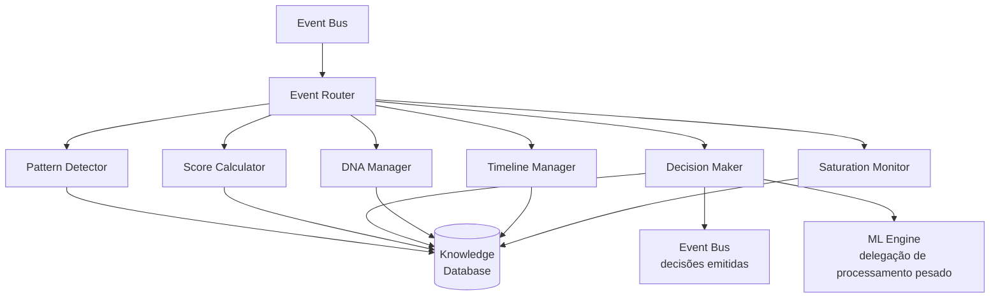
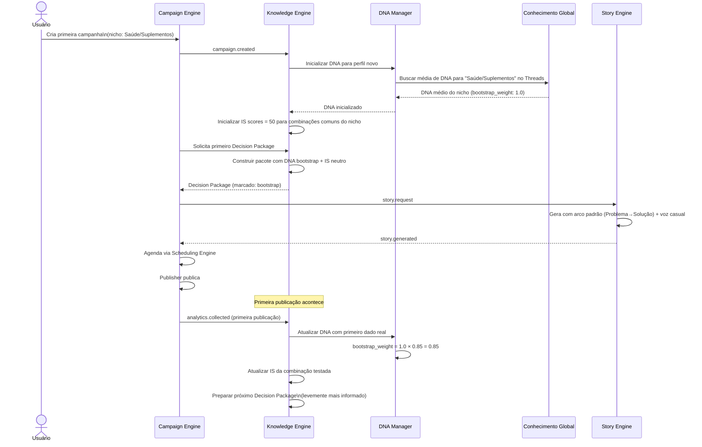

# 09 — Knowledge Engine

> *"Ele não executa. Ele decide. Tudo o mais é consequência."*

---

## Objetivo deste Documento

Definir a arquitetura interna, as responsabilidades, os mecanismos de decisão, o modelo de dados e os contratos do Knowledge Engine — o único componente da plataforma com autoridade para decidir o que testar, o que escalar, o que pausar e o que arquivar.

Este documento resolve as pendências P001 (cold start), P002 (threshold do Intelligence Score) e P006 (parâmetros de decaimento).

---

## 1. O que é o Knowledge Engine

O Knowledge Engine é o cérebro da plataforma. Não armazena dados para consulta passiva — processa eventos, atualiza modelos de conhecimento e emite decisões. Outros componentes executam; o Knowledge Engine decide.

**A autoridade do KE é total sobre:**
- O que incluir no próximo Decision Package de qualquer campanha
- Quando uma campanha está pronta para escala
- Quando uma campanha deve ser pausada
- O que constitui o DNA atual de um perfil
- Quais padrões são válidos, quais expiraram, quais são anti-padrões
- Como distribuir capacidade entre campanhas (Campaign Priority Score)

**O KE nunca:**
- Publica diretamente (Publisher)
- Gera histórias (Story Engine)
- Calcula horários (Scheduling Engine)
- Coleta métricas de APIs externas (Analytics Engine)
- Toma decisões de negócio do usuário (escalar ou não escalar)

---

## 2. Componentes Internos

O Knowledge Engine é composto por seis subcomponentes especializados que operam sobre a mesma base de dados:



### 2.1 Pattern Detector

Identifica padrões emergentes a partir de dados de performance acumulados.

**O que faz:**
- Ao receber um evento `analytics.collected`, compara o resultado com o histórico da campanha e do perfil
- Identifica se o resultado reforça um padrão existente, contradiz um padrão, ou sugere um padrão novo
- Detecta quando uma combinação de dimensões está demonstrando consistência além do esperado por acaso
- Identifica Story Families emergentes (DECISIONS #050)
- Registra candidatos a anti-padrão quando combinações repetidamente falham (DECISIONS #056)

**O que não faz:**
- Não define se o padrão é suficientemente forte para escala (Score Calculator faz isso)
- Não executa análises estatísticas complexas (delega ao ML Engine)

### 2.2 Score Calculator

Mantém e atualiza todos os Intelligence Scores do sistema.

**O que faz:**
- Atualiza o IS de cada combinação de dimensões testada após cada resultado de publicação
- Aplica decaimento temporal a todos os scores ativos
- Integra os resultados de qualidade (QS) como filtro — resultados com QS < 70 recebem peso reduzido
- Calcula o Campaign Priority Score (DECISIONS #060) com base no IS, retorno esperado e estado da campanha
- Mantém o histórico de evolução do IS para detectar tendências

**Fórmula de atualização do IS (simplificada):**

```
IS_novo = IS_atual + (α × desvio_do_baseline × peso_qualidade × peso_volume)

Onde:
  α = taxa de aprendizado (0.1–0.3, calibrado pelo ML Engine)
  desvio_do_baseline = (CTR_publicação - CTR_médio_do_nicho) / CTR_médio_do_nicho
  peso_qualidade = QS / 100 (histórias com QS baixo contribuem menos)
  peso_volume = log(n_publicações) / log(10) (mais publicações = mais confiança, mas com retorno decrescente)
```

Esta fórmula é o ponto de partida. O ML Engine refina os coeficientes com dados reais.

### 2.3 Decision Maker

O único componente autorizado a emitir decisões que afetam campanhas.

**O que faz:**
- Após cada atualização de IS, verifica se alguma campanha cruzou um threshold de decisão
- Monta o Decision Package para o Story Engine a partir do estado atual do KE
- Emite `campaign.scale_eligible` quando IS ≥ threshold de escala (provisório: 81)
- Emite `campaign.pause_recommended` quando os critérios de pausa são atingidos
- Emite `saturation.confirmed` quando o Saturation Monitor confirma saturação total
- Calcula e distribui os Campaign Priority Scores para o Scheduling Engine
- Decide o que entra em cada Decision Package (exploração vs. replicação, família vs. novo território)

**O Decision Maker é o único que sabe "o que fazer a seguir".** Ele tem acesso completo ao estado de todas as campanhas, ao DNA do perfil, a todos os padrões e anti-padrões. Sua perspectiva é global — não de uma campanha isolada.

### 2.4 DNA Manager

Constrói e mantém o DNA de cada perfil social.

**O que faz:**
- Atualiza o DNA após cada ciclo de publicação + resultado
- Mantém embeddings de voz (via pgvector) calculados a partir de histórias de alto desempenho
- Rastreia a evolução do DNA ao longo do tempo (o DNA muda — audiências mudam, o afiliado evolui)
- Sinaliza quando o DNA sofre uma mudança significativa (ex.: afiliado muda de nicho, tom evolui naturalmente)
- Em cold start: inicializa o DNA com dados de bootstrap do Conhecimento Global (DECISIONS #055)

**O que o DNA contém:**

```typescript
interface ProfileDNA {
  profileId: string;
  network: string;

  // Características de voz (descobertas, não declaradas)
  voiceEmbedding: number[];         // vetor 1536-dim (pgvector)
  dominantRegister: string;         // 'casual' | 'íntimo' | 'direto' | 'reflexivo'
  averageLength: number;            // palavras médias de histórias bem-sucedidas
  ctaStyle: string;                 // estilo de CTA predominante em sucessos

  // Padrões de audiência
  topPerformingArcs: number[];      // arcos ordenados por IS médio
  topPerformingTriggers: string[];  // gatilhos emocionais ordenados por IS
  audienceResponseVelocity: number; // velocidade média de clique (horas)

  // Padrões temporais
  bestTimeWindows: TimeWindow[];    // janelas de horário validadas

  // Metadata
  dataPoints: number;               // publicações que construíram este DNA
  bootstrapWeight: number;          // 0-1: quanto ainda é bootstrap vs. dado real (0 = totalmente real)
  lastUpdated: string;
  version: number;                  // incrementado a cada mudança significativa
}
```

### 2.5 Timeline Manager

Gerencia a Learning Timeline — o registro imutável de aprendizados significativos do perfil.

**O que vai para a Timeline:**
- Novo padrão confirmado (IS cruza threshold de confiança pela primeira vez)
- Padrão expirado (IS cai abaixo de viabilidade por decaimento + performance)
- Anti-padrão confirmado (combinação demonstra baixo desempenho em ≥ 3 testes com QS ≥ 70)
- Mudança significativa de DNA (evolução do perfil)
- Saturação detectada e confirmada
- Conclusão de ciclo de Story Family (o que foi aprendido)

**O que NÃO vai para a Timeline:**
- Resultado de cada publicação individual (isso vai nos analytics)
- Flutuações normais de IS (só entram mudanças de estado significativas)
- Eventos técnicos (falhas de geração, retentativas)

**Regra de imutabilidade:** entradas na Timeline nunca são deletadas. Entradas que tornam uma entrada anterior obsoleta são marcadas como "supersedem" a entrada anterior — ambas permanecem.

**Representação para o usuário:** as entradas da Timeline são traduzidas pela Entidade em linguagem simples (DECISIONS #041) antes de aparecerem na área de Aprendizados. O usuário nunca vê os dados brutos da Timeline.

### 2.6 Saturation Monitor

Detecta e confirma saturação em campanhas no Motor ESCALA (DECISIONS #057).

**O que faz:**
- Monitora tendência de CTR para todas as campanhas em estado SCALING
- Distingue variação normal de tendência de queda (análise de regressão, delegada ao ML Engine)
- Gerencia o ciclo parcial → total de saturação (DECISIONS #057)
- Sinaliza ao Decision Maker quando saturação parcial ou total é confirmada
- Analisa causa provável da saturação (audiência esgotada, padrão obsoleto, sazonalidade)

---

## 3. Intelligence Score — Modelo Completo

### 3.1 O que o IS mede

O Intelligence Score (0–100) mede a confiança do Knowledge Engine de que uma combinação específica de dimensões narrativas funciona para um perfil, produto e rede em um dado momento.

**IS por entidade:** o IS não é um número por campanha — é um número por combinação testada. Uma campanha pode ter múltiplas combinações com IS diferentes.

```
Campanha: Produto A · Threads · Perfil @usuario

Combinação 1: Transformação + Aspiração + Médio + Casual + Direto → IS: 84
Combinação 2: Descoberta + Curiosidade + Curto + Casual + Implícito → IS: 67
Combinação 3: Problema→Solução + Alívio + Médio + Direto + Direto → IS: 43
Anti-padrão:  Autoridade + Prova Social + Longo + Formal + Implícito → IS: 18 (anti-padrão)
```

A campanha é elegível para escala com base na Combinação 1. O Decision Package para o ESCALA usa as dimensões da Combinação 1.

### 3.2 Estados do IS

| Faixa | Estado | Significado | Ação do KE |
|---|---|---|---|
| 0–20 | Anti-padrão | Demonstrou baixo desempenho consistente | Evitar ativamente em futuros pacotes |
| 21–40 | Ineficaz | Evidência de baixo desempenho, mas insuficiente para anti-padrão | Deprioritizar |
| 41–60 | Inconclusivo | Dados insuficientes ou sinal misto | Continuar testando |
| 61–80 | Promissor | Sinal positivo, ainda não confirmado | Priorizar confirmação |
| 81–90 | Validado | Elegível para escala; confiança sólida | Recomendar escala |
| 91–100 | Alta confiança | Padrão muito sólido; raramente atingido | Escalar com máxima prioridade |

### 3.3 Decaimento Temporal do IS (Resolução de P006)

O IS decai com o tempo quando o padrão não está sendo ativamente validado. Este é um princípio filosófico (DECISIONS #014); os parâmetros abaixo são o ponto de partida para calibração.

**Modelo de decaimento (MVP — a calibrar pelo ML Engine):**

```
IS_decaído = IS_atual × (1 - taxa_decaimento)^dias_sem_validação

taxa_decaimento base = 0.015 por semana (~6% ao mês)

Modificadores:
  Padrão em ESCALA ativo: taxa × 0.3 (decai 70% mais devagar — está sendo validado continuamente)
  Padrão em nicho com saturação alta detectada: taxa × 2.0 (decai mais rápido — mercado muda)
  Anti-padrão: sem decaimento (permanecem indefinidamente como referência negativa)
```

**Consequências do decaimento:**
- IS que decai de 84 para 79 → campanha sai de SCALE_ELIGIBLE enquanto não revalida
- IS que decai para < 40 → padrão marcado como "possivelmente expirado" na Learning Timeline
- IS que decai para < 20 → padrão marcado como anti-padrão por decaimento (não necessariamente é ruim — pode simplesmente ser informação antiga)

**Distinção importante:** IS < 20 por decaimento puro ≠ anti-padrão confirmado. O Timeline Manager registra os dois com estados diferentes. Um padrão expirado pode ser reativado com novas publicações; um anti-padrão confirmado precisa de evidência forte contrária para ser removido.

### 3.4 Resolução de P002 — Threshold de Escala

O threshold provisório de 81 permanece como valor inicial. A calibração com dados reais ocorre no documento 15 (Machine Learning). O que é fixado agora:

- **Threshold de elegibilidade de escala:** 81 (provisório)
- **Confirmação mínima:** IS ≥ 81 em ≥ 2 publicações com QS ≥ 70
- **O threshold não é configurável pelo usuário** (DECISIONS #003) — a fronteira TESTE/ESCALA é protegida
- **O threshold pode ser ajustado pelo time de produto** com base em dados reais de conversão (não pelo usuário final)

---

## 4. DNA do Perfil — Construção e Evolução

### 4.1 Resolução de P001 — Cold Start

**Problema:** perfil novo sem histórico. O DNA Manager não tem dados reais para trabalhar.

**Estratégia adotada:**

**Fase 1 — Bootstrap por Conhecimento Global (dias 1–5):**
O DNA Manager inicializa com os padrões médios do Conhecimento Global para o nicho declarado pelo usuário no onboarding. Isso não é o DNA do usuário — é um placeholder informado que reduz o espaço de busca inicial.

```
bootstrap_dna = média(dna_de_perfis_com_nicho_similar)
bootstrap_weight = 1.0  ← indica 100% bootstrap, 0% real
```

O Story Engine recebe o Decision Package com um pacote de dados marcado como bootstrap. A Intelligence Layer ainda toma uma decisão de geração — mas é menos específica porque o DNA é genérico.

**Fase 2 — Substituição progressiva (histórias 1–10):**
A cada publicação com resultado, o DNA Manager atualiza:
```
dna_real = dna_real × (1 - α) + novo_dado × α
bootstrap_weight = bootstrap_weight × 0.85  ← diminui com cada dado real
```

**Fase 3 — DNA estabelecido (após ~10 publicações com dados):**
O `bootstrap_weight` < 0.1 indica que o DNA é majoritariamente baseado em dados reais. O DNA Manager ativa o modo completo de verificação de consistência.

**O usuário nunca vê "cold start" ou "bootstrap".** A Entidade comunica:
> *"Ainda estou aprendendo sobre o seu perfil. Cada publicação me ajuda a entender melhor o que funciona para a sua audiência."*

### 4.2 Evolução Contínua do DNA

O DNA não é fixo. Ele evolui com o perfil. O DNA Manager detecta evolução quando:
- As histórias de melhor desempenho recente têm embedding significativamente diferente das de 90 dias atrás
- Um arco que consistentemente performava acima da média começa a perder força
- Novos padrões de horário emergem diferentes dos históricos

**Quando há evolução significativa:**
1. O DNA Manager cria uma nova versão do DNA (`version: n+1`)
2. A versão anterior é preservada (imutabilidade)
3. A Timeline Manager registra a evolução como aprendizado
4. O IS de todas as combinações anteriores recebe um penalty de decaimento acelerado (evidência antiga pode não refletir o DNA atual)

**A Entidade pode comunicar ao usuário:**
> *"Percebi que o seu perfil está evoluindo. Estou atualizando o que aprendi sobre a sua audiência."*

---

## 5. Conhecimento Global vs. Privado (DECISIONS #055)

O Knowledge Engine mantém dois bancos de conhecimento completamente separados:

### Conhecimento Global

Padrões que emergem de múltiplos perfis e campanhas, agregados de forma que nenhum usuário individual seja identificável.

**O que é Global:**
- Médias de performance por arco narrativo × nicho × rede
- Padrões de horário por categoria × rede
- Velocidade de saturação típica por nicho
- Arcos que consistentemente não funcionam em determinadas categorias
- Dados de bootstrap para cold start

**Como é agregado:** apenas média e desvio padrão por categoria — nunca dados de um perfil individual.

**Quem usa o Global:** DNA Manager (cold start), Decision Maker (calibração de baselines), ML Engine (treinamento de modelos).

### Conhecimento Privado

Tudo que é específico de um perfil: DNA, IS por campanha, Learning Timeline, anti-padrões, padrões validados, história de campanhas.

**O Conhecimento Privado nunca:**
- É compartilhado com outros usuários
- É usado para treinar modelos globais de forma identificável
- É exportado exceto por solicitação explícita do próprio usuário (LGPD)

**Separação no banco de dados:** schemas distintos com controles de acesso separados (documento 11).

---

## 6. Anti-Padrões — Registro e Uso

Os anti-padrões são o registro do que definitivamente não funciona para um perfil específico (DECISIONS #056).

### 6.1 Como um anti-padrão é confirmado

```
Candidato a anti-padrão:
  Combinação [arc=Autoridade, trigger=Prova Social, length=Longo]
  Resultado 1: CTR 1.2% (baseline: 5.8%) · QS: 78 ← execução boa, hipótese ruim
  Resultado 2: CTR 1.5% · QS: 82
  Resultado 3: CTR 0.9% · QS: 74
  → 3 publicações com QS ≥ 70, todas consistentemente abaixo de 30% do baseline
  → Status: ANTI-PADRÃO CONFIRMADO
  → IS: 12 (não vai a 0 — pode mudar com evidência futura)
```

**Critério de confirmação de anti-padrão:** ≥ 3 publicações com QS ≥ 70 onde o CTR está abaixo de 30% do baseline do nicho. (Thresholds a calibrar pelo ML Engine — estes são os valores iniciais.)

### 6.2 Decaimento de Anti-Padrões

Anti-padrões não decaem da mesma forma que padrões positivos. Eles podem ser "reabilitados" se:
- Houver mudança significativa de DNA (o perfil evoluiu — o que não funcionava antes pode funcionar agora)
- O nicho sofrer transformação relevante (tendência de mercado muda o comportamento da audiência)
- Mais de 180 dias se passarem sem novas evidências negativas (o contexto pode ter mudado)

Quando um anti-padrão é reabilitado, ele volta para o estado "Inconclusivo" (IS: 45–55) — não é descartado. A Timeline Manager registra a reabilitação.

### 6.3 Anti-Padrões no Decision Package

O Decision Maker nunca inclui dimensões de anti-padrões confirmados em Decision Packages, exceto em uma situação: quando não há combinação disponível suficientemente boa, o KE pode gerar um Decision Package com dimensões menos testadas mas não confirmadas como anti-padrões, marcadas como "alta incerteza". Isso ocorre raramente — geralmente no início de ciclos de TESTE para produtos em nichos com muito pouco histórico.

---

## 7. Campaign Priority Score — Mecânica

O Campaign Priority Score (CPS) determina como a capacidade de publicação disponível é distribuída entre campanhas (DECISIONS #060 e #061).

### 7.1 Cálculo do CPS

```typescript
interface CampaignPriorityScore {
  campaignId: string;
  score: number;          // 0–100

  // Componentes
  intelligenceScore: number;        // IS mais alto da campanha (peso 35%)
  expectedReturn: number;           // comissão estimada por publicação (peso 30%)
  stageMultiplier: number;          // multiplicador por estado (peso 20%)
  trendFactor: number;              // crescendo=+, estável=neutro, caindo=- (peso 15%)
}

// Multiplicadores de estado:
// SCALING: 1.4
// SCALE_ELIGIBLE (aguardando aprovação): 1.2
// MONITORING (em queda controlada): 0.9
// TESTING (avançado, IS > 60): 1.1
// TESTING (inicial, IS ≤ 60): 0.8
// SATURATING: 0.4
// PAUSED: 0 (não recebe alocação)
```

### 7.2 Distribuição de Capacidade

O Scheduling Engine recebe os CPS de todas as campanhas ativas e distribui o orçamento mensal de publicações proporcionalmente:

```
Total mensal do plano: 200 publicações
Campanha A (SCALING, CPS: 88): 40% → 80 publicações
Campanha B (TESTING avançado, CPS: 71): 35% → 70 publicações
Campanha C (TESTING inicial, CPS: 45): 25% → 50 publicações

[Se Campanha A entra em SATURATING]
Rebalanceamento automático:
Campanha A (SATURATING, CPS: 31): 15% → 30 publicações
Campanha B (CPS: 71): 50% → 100 publicações
Campanha C (CPS: 45): 35% → 70 publicações
```

O rebalanceamento é silencioso — o usuário não é notificado a cada ajuste. O Dashboard mostra o estado atual das alocações de forma transparente se o usuário quiser verificar.

---

## 8. Eventos — Subscrições e Emissões

### 8.1 Eventos que o KE subscreve

| Evento | Origem | O que o KE faz |
|---|---|---|
| `analytics.collected` | Analytics Engine | Atualiza IS, verifica saturação, atualiza CPS |
| `story.generated` | Story Engine | Registra QS na base, vincula ao Decision Package |
| `story.failed` | Story Engine | Registra falha; incrementa contador de falhas por combinação |
| `publication.published` | Publisher | Vincula publicação à timeline para rastreamento |
| `campaign.created` | Campaign Engine | Inicializa IS scores, solicita bootstrap DNA se cold start |
| `campaign.scale_approved` | Campaign Engine | Prepara Scale Package |
| `campaign.scale_rejected` | Campaign Engine | Registra preferência do usuário; para de recomendar por período |
| `mode_review.rejected` | Campaign Engine | Registra rejeição como sinal de aprendizado (DECISIONS #021) |
| `campaign.paused` | Campaign Engine | Ajusta decay acceleration para campanhas pausadas |

### 8.2 Eventos que o KE emite

| Evento | Destino | Quando |
|---|---|---|
| `knowledge.decision_package` | Campaign Engine | A cada requisição de novo Decision Package |
| `campaign.scale_eligible` | Campaign Engine | IS ≥ 81 confirmado em ≥ 2 publicações com QS ≥ 70 |
| `campaign.pause_recommended` | Campaign Engine | Critérios de pausa por baixa performance atingidos |
| `saturation.confirmed` | Campaign Engine | Saturação total detectada pelo Saturation Monitor |
| `knowledge.capacity_allocation` | Scheduling Engine | Após cada atualização de CPS (a cada ciclo de analytics) |
| `learning.timeline.entry` | Timeline Manager (interno) | Evento significativo de aprendizado |
| `profile.dna.updated` | Campaign Engine | Mudança significativa de DNA |
| `ml.processing_request` | ML Engine | Processamento estatístico pesado necessário |

---

## 9. Relação com o ML Engine

O Knowledge Engine delega processamento estatístico pesado ao ML Engine. A fronteira é:

**KE faz internamente (rápido, em tempo real):**
- Atualização incremental de IS
- Aplicação de decaimento
- Verificação de thresholds e estados
- Montagem de Decision Packages
- Cálculo de CPS

**KE delega ao ML Engine (lento, em background, não está no caminho crítico):**
- Análise de tendência de saturação (regressão sobre séries temporais)
- Detecção de clusters de padrões similares
- Calibração de parâmetros (taxa de decaimento, thresholds de IS)
- Cálculo de embeddings de DNA (processamento de NLP)
- Meta-aprendizado contextual (DECISIONS #052)
- Análise de correlação entre variáveis para sugerir novos padrões

**Interface KE → ML Engine:**
```typescript
// KE solicita análise ao ML Engine via evento:
interface MLProcessingRequest {
  type: 'saturation_analysis' | 'pattern_clustering' | 'embedding_update' | 'calibration';
  profileId: string;
  data: unknown;  // payload específico por tipo
  priority: 'low' | 'normal' | 'high';
}

// ML Engine retorna resultado via evento:
interface MLProcessingResult {
  requestId: string;
  type: string;
  result: unknown;  // resultado específico por tipo
  confidence: number;
}
```

---

## 10. Cold Start Completo — Fluxo End-to-End



---

## 11. Persistência — Schema de Dados

O Knowledge Engine é dono dos seguintes schemas no PostgreSQL:

```sql
-- CONHECIMENTO PRIVADO (por perfil)

-- Intelligence Scores por combinação
CREATE TABLE knowledge.intelligence_scores (
  id              UUID PRIMARY KEY DEFAULT gen_random_uuid(),
  profile_id      UUID NOT NULL,
  campaign_id     UUID,
  network         VARCHAR(50) NOT NULL,
  
  -- Combinação de dimensões (o "o quê" foi testado)
  narrative_arc   SMALLINT NOT NULL,
  emotional_trigger VARCHAR(50) NOT NULL,
  length_bucket   VARCHAR(20) NOT NULL,
  voice_register  VARCHAR(50) NOT NULL,
  cta_style       VARCHAR(50) NOT NULL,
  
  -- Score e estado
  score           NUMERIC(5,2) NOT NULL DEFAULT 50,
  state           VARCHAR(20) NOT NULL DEFAULT 'inconclusive',
  -- inconclusive | promising | validated | ineffective | anti_pattern | expired
  
  publications_count    INTEGER NOT NULL DEFAULT 0,
  publications_valid_qs INTEGER NOT NULL DEFAULT 0,
  last_result_at        TIMESTAMPTZ,
  last_decayed_at       TIMESTAMPTZ,
  created_at            TIMESTAMPTZ NOT NULL DEFAULT NOW(),
  updated_at            TIMESTAMPTZ NOT NULL DEFAULT NOW()
);

-- DNA do Perfil (versionado)
CREATE TABLE knowledge.profile_dna (
  id              UUID PRIMARY KEY DEFAULT gen_random_uuid(),
  profile_id      UUID NOT NULL,
  network         VARCHAR(50) NOT NULL,
  version         INTEGER NOT NULL,
  
  -- Características de voz
  voice_embedding  vector(1536),  -- pgvector
  dominant_register VARCHAR(50),
  average_length    INTEGER,
  cta_style         VARCHAR(50),
  
  -- Padrões de audiência
  top_arcs        JSONB,
  top_triggers    JSONB,
  response_velocity_hours NUMERIC(6,2),
  
  -- Padrões temporais
  best_time_windows JSONB,
  
  -- Metadata
  data_points     INTEGER NOT NULL DEFAULT 0,
  bootstrap_weight NUMERIC(4,3) NOT NULL DEFAULT 1.0,
  is_current      BOOLEAN NOT NULL DEFAULT true,
  created_at      TIMESTAMPTZ NOT NULL DEFAULT NOW()
);

-- Learning Timeline (append-only, nunca deletar)
-- SCHEMA AUTORITATIVO: Documento 11 (Banco de Dados). Este é um resumo de referência.
CREATE TABLE knowledge.learning_timeline (
  id              UUID PRIMARY KEY DEFAULT gen_random_uuid(),
  profile_id      UUID NOT NULL REFERENCES profiles.affiliate_profiles(id),
  campaign_id     UUID REFERENCES campaigns.campaigns(id),

  -- Tipo e conteúdo
  entry_type      VARCHAR(50) NOT NULL,
  -- Valores válidos: pattern_activated | pattern_confirmed | pattern_expired |
  -- anti_pattern_confirmed | anti_pattern_reeval | scale_achieved |
  -- saturation_detected | dna_update

  title           VARCHAR(255) NOT NULL,   -- exibido ao usuário
  evidence        JSONB NOT NULL,          -- dados brutos que sustentam a entrada

  -- Explicações pré-calculadas para o "Por quê?" (DECISIONS #069, #070)
  why_activation  TEXT,    -- "por que esse padrão foi identificado"
  why_expiration  TEXT,    -- "por que esse padrão expirou" (preenchido na expiração)

  -- Ordenação e estado
  impact_score    NUMERIC(5,2) NOT NULL DEFAULT 0,  -- ordena exibição ao usuário
  state           VARCHAR(20) NOT NULL DEFAULT 'active',
  is_expired      BOOLEAN NOT NULL DEFAULT false,
  superseded_by   UUID REFERENCES knowledge.learning_timeline(id),

  recorded_at     TIMESTAMPTZ NOT NULL DEFAULT NOW(),
  expired_at      TIMESTAMPTZ
);

-- Campaign Priority Scores (histórico, recalculado a cada ciclo de analytics)
-- SCHEMA AUTORITATIVO: Documento 11 (Banco de Dados). Este é um resumo de referência.
CREATE TABLE knowledge.campaign_priority_scores (
  id               UUID PRIMARY KEY DEFAULT gen_random_uuid(),
  campaign_id      UUID NOT NULL REFERENCES campaigns.campaigns(id),
  profile_id       UUID NOT NULL REFERENCES profiles.affiliate_profiles(id),
  score            NUMERIC(5,2) NOT NULL,
  is_component     NUMERIC(5,2) NOT NULL,    -- contribuição do Intelligence Score
  return_component NUMERIC(5,2) NOT NULL,    -- contribuição do retorno esperado
  stage_component  NUMERIC(5,2) NOT NULL,    -- contribuição do multiplicador de estágio
  trend_component  NUMERIC(5,2) NOT NULL,    -- contribuição da tendência
  campaign_state   VARCHAR(20) NOT NULL,
  calculated_at    TIMESTAMPTZ NOT NULL DEFAULT NOW()
);
```

```sql
-- CONHECIMENTO GLOBAL (agregado, não identificável)

CREATE TABLE knowledge.global_patterns (
  id              UUID PRIMARY KEY DEFAULT gen_random_uuid(),
  niche           VARCHAR(100) NOT NULL,
  network         VARCHAR(50) NOT NULL,
  narrative_arc   SMALLINT NOT NULL,
  emotional_trigger VARCHAR(50) NOT NULL,
  
  -- Agregado (nunca dados individuais)
  avg_ctr         NUMERIC(6,4),
  sample_size     INTEGER NOT NULL,  -- quantos perfis geraram este dado
  confidence      NUMERIC(4,3),
  
  updated_at      TIMESTAMPTZ NOT NULL DEFAULT NOW()
);
```

---

## 12. Casos Extremos

### CE-KE-001: Campanha com volume insuficiente de publicações para IS confiável
**Situação:** campanha tem 3 publicações, todas com CTR alto, IS calculado em 89.  
**Comportamento:** o Score Calculator aplica o fator de volume (`peso_volume = log(3)/log(10) ≈ 0.48`). O IS efetivo é moderado — o alto CTR com apenas 3 publicações não é suficiente para cruzar o threshold com confiança. O Decision Maker não emite `campaign.scale_eligible` até que o IS se consolide com mais publicações. Prevenção de falso positivo por sorte.

### CE-KE-002: DNA de perfil sofre mudança abrupta
**Situação:** afiliado muda de nicho de Saúde para Tecnologia de repente (troca de produto sem aviso).  
**Comportamento:** o DNA Manager detecta que as novas histórias têm embedding distante (cosine similarity < 0.5 com DNA atual). Sinalizaao Decision Maker que o DNA está provavelmente inadequado. O KE inicia uma fase de transição: `bootstrap_weight` é elevado parcialmente (DNA antigo perde relevância). A Timeline Manager registra a transição. A Entidade comunica: *"Percebi uma mudança no seu conteúdo. Estou atualizando o que aprendi sobre o seu perfil."*

### CE-KE-003: Todos os IS de um perfil decaem abaixo de 50
**Situação:** usuário fica 6 meses inativo, todos os IS decaíram.  
**Comportamento:** quando o usuário retorna e cria uma nova campanha, o KE trata a situação como um cold start parcial: o DNA ainda existe (versão histórica) mas com bootstrap_weight elevado para 0.7. Os IS anteriores são preservados mas marcados como "desatualizados". O Decision Maker usa uma estratégia de exploração como se fosse nova, mas com o DNA histórico como referência de ponto de partida.

### CE-KE-004: Conflito entre anti-padrão e recomendação de exploração
**Situação:** o Decision Maker quer explorar uma combinação nova que inclui uma dimensão de anti-padrão.  
**Comportamento:** o Decision Maker verifica anti-padrões antes de gerar qualquer Decision Package. Se a combinação candidata inclui uma dimensão de anti-padrão confirmado, ela é descartada automaticamente. O KE busca a próxima combinação não testada que não conflite com anti-padrões. Apenas se não houver combinações disponíveis sem conflito é que o KE considera usar dimensões de anti-padrões "envelhecidos" (> 180 dias), marcados como "alta incerteza".

### CE-KE-005: Usuário tem muitas campanhas simultâneas com CPS similares
**Situação:** 5 campanhas com CPS entre 60 e 70 — difícil priorizar.  
**Comportamento:** o Scheduling Engine usa o CPS para alocação proporcional. Em empate técnico, o desempate é por: (1) campanha mais recente com menos dados — priorizar aprendizado; (2) produto com maior ticket médio — maior retorno esperado. O usuário não vê a lógica de desempate — apenas vê que suas campanhas estão sendo gerenciadas equilibradamente.

---

## 13. Possíveis Melhorias Futuras

1. **Moment da Compra (V2+):** quando a dimensão 13 (DECISIONS #049) for implementada, o DNA Manager incorporará o estágio de compra predominante da audiência de cada perfil, e o Decision Maker usará essa informação para calibrar a seleção de arco narrativo.

2. **Meta-aprendizado contextual (V2+):** o ML Engine processará dados acumulados para gerar padrões contextuais de segunda ordem — "este arco funciona para esta audiência neste estágio de compra durante este período do ano" (DECISIONS #052).

3. **KE cross-campanha para Story Families:** quando a mesma Story Family demonstra alto desempenho em duas campanhas de produtos diferentes da mesma categoria, o KE poderá usar esse aprendizado cross-campanha como bootstrap acelerado para novos produtos na mesma categoria.

4. **Explicabilidade aprimorada:** além do mecanismo "Por quê?" atual (DECISIONS #015), o KE pode gerar explicações mais ricas com base em cadeia de evidências — mostrando ao usuário não apenas o padrão mas a trajetória que o levou a ele.

---

## Decisões Pendentes Resolvidas

| Pendência | Resolução |
|---|---|
| **P001** — Cold start do DNA | Bootstrap por Conhecimento Global do nicho; substituição progressiva com dados reais; `bootstrap_weight` como métrica de maturidade do DNA |
| **P002** — Threshold exato do IS para escala | Mantido em 81 (provisório); critério de confirmação: ≥ 2 publicações com QS ≥ 70; calibração formal no documento 15 |
| **P006** — Parâmetros de decaimento | Taxa base: 0.015/semana; modificadores por estado ativo/passivo/nicho em saturação; piso em IS=0; anti-padrões sem decaimento |

---

## Decisões Registradas

| Data | Decisão |
|---|---|
| 2026-07-11 | P001 resolvida: bootstrap por Conhecimento Global com substituição progressiva |
| 2026-07-11 | P002 resolvida: IS 81 provisório, confirmado em ≥ 2 publicações com QS ≥ 70 |
| 2026-07-11 | P006 resolvida: taxa de decaimento base 0.015/semana com modificadores por contexto |
| 2026-07-11 | IS é por combinação de dimensões, não por campanha |
| 2026-07-11 | Anti-padrão confirmado: ≥ 3 publicações com QS ≥ 70 abaixo de 30% do baseline |
| 2026-07-11 | Anti-padrões reabilitados para "Inconclusivo" após 180 dias sem evidência nova |
| 2026-07-11 | DNA versionado: versões anteriores preservadas (imutabilidade) |
| 2026-07-11 | Conhecimento Global separado em schema distinto com acesso controlado |
| 2026-07-11 | CPS recalculado a cada ciclo de analytics |

---

*Documento criado em: 2026-07-11*  
*Versão: 0.2 — Aprovado (schemas sincronizados com Documento 11 — fonte de verdade do banco)*
